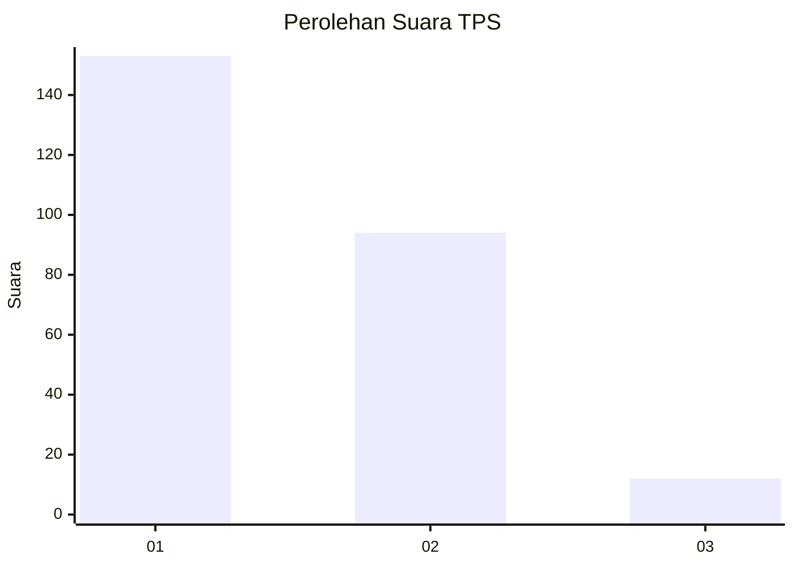
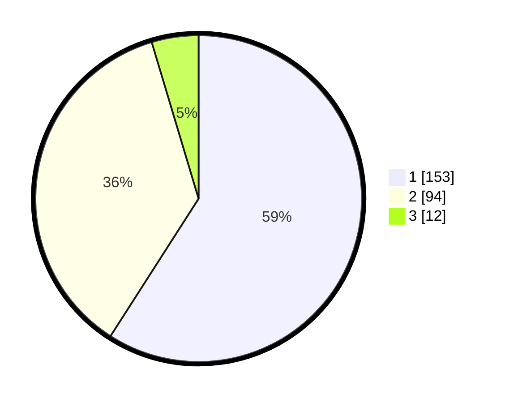

# Hasil

## Grafik

## Tabel

| No. | Nama Paslon    | Suara | Suara (raw) | Persentase |
|:--- |:-------------- | -----:| -----------:| ----------:|
| 1   | ANIES MUHAIMIN | 153   | [153][p-1]  | 59,07      |
| 2   | PRABOWO GIBRAN | 94    | [94][p-2]   | 36,29      |
| 3   | GANJAR MAHFUD  | 12    | [12][p-3]   | 4,63       |

[p-1]: https://github.com/gigit-pemilu/pemilu-2024/blob/main/pilpres/hitung-suara/sub/36-banten/sub/04-serang/sub/19-petir/sub/2014-kubang-jaya/sub/005-tps/sub/paslon-1.txt
[p-2]: https://github.com/gigit-pemilu/pemilu-2024/blob/main/pilpres/hitung-suara/sub/36-banten/sub/04-serang/sub/19-petir/sub/2014-kubang-jaya/sub/005-tps/sub/paslon-2.txt
[p-3]: https://github.com/gigit-pemilu/pemilu-2024/blob/main/pilpres/hitung-suara/sub/36-banten/sub/04-serang/sub/19-petir/sub/2014-kubang-jaya/sub/005-tps/sub/paslon-3.txt

## Foto C Plano

https://sirekap-obj-formc.kpu.go.id/a876/pemilu/ppwp/36/04/19/20/14/3604192014005-20240215-004913--4f6a4daa-90d5-4f8c-8fc3-a51e71d17ffe.jpg

https://sirekap-obj-formc.kpu.go.id/a876/pemilu/ppwp/36/04/19/20/14/3604192014005-20240215-004201--a961de1d-0728-408c-a755-80799276b501.jpg

https://sirekap-obj-formc.kpu.go.id/a876/pemilu/ppwp/36/04/19/20/14/3604192014005-20240215-004339--b7cc1915-fd47-4cf2-b9e5-b265f12f085c.jpg

## Metadata

| Key        | Value               |
| ---------- | ------------------- |
| Time Stamp | 2024-02-24 22:31:28 |

