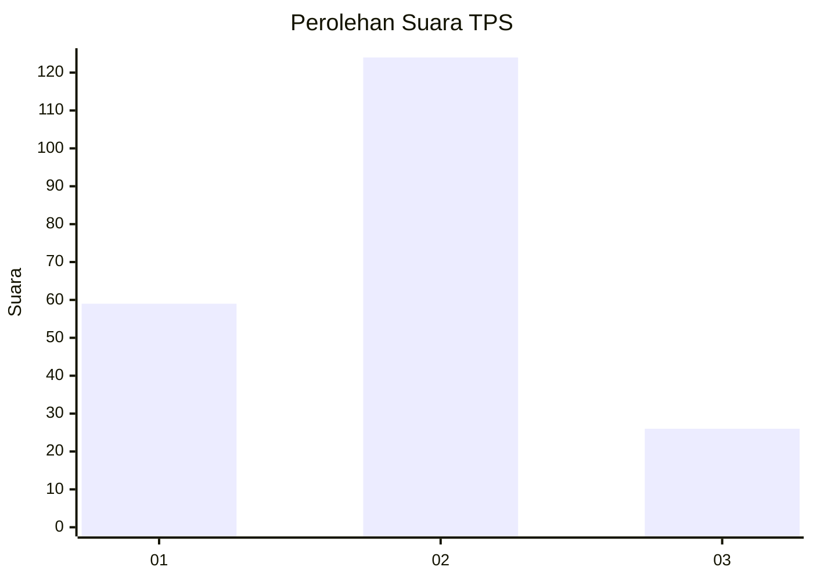
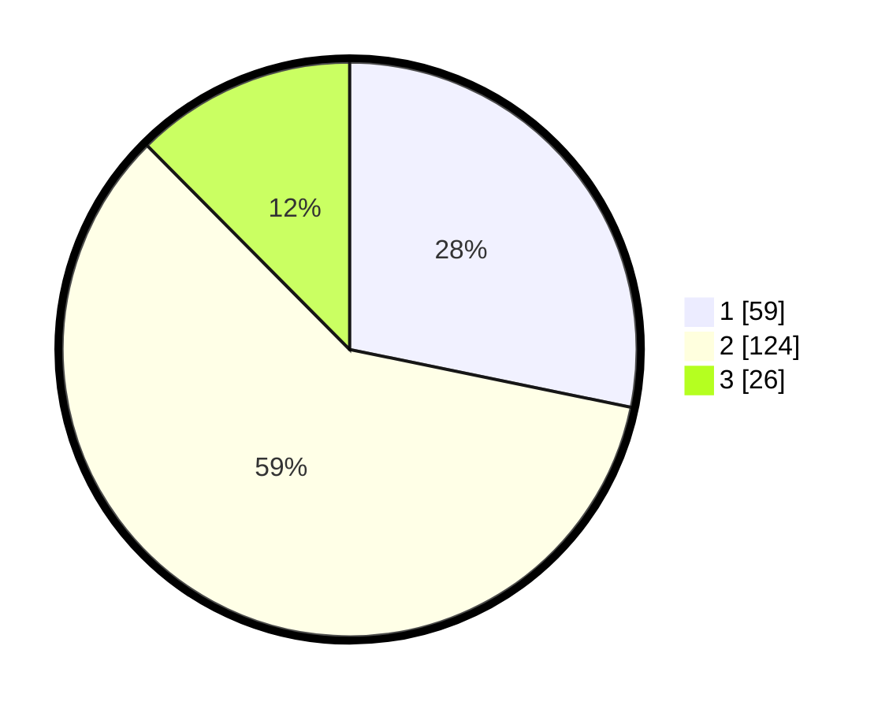

# Hasil

## Grafik

## Tabel

| No. | Nama Paslon    | Suara | Suara (raw) | Persentase |
|:--- |:-------------- | -----:| -----------:| ----------:|
| 1   | ANIES MUHAIMIN | 59    | [59][p-1]   | 28,23      |
| 2   | PRABOWO GIBRAN | 124   | [124][p-2]  | 59,33      |
| 3   | GANJAR MAHFUD  | 26    | [26][p-3]   | 12,44      |

[p-1]: https://github.com/gigit-pemilu/pemilu-2024/blob/main/pilpres/hitung-suara/sub/36-banten/sub/04-serang/sub/20-tunjung-teja/sub/2001-tunjung-teja/sub/005-tps/sub/paslon-1.txt
[p-2]: https://github.com/gigit-pemilu/pemilu-2024/blob/main/pilpres/hitung-suara/sub/36-banten/sub/04-serang/sub/20-tunjung-teja/sub/2001-tunjung-teja/sub/005-tps/sub/paslon-2.txt
[p-3]: https://github.com/gigit-pemilu/pemilu-2024/blob/main/pilpres/hitung-suara/sub/36-banten/sub/04-serang/sub/20-tunjung-teja/sub/2001-tunjung-teja/sub/005-tps/sub/paslon-3.txt

## Foto C Plano

https://sirekap-obj-formc.kpu.go.id/af64/pemilu/ppwp/36/04/20/20/01/3604202001005-20240215-010905--5771e030-64bd-4b42-b270-0d77ed0e8e98.jpg

https://sirekap-obj-formc.kpu.go.id/af64/pemilu/ppwp/36/04/20/20/01/3604202001005-20240215-021327--2cd8aa99-0cfe-4158-a7f2-54b025c16415.jpg

https://sirekap-obj-formc.kpu.go.id/af64/pemilu/ppwp/36/04/20/20/01/3604202001005-20240215-011257--12ae1085-80d8-46fc-a64b-c22bf855e3c5.jpg

## Metadata

| Key        | Value               |
| ---------- | ------------------- |
| Time Stamp | 2024-02-24 22:31:28 |

