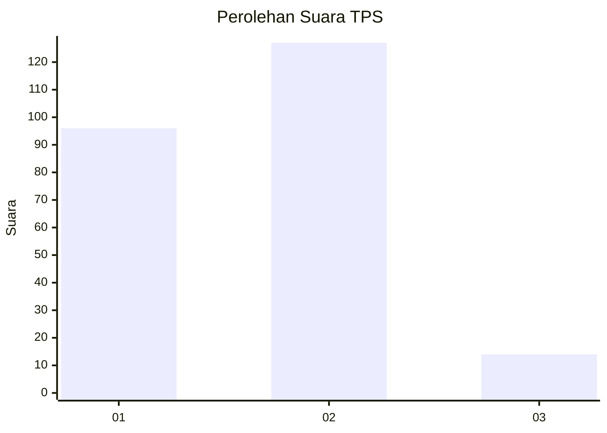
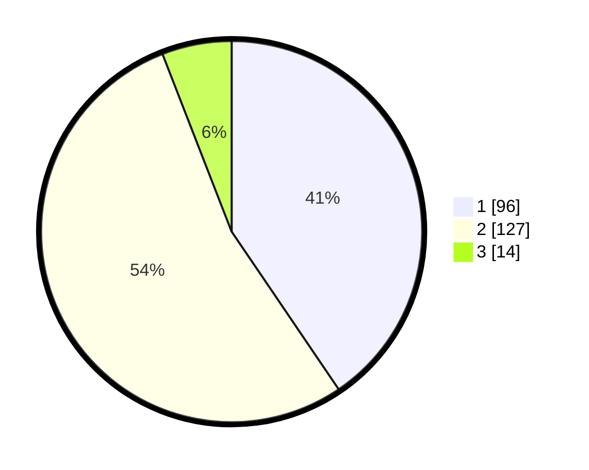

# Hasil

## Grafik

## Tabel

| No. | Nama Paslon    | Suara | Suara (raw) | Persentase |
|:--- |:-------------- | -----:| -----------:| ----------:|
| 1   | ANIES MUHAIMIN | 96    | [96][p-1]   | 40,51      |
| 2   | PRABOWO GIBRAN | 127   | [127][p-2]  | 53,59      |
| 3   | GANJAR MAHFUD  | 14    | [14][p-3]   | 5,91       |

[p-1]: https://github.com/gigit-pemilu/pemilu-2024/blob/main/pilpres/hitung-suara/sub/36-banten/sub/04-serang/sub/22-baros/sub/2001-baros/sub/003-tps/sub/paslon-1.txt
[p-2]: https://github.com/gigit-pemilu/pemilu-2024/blob/main/pilpres/hitung-suara/sub/36-banten/sub/04-serang/sub/22-baros/sub/2001-baros/sub/003-tps/sub/paslon-2.txt
[p-3]: https://github.com/gigit-pemilu/pemilu-2024/blob/main/pilpres/hitung-suara/sub/36-banten/sub/04-serang/sub/22-baros/sub/2001-baros/sub/003-tps/sub/paslon-3.txt

## Foto C Plano

https://sirekap-obj-formc.kpu.go.id/8697/pemilu/ppwp/36/04/22/20/01/3604222001003-20240220-143759--9782cd10-a9e2-42f6-929f-18835b3789c8.jpg

https://sirekap-obj-formc.kpu.go.id/8697/pemilu/ppwp/36/04/22/20/01/3604222001003-20240218-095652--8b22311a-941f-46ca-9270-d9f6610a7629.jpg

https://sirekap-obj-formc.kpu.go.id/8697/pemilu/ppwp/36/04/22/20/01/3604222001003-20240218-095922--27d7ad5e-7b17-4686-a832-7df40d8ae2d6.jpg

## Metadata

| Key        | Value               |
| ---------- | ------------------- |
| Time Stamp | 2024-02-20 15:00:00 |

