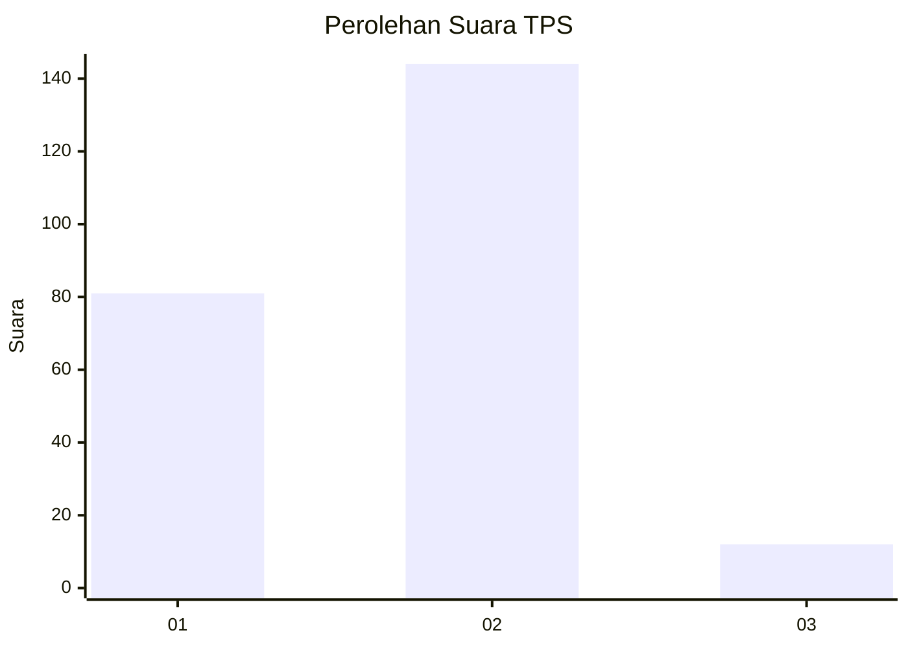
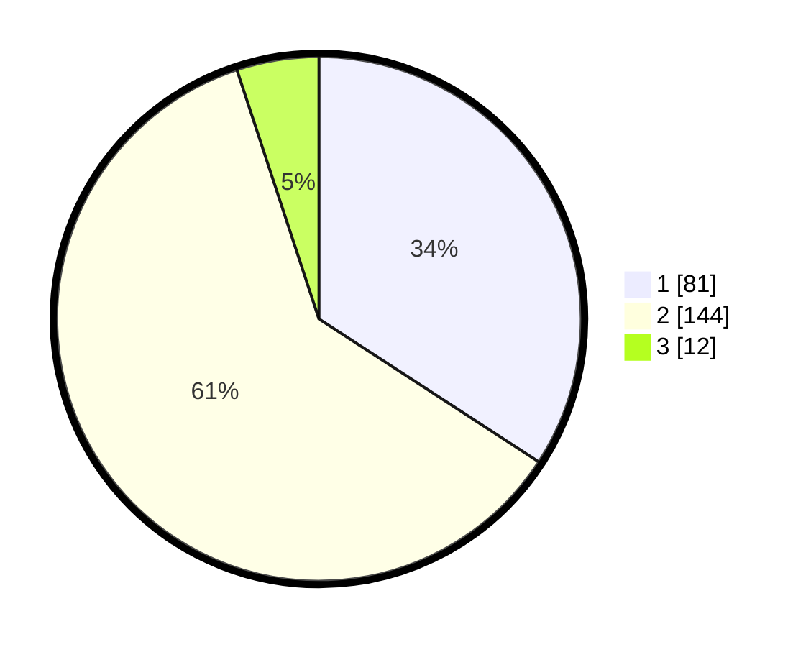

# Hasil

## Grafik

## Tabel

| No. | Nama Paslon    | Suara | Suara (raw) | Persentase |
|:--- |:-------------- | -----:| -----------:| ----------:|
| 1   | ANIES MUHAIMIN | 81    | [81][p-1]   | 34,18      |
| 2   | PRABOWO GIBRAN | 144   | [144][p-2]  | 60,76      |
| 3   | GANJAR MAHFUD  | 12    | [12][p-3]   | 5,06       |

[p-1]: https://github.com/gigit-pemilu/pemilu-2024-36-banten/blob/main/pilpres/hitung-suara/sub/36-banten/sub/04-serang/sub/22-baros/sub/2001-baros/sub/005-tps/sub/paslon-1.txt
[p-2]: https://github.com/gigit-pemilu/pemilu-2024-36-banten/blob/main/pilpres/hitung-suara/sub/36-banten/sub/04-serang/sub/22-baros/sub/2001-baros/sub/005-tps/sub/paslon-2.txt
[p-3]: https://github.com/gigit-pemilu/pemilu-2024-36-banten/blob/main/pilpres/hitung-suara/sub/36-banten/sub/04-serang/sub/22-baros/sub/2001-baros/sub/005-tps/sub/paslon-3.txt

## Foto C Plano

https://sirekap-obj-formc.kpu.go.id/cd14/pemilu/ppwp/36/04/22/20/01/3604222001005-20240214-195457--934f4fe4-f3c3-4514-aa32-d85408b0615d.jpg

https://sirekap-obj-formc.kpu.go.id/cd14/pemilu/ppwp/36/04/22/20/01/3604222001005-20240214-195702--85c4f77f-a611-4281-ae61-28f19477430e.jpg

https://sirekap-obj-formc.kpu.go.id/cd14/pemilu/ppwp/36/04/22/20/01/3604222001005-20240214-195747--41922625-8b49-40fc-be88-1b8781a0c08e.jpg

## Metadata

| Key        | Value               |
| ---------- | ------------------- |
| Time Stamp | 2024-02-15 19:30:26 |

