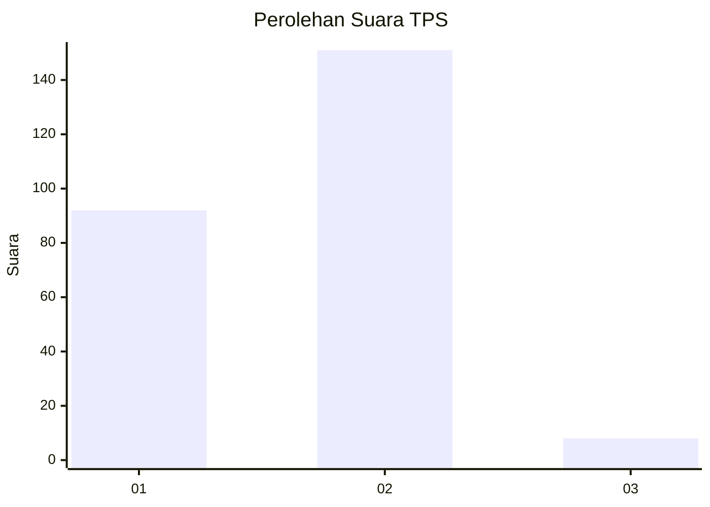
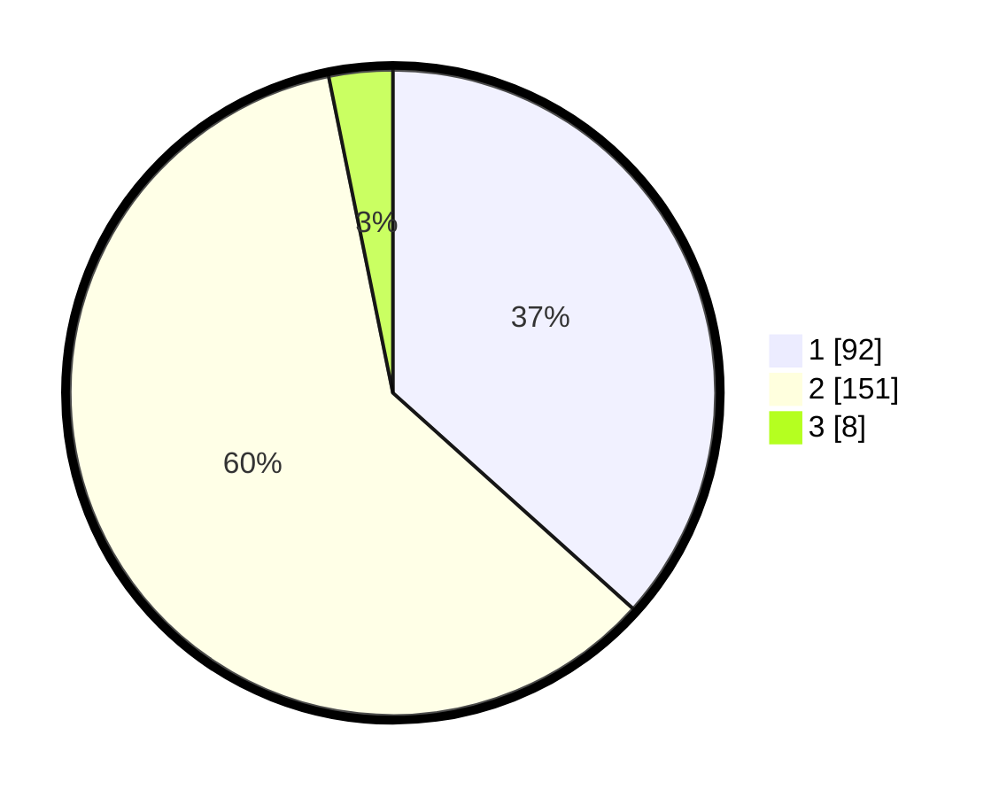

# Hasil

## Grafik

## Tabel

| No. | Nama Paslon    | Suara | Suara (raw) | Persentase |
|:--- |:-------------- | -----:| -----------:| ----------:|
| 1   | ANIES MUHAIMIN | 92    | [92][p-1]   | 36,65      |
| 2   | PRABOWO GIBRAN | 151   | [151][p-2]  | 60,16      |
| 3   | GANJAR MAHFUD  | 8     | [8][p-3]    | 3,19       |

[p-1]: https://github.com/gigit-pemilu/pemilu-2024/blob/main/pilpres/hitung-suara/sub/36-banten/sub/04-serang/sub/24-pamarayan/sub/2001-pamarayan/sub/002-tps/sub/paslon-1.txt
[p-2]: https://github.com/gigit-pemilu/pemilu-2024/blob/main/pilpres/hitung-suara/sub/36-banten/sub/04-serang/sub/24-pamarayan/sub/2001-pamarayan/sub/002-tps/sub/paslon-2.txt
[p-3]: https://github.com/gigit-pemilu/pemilu-2024/blob/main/pilpres/hitung-suara/sub/36-banten/sub/04-serang/sub/24-pamarayan/sub/2001-pamarayan/sub/002-tps/sub/paslon-3.txt

## Foto C Plano

https://sirekap-obj-formc.kpu.go.id/0a7d/pemilu/ppwp/36/04/24/20/01/3604242001002-20240218-111331--2dc5e0d8-0a7f-4d0f-a074-d9105d182d1e.jpg

https://sirekap-obj-formc.kpu.go.id/0a7d/pemilu/ppwp/36/04/24/20/01/3604242001002-20240218-111546--1adecbd4-74ff-49d5-b24c-621e2b22416e.jpg

https://sirekap-obj-formc.kpu.go.id/0a7d/pemilu/ppwp/36/04/24/20/01/3604242001002-20240218-111638--3b0536c4-5521-4e5c-baf7-2b9b530eebeb.jpg

## Metadata

| Key        | Value               |
| ---------- | ------------------- |
| Time Stamp | 2024-02-19 15:00:00 |

## DATA PEMILIH TETAP

Jumlah pemilih dalam DPT: **293**.
 * L: **447**.
 * P: **159**.

## DATA PENGGUNA HAK PILIH

Jumlah pengguna hak pilih dalam DPT: **233**.
 * L: **439**.
 * P: **335**.

Jumlah pengguna hak pilih dalam DPTb: **885**.
 * L: **484**.
 * P: **885**.

Jumlah pengguna hak pilih dalam DPK: **584**.
 * L: **828**.
 * P: **448**.

Jumlah pengguna hak pilih: **254**.
 * L: **833**.
 * P: **436**.

## JUMLAH SUARA SAH DAN TIDAK SAH

JUMLAH SELURUH SUARA SAH: **251**.

JUMLAH SUARA TIDAK SAH: **3**.

JUMLAH SELURUH SUARA SAH DAN SUARA TIDAK SAH: **254**.

