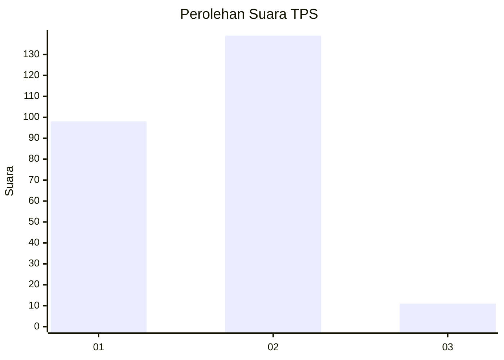
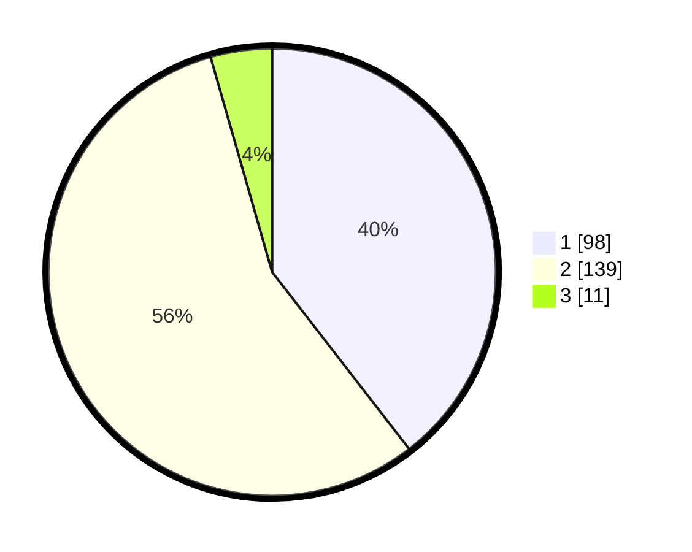

# Hasil

## Grafik

## Tabel

| No. | Nama Paslon    | Suara | Suara (raw) | Persentase |
|:--- |:-------------- | -----:| -----------:| ----------:|
| 1   | ANIES MUHAIMIN | 98    | [98][p-1]   | 39,52      |
| 2   | PRABOWO GIBRAN | 139   | [139][p-2]  | 56,05      |
| 3   | GANJAR MAHFUD  | 11    | [11][p-3]   | 4,44       |

[p-1]: https://github.com/gigit-pemilu/pemilu-2024/blob/main/pilpres/hitung-suara/sub/36-banten/sub/04-serang/sub/24-pamarayan/sub/2001-pamarayan/sub/003-tps/sub/paslon-1.txt
[p-2]: https://github.com/gigit-pemilu/pemilu-2024/blob/main/pilpres/hitung-suara/sub/36-banten/sub/04-serang/sub/24-pamarayan/sub/2001-pamarayan/sub/003-tps/sub/paslon-2.txt
[p-3]: https://github.com/gigit-pemilu/pemilu-2024/blob/main/pilpres/hitung-suara/sub/36-banten/sub/04-serang/sub/24-pamarayan/sub/2001-pamarayan/sub/003-tps/sub/paslon-3.txt

## Foto C Plano

https://sirekap-obj-formc.kpu.go.id/fa89/pemilu/ppwp/36/04/24/20/01/3604242001003-20240218-112129--f33f499d-2685-4782-ab49-eb8a1bb53554.jpg

https://sirekap-obj-formc.kpu.go.id/fa89/pemilu/ppwp/36/04/24/20/01/3604242001003-20240218-112419--a41d0136-baf5-455d-b15c-e9cf60d91037.jpg

https://sirekap-obj-formc.kpu.go.id/fa89/pemilu/ppwp/36/04/24/20/01/3604242001003-20240218-112325--f469e16d-282a-4c0e-8baf-b52a4b07e64b.jpg

## Metadata

| Key        | Value               |
| ---------- | ------------------- |
| Time Stamp | 2024-02-21 11:00:00 |

## DATA PEMILIH TETAP

Jumlah pemilih dalam DPT: **299**.
 * L: **894**.
 * P: **655**.

## DATA PENGGUNA HAK PILIH

Jumlah pengguna hak pilih dalam DPT: **256**.
 * L: **15**.
 * P: **636**.

Jumlah pengguna hak pilih dalam DPTb: **8**.
 * L: **888**.
 * P: **880**.

Jumlah pengguna hak pilih dalam DPK: **2**.
 * L: **886**.
 * P: **886**.

Jumlah pengguna hak pilih: **253**.
 * L: **647**.
 * P: **638**.

## JUMLAH SUARA SAH DAN TIDAK SAH

JUMLAH SELURUH SUARA SAH: **248**.

JUMLAH SUARA TIDAK SAH: **5**.

JUMLAH SELURUH SUARA SAH DAN SUARA TIDAK SAH: **253**.

