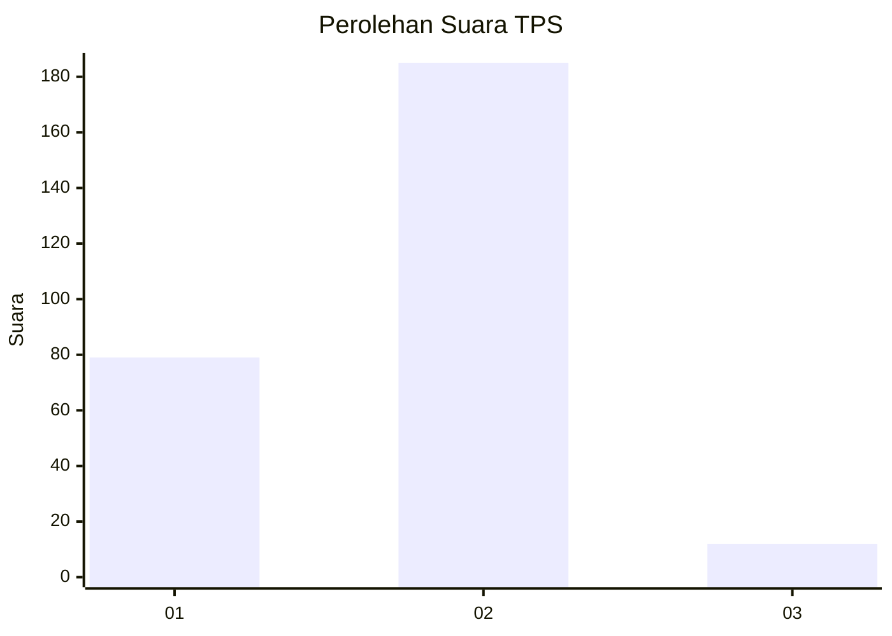
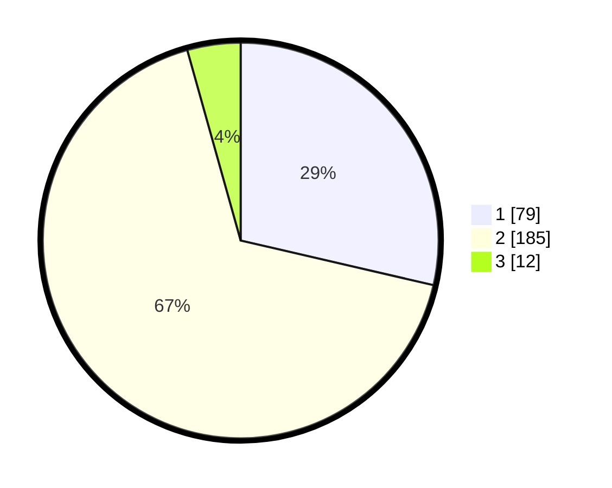

# Hasil

## Grafik

## Tabel

| No. | Nama Paslon    | Suara | Suara (raw) | Persentase |
|:--- |:-------------- | -----:| -----------:| ----------:|
| 1   | ANIES MUHAIMIN | 79    | [79][p-1]   | 28,62      |
| 2   | PRABOWO GIBRAN | 185   | [185][p-2]  | 67,03      |
| 3   | GANJAR MAHFUD  | 12    | [12][p-3]   | 4,35       |

[p-1]: https://github.com/gigit-pemilu/pemilu-2024/blob/main/pilpres/hitung-suara/sub/36-banten/sub/04-serang/sub/27-ciomas/sub/2001-ujungtebu/sub/010-tps/sub/paslon-1.txt
[p-2]: https://github.com/gigit-pemilu/pemilu-2024/blob/main/pilpres/hitung-suara/sub/36-banten/sub/04-serang/sub/27-ciomas/sub/2001-ujungtebu/sub/010-tps/sub/paslon-2.txt
[p-3]: https://github.com/gigit-pemilu/pemilu-2024/blob/main/pilpres/hitung-suara/sub/36-banten/sub/04-serang/sub/27-ciomas/sub/2001-ujungtebu/sub/010-tps/sub/paslon-3.txt

## Foto C Plano

https://sirekap-obj-formc.kpu.go.id/bc6c/pemilu/ppwp/36/04/27/20/01/3604272001010-20240214-225748--81439c7a-7cd8-4ccd-bbb5-2fd98a8f3187.jpg

https://sirekap-obj-formc.kpu.go.id/bc6c/pemilu/ppwp/36/04/27/20/01/3604272001010-20240216-144451--aa01a848-11ef-4097-9ea6-909cfd03af47.jpg

https://sirekap-obj-formc.kpu.go.id/bc6c/pemilu/ppwp/36/04/27/20/01/3604272001010-20240214-230432--2a63d3d8-631c-4d92-836b-cc35a7b3eabc.jpg

## Metadata

| Key        | Value               |
| ---------- | ------------------- |
| Time Stamp | 2024-02-16 22:01:00 |

