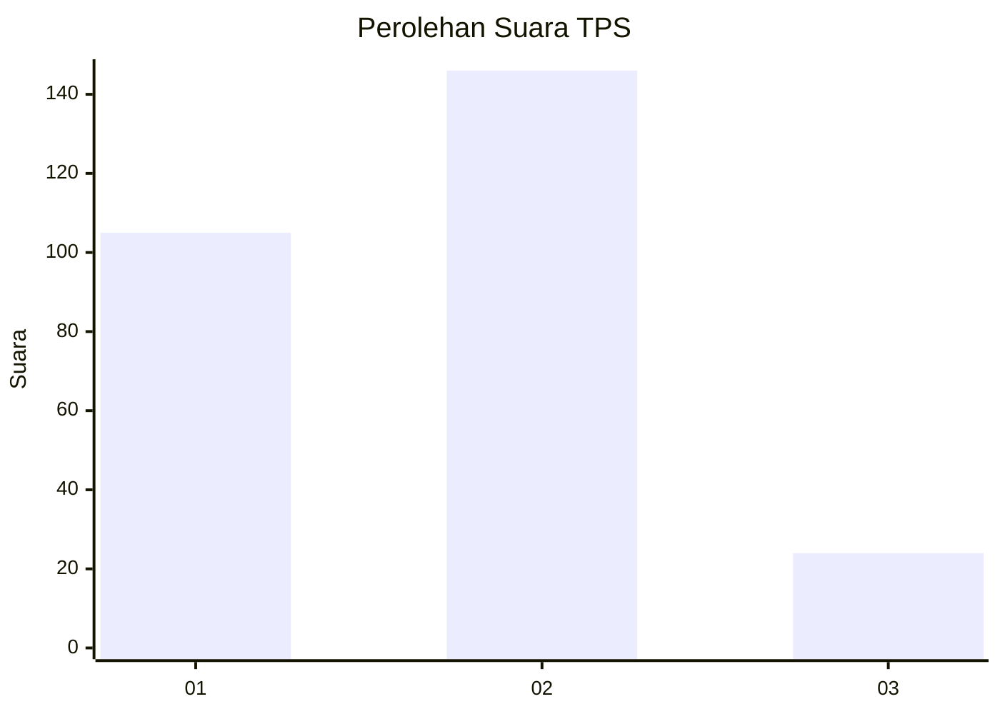
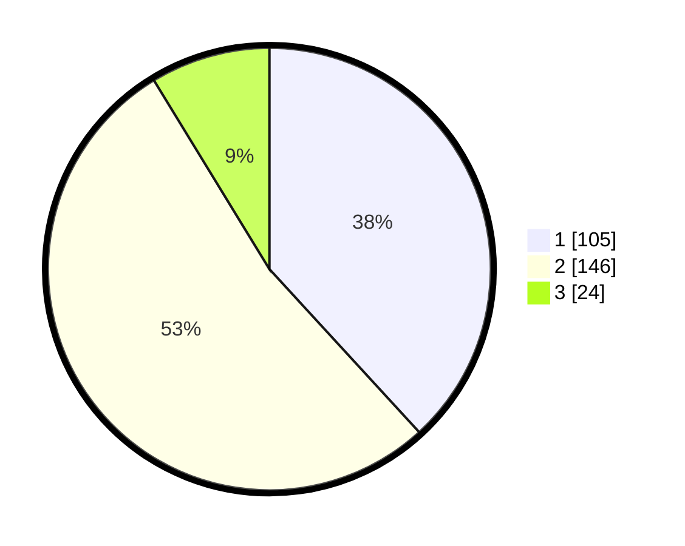

# Hasil

## Grafik

## Tabel

| No. | Nama Paslon    | Suara | Suara (raw) | Persentase |
|:--- |:-------------- | -----:| -----------:| ----------:|
| 1   | ANIES MUHAIMIN | 105   | [105][p-1]  | 38,18      |
| 2   | PRABOWO GIBRAN | 146   | [146][p-2]  | 53,09      |
| 3   | GANJAR MAHFUD  | 24    | [24][p-3]   | 8,73       |

[p-1]: https://github.com/gigit-pemilu/pemilu-2024/blob/main/pilpres/hitung-suara/sub/36-banten/sub/04-serang/sub/27-ciomas/sub/2006-sukarena/sub/001-tps/sub/paslon-1.txt
[p-2]: https://github.com/gigit-pemilu/pemilu-2024/blob/main/pilpres/hitung-suara/sub/36-banten/sub/04-serang/sub/27-ciomas/sub/2006-sukarena/sub/001-tps/sub/paslon-2.txt
[p-3]: https://github.com/gigit-pemilu/pemilu-2024/blob/main/pilpres/hitung-suara/sub/36-banten/sub/04-serang/sub/27-ciomas/sub/2006-sukarena/sub/001-tps/sub/paslon-3.txt

## Foto C Plano

https://sirekap-obj-formc.kpu.go.id/6cca/pemilu/ppwp/36/04/27/20/06/3604272006001-20240223-093838--a8df573d-1533-4550-a43a-7e7ae1ba79a2.jpg

https://sirekap-obj-formc.kpu.go.id/6cca/pemilu/ppwp/36/04/27/20/06/3604272006001-20240223-094143--424ea55a-2f57-4809-8dd8-891b425983c0.jpg

https://sirekap-obj-formc.kpu.go.id/6cca/pemilu/ppwp/36/04/27/20/06/3604272006001-20240223-094301--22782637-79c8-4694-86aa-c24a854b80c2.jpg

## Metadata

| Key        | Value               |
| ---------- | ------------------- |
| Time Stamp | 2024-02-25 16:00:00 |

