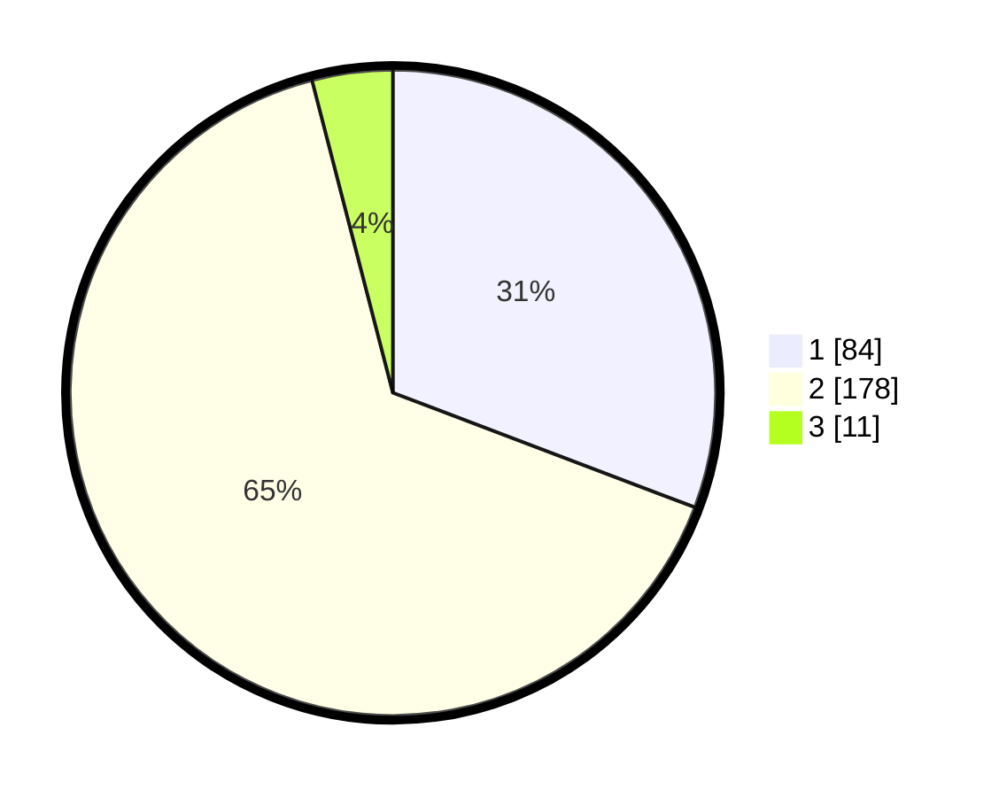

# Hasil

## Grafik

## Tabel

| No. | Nama Paslon    | Suara | Suara (raw) | Persentase |
|:--- |:-------------- | -----:| -----------:| ----------:|
| 1   | ANIES MUHAIMIN | 84    | [84][p-1]   | 30,77      |
| 2   | PRABOWO GIBRAN | 178   | [178][p-2]  | 65,20      |
| 3   | GANJAR MAHFUD  | 11    | [11][p-3]   | 4,03       |

[p-1]: https://github.com/gigit-pemilu/pemilu-2024-36-banten/blob/main/pilpres/hitung-suara/sub/36-banten/sub/04-serang/sub/27-ciomas/sub/2007-sukadana/sub/003-tps/sub/paslon-1.txt
[p-2]: https://github.com/gigit-pemilu/pemilu-2024-36-banten/blob/main/pilpres/hitung-suara/sub/36-banten/sub/04-serang/sub/27-ciomas/sub/2007-sukadana/sub/003-tps/sub/paslon-2.txt
[p-3]: https://github.com/gigit-pemilu/pemilu-2024-36-banten/blob/main/pilpres/hitung-suara/sub/36-banten/sub/04-serang/sub/27-ciomas/sub/2007-sukadana/sub/003-tps/sub/paslon-3.txt

## Foto C Plano

https://sirekap-obj-formc.kpu.go.id/dd97/pemilu/ppwp/36/04/27/20/07/3604272007003-20240215-093155--21ba354a-71bd-416b-83aa-7486fb4806f8.jpg

https://sirekap-obj-formc.kpu.go.id/dd97/pemilu/ppwp/36/04/27/20/07/3604272007003-20240214-155815--a7e9ad07-31c9-4707-be93-176c90e9acd3.jpg

https://sirekap-obj-formc.kpu.go.id/dd97/pemilu/ppwp/36/04/27/20/07/3604272007003-20240214-155642--dfca6514-71d9-4d45-8e60-e9a047d90ecb.jpg

## Metadata

| Key        | Value               |
| ---------- | ------------------- |
| Time Stamp | 2024-02-15 15:00:29 |

