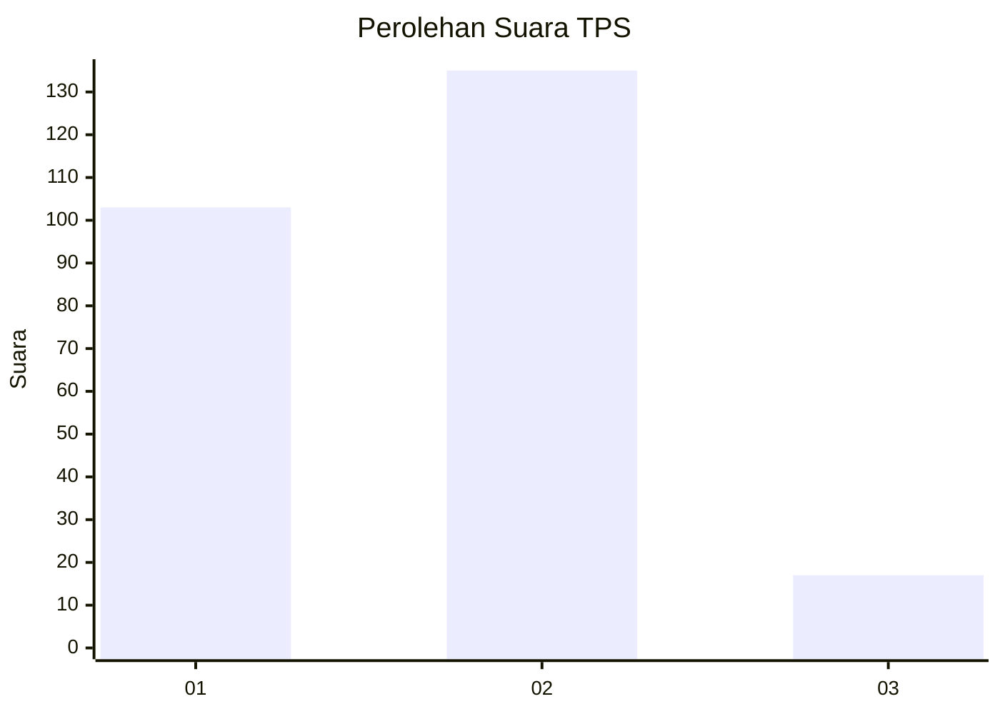

# Hasil

## Grafik

## Tabel

| No. | Nama Paslon    | Suara | Suara (raw) | Persentase |
|:--- |:-------------- | -----:| -----------:| ----------:|
| 1   | ANIES MUHAIMIN | 103   | [103][p-1]  | 40,39      |
| 2   | PRABOWO GIBRAN | 135   | [135][p-2]  | 52,94      |
| 3   | GANJAR MAHFUD  | 17    | [17][p-3]   | 6,67       |

[p-1]: https://github.com/gigit-pemilu/pemilu-2024/blob/main/pilpres/hitung-suara/sub/36-banten/sub/04-serang/sub/28-pabuaran/sub/2001-pabuaran/sub/002-tps/sub/paslon-1.txt
[p-2]: https://github.com/gigit-pemilu/pemilu-2024/blob/main/pilpres/hitung-suara/sub/36-banten/sub/04-serang/sub/28-pabuaran/sub/2001-pabuaran/sub/002-tps/sub/paslon-2.txt
[p-3]: https://github.com/gigit-pemilu/pemilu-2024/blob/main/pilpres/hitung-suara/sub/36-banten/sub/04-serang/sub/28-pabuaran/sub/2001-pabuaran/sub/002-tps/sub/paslon-3.txt

## Foto C Plano

https://sirekap-obj-formc.kpu.go.id/df50/pemilu/ppwp/36/04/28/20/01/3604282001002-20240215-072415--a78718ed-a679-4d65-8285-090094676b77.jpg

https://sirekap-obj-formc.kpu.go.id/df50/pemilu/ppwp/36/04/28/20/01/3604282001002-20240215-072659--73ef5611-6ee3-4425-ae04-e917e4bc16ae.jpg

https://sirekap-obj-formc.kpu.go.id/df50/pemilu/ppwp/36/04/28/20/01/3604282001002-20240215-072754--3d5b68f9-f831-4751-ac82-e05ce128ac93.jpg

## Metadata

| Key        | Value               |
| ---------- | ------------------- |
| Time Stamp | 2024-02-15 23:29:50 |

