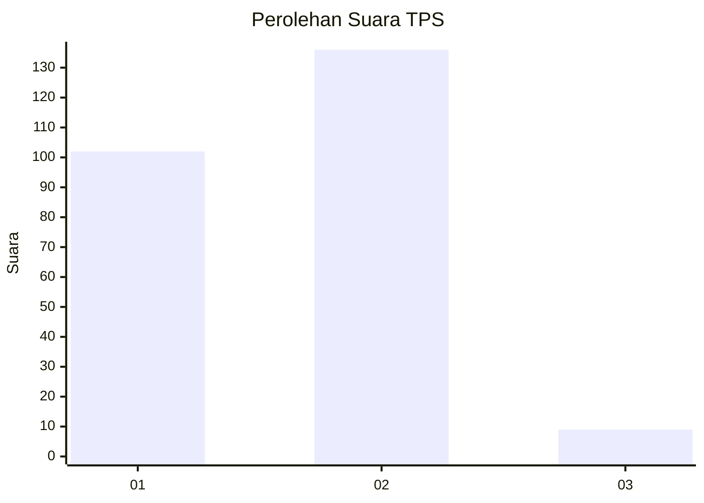
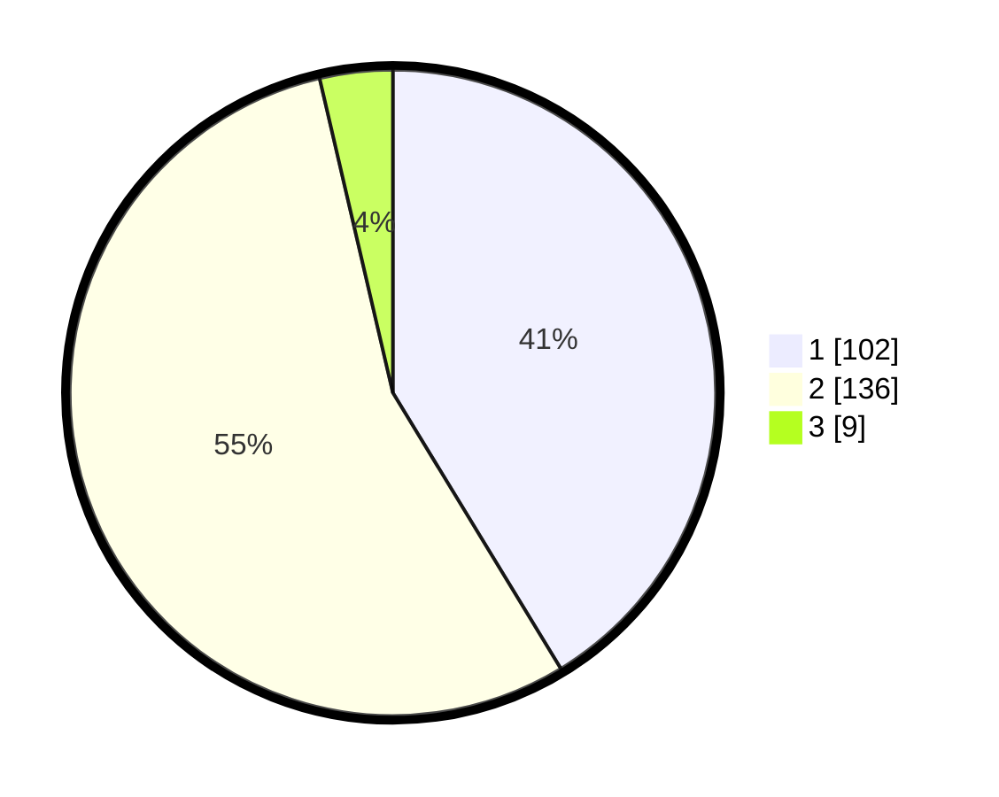

# Hasil

## Grafik

## Tabel

| No. | Nama Paslon    | Suara | Suara (raw) | Persentase |
|:--- |:-------------- | -----:| -----------:| ----------:|
| 1   | ANIES MUHAIMIN | 102   | [102][p-1]  | 41,30      |
| 2   | PRABOWO GIBRAN | 136   | [136][p-2]  | 55,06      |
| 3   | GANJAR MAHFUD  | 9     | [9][p-3]    | 3,64       |

[p-1]: https://github.com/gigit-pemilu/pemilu-2024/blob/main/pilpres/hitung-suara/sub/36-banten/sub/04-serang/sub/28-pabuaran/sub/2001-pabuaran/sub/003-tps/sub/paslon-1.txt
[p-2]: https://github.com/gigit-pemilu/pemilu-2024/blob/main/pilpres/hitung-suara/sub/36-banten/sub/04-serang/sub/28-pabuaran/sub/2001-pabuaran/sub/003-tps/sub/paslon-2.txt
[p-3]: https://github.com/gigit-pemilu/pemilu-2024/blob/main/pilpres/hitung-suara/sub/36-banten/sub/04-serang/sub/28-pabuaran/sub/2001-pabuaran/sub/003-tps/sub/paslon-3.txt

## Foto C Plano

https://sirekap-obj-formc.kpu.go.id/eccc/pemilu/ppwp/36/04/28/20/01/3604282001003-20240223-010235--a1456991-1238-4452-9545-93893b467f16.jpg

https://sirekap-obj-formc.kpu.go.id/eccc/pemilu/ppwp/36/04/28/20/01/3604282001003-20240215-073548--91d98c27-c79c-486c-ac15-1dc2b5ad4cf9.jpg

https://sirekap-obj-formc.kpu.go.id/eccc/pemilu/ppwp/36/04/28/20/01/3604282001003-20240215-073734--1e63b75a-4a0c-4e51-aa84-a59ca2f23203.jpg

## Metadata

| Key        | Value               |
| ---------- | ------------------- |
| Time Stamp | 2024-02-24 22:31:28 |

