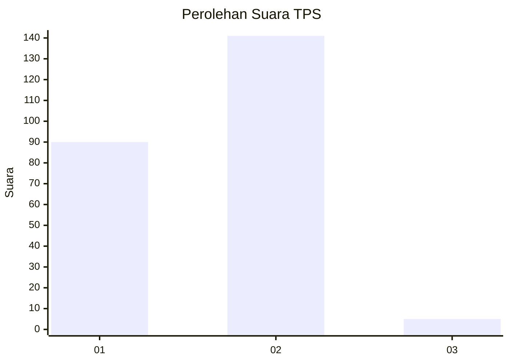
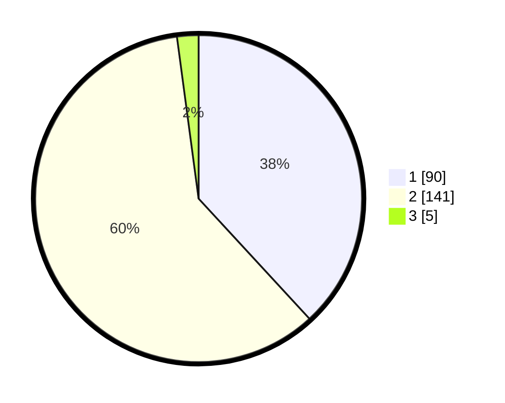

# Hasil

## Grafik

## Tabel

| No. | Nama Paslon    | Suara | Suara (raw) | Persentase |
|:--- |:-------------- | -----:| -----------:| ----------:|
| 1   | ANIES MUHAIMIN | 90    | [90][p-1]   | 38,14      |
| 2   | PRABOWO GIBRAN | 141   | [141][p-2]  | 59,75      |
| 3   | GANJAR MAHFUD  | 5     | [5][p-3]    | 2,12       |

[p-1]: https://github.com/gigit-pemilu/pemilu-2024/blob/main/pilpres/hitung-suara/sub/36-banten/sub/04-serang/sub/28-pabuaran/sub/2001-pabuaran/sub/004-tps/sub/paslon-1.txt
[p-2]: https://github.com/gigit-pemilu/pemilu-2024/blob/main/pilpres/hitung-suara/sub/36-banten/sub/04-serang/sub/28-pabuaran/sub/2001-pabuaran/sub/004-tps/sub/paslon-2.txt
[p-3]: https://github.com/gigit-pemilu/pemilu-2024/blob/main/pilpres/hitung-suara/sub/36-banten/sub/04-serang/sub/28-pabuaran/sub/2001-pabuaran/sub/004-tps/sub/paslon-3.txt

## Foto C Plano

https://sirekap-obj-formc.kpu.go.id/250c/pemilu/ppwp/36/04/28/20/01/3604282001004-20240216-140755--aeb7116f-7d4b-4b05-93cc-59f7dbf8073f.jpg

https://sirekap-obj-formc.kpu.go.id/250c/pemilu/ppwp/36/04/28/20/01/3604282001004-20240215-163408--46e6f625-384e-47aa-b2c4-726d782fcea6.jpg

https://sirekap-obj-formc.kpu.go.id/250c/pemilu/ppwp/36/04/28/20/01/3604282001004-20240215-025358--a552e15b-74b3-48b0-b004-99086bbac7f8.jpg

## Metadata

| Key        | Value               |
| ---------- | ------------------- |
| Time Stamp | 2024-02-16 14:30:33 |

