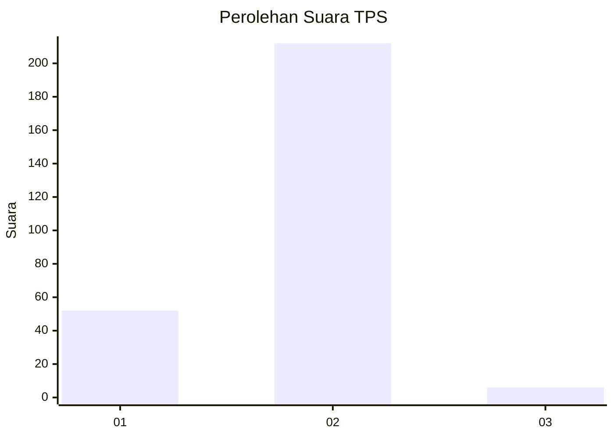
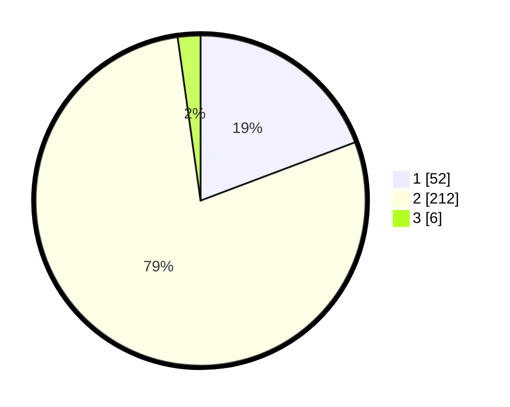

# Hasil

## Grafik

## Tabel

| No. | Nama Paslon    | Suara | Suara (raw) | Persentase |
|:--- |:-------------- | -----:| -----------:| ----------:|
| 1   | ANIES MUHAIMIN | 52    | [52][p-1]   | 19,26      |
| 2   | PRABOWO GIBRAN | 212   | [212][p-2]  | 78,52      |
| 3   | GANJAR MAHFUD  | 6     | [6][p-3]    | 2,22       |

[p-1]: https://github.com/gigit-pemilu/pemilu-2024/blob/main/pilpres/hitung-suara/sub/36-banten/sub/04-serang/sub/28-pabuaran/sub/2001-pabuaran/sub/017-tps/sub/paslon-1.txt
[p-2]: https://github.com/gigit-pemilu/pemilu-2024/blob/main/pilpres/hitung-suara/sub/36-banten/sub/04-serang/sub/28-pabuaran/sub/2001-pabuaran/sub/017-tps/sub/paslon-2.txt
[p-3]: https://github.com/gigit-pemilu/pemilu-2024/blob/main/pilpres/hitung-suara/sub/36-banten/sub/04-serang/sub/28-pabuaran/sub/2001-pabuaran/sub/017-tps/sub/paslon-3.txt

## Foto C Plano

https://sirekap-obj-formc.kpu.go.id/a18d/pemilu/ppwp/36/04/28/20/01/3604282001017-20240215-060734--373fcb1c-fcc0-463c-9e58-150a4aa42c5f.jpg

https://sirekap-obj-formc.kpu.go.id/a18d/pemilu/ppwp/36/04/28/20/01/3604282001017-20240215-060842--3fecb752-65d6-4e2d-b52b-3d0848cd20b9.jpg

https://sirekap-obj-formc.kpu.go.id/a18d/pemilu/ppwp/36/04/28/20/01/3604282001017-20240215-061024--9d922473-f706-4f00-ad58-34a08b7d02a5.jpg

## Metadata

| Key        | Value               |
| ---------- | ------------------- |
| Time Stamp | 2024-02-16 00:00:26 |

