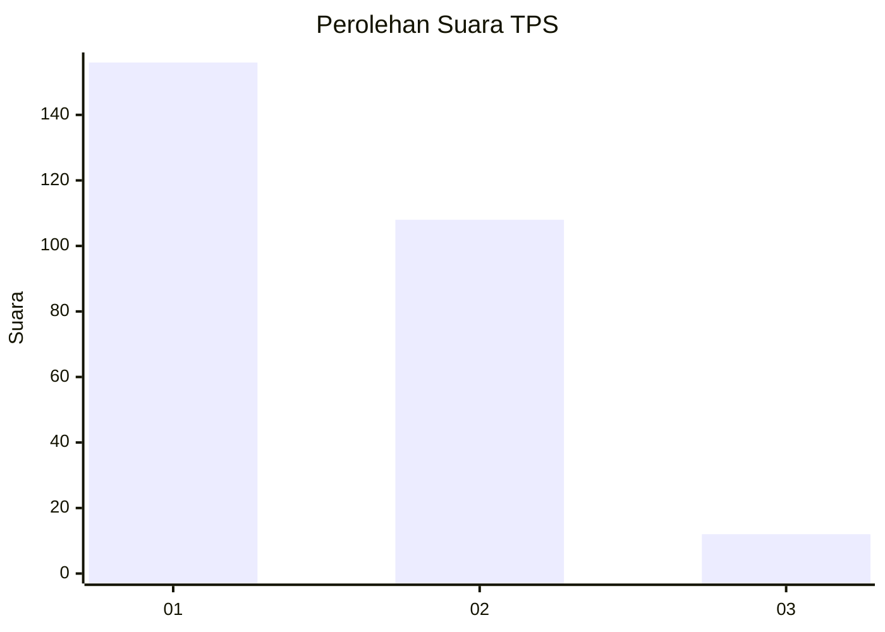
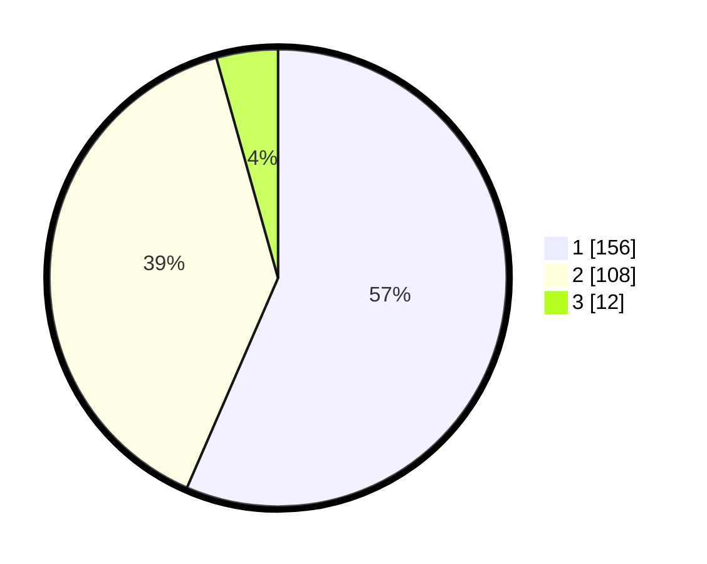

# Hasil

## Grafik

## Tabel

| No. | Nama Paslon    | Suara | Suara (raw) | Persentase |
|:--- |:-------------- | -----:| -----------:| ----------:|
| 1   | ANIES MUHAIMIN | 156   | [156][p-1]  | 56,52      |
| 2   | PRABOWO GIBRAN | 108   | [108][p-2]  | 39,13      |
| 3   | GANJAR MAHFUD  | 12    | [12][p-3]   | 4,35       |

[p-1]: https://github.com/gigit-pemilu/pemilu-2024/blob/main/pilpres/hitung-suara/sub/36-banten/sub/04-serang/sub/28-pabuaran/sub/2010-sindangsari/sub/008-tps/sub/paslon-1.txt
[p-2]: https://github.com/gigit-pemilu/pemilu-2024/blob/main/pilpres/hitung-suara/sub/36-banten/sub/04-serang/sub/28-pabuaran/sub/2010-sindangsari/sub/008-tps/sub/paslon-2.txt
[p-3]: https://github.com/gigit-pemilu/pemilu-2024/blob/main/pilpres/hitung-suara/sub/36-banten/sub/04-serang/sub/28-pabuaran/sub/2010-sindangsari/sub/008-tps/sub/paslon-3.txt

## Foto C Plano

https://sirekap-obj-formc.kpu.go.id/8537/pemilu/ppwp/36/04/28/20/10/3604282010008-20240215-092330--609779c6-9799-4f3c-88a3-cd0d84651cd2.jpg

https://sirekap-obj-formc.kpu.go.id/8537/pemilu/ppwp/36/04/28/20/10/3604282010008-20240215-092552--8268a30b-8706-418b-b08e-1ff809be54a8.jpg

https://sirekap-obj-formc.kpu.go.id/8537/pemilu/ppwp/36/04/28/20/10/3604282010008-20240215-092807--d1d62de5-3a1e-41e6-9f14-fe737b18d3e5.jpg

## Metadata

| Key        | Value               |
| ---------- | ------------------- |
| Time Stamp | 2024-02-16 22:01:00 |

