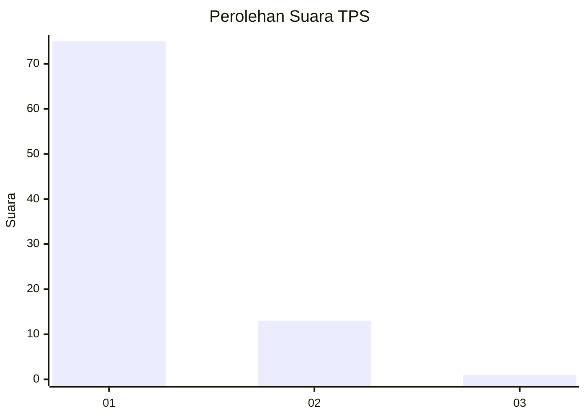
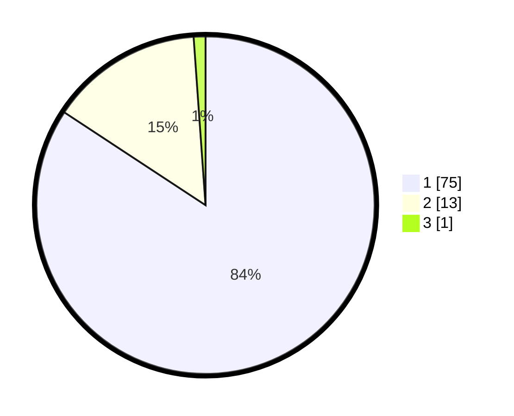

# Hasil

## Grafik

## Tabel

| No. | Nama Paslon    | Suara | Suara (raw) | Persentase |
|:--- |:-------------- | -----:| -----------:| ----------:|
| 1   | ANIES MUHAIMIN | 75    | [75][p-1]   | 84,27      |
| 2   | PRABOWO GIBRAN | 13    | [13][p-2]   | 14,61      |
| 3   | GANJAR MAHFUD  | 1     | [1][p-3]    | 1,12       |

[p-1]: https://github.com/gigit-pemilu/pemilu-2024/blob/main/pilpres/hitung-suara/sub/36-banten/sub/04-serang/sub/28-pabuaran/sub/2012-sindangheula/sub/901-tps/sub/paslon-1.txt
[p-2]: https://github.com/gigit-pemilu/pemilu-2024/blob/main/pilpres/hitung-suara/sub/36-banten/sub/04-serang/sub/28-pabuaran/sub/2012-sindangheula/sub/901-tps/sub/paslon-2.txt
[p-3]: https://github.com/gigit-pemilu/pemilu-2024/blob/main/pilpres/hitung-suara/sub/36-banten/sub/04-serang/sub/28-pabuaran/sub/2012-sindangheula/sub/901-tps/sub/paslon-3.txt

## Foto C Plano

https://sirekap-obj-formc.kpu.go.id/0f0f/pemilu/ppwp/36/04/28/20/12/3604282012901-20240214-214016--4dbcdf60-115e-4632-9317-89e61b64ebda.jpg

https://sirekap-obj-formc.kpu.go.id/0f0f/pemilu/ppwp/36/04/28/20/12/3604282012901-20240214-214212--48062b2a-db16-4bd5-886f-d420a8da8416.jpg

https://sirekap-obj-formc.kpu.go.id/0f0f/pemilu/ppwp/36/04/28/20/12/3604282012901-20240214-214229--ca989a69-53d2-457d-90b5-451b96bf5df3.jpg

## Metadata

| Key        | Value               |
| ---------- | ------------------- |
| Time Stamp | 2024-02-15 15:00:29 |

