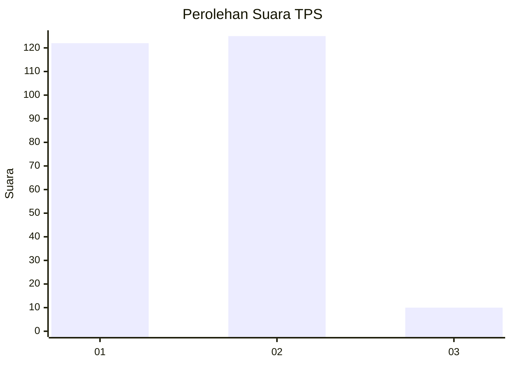
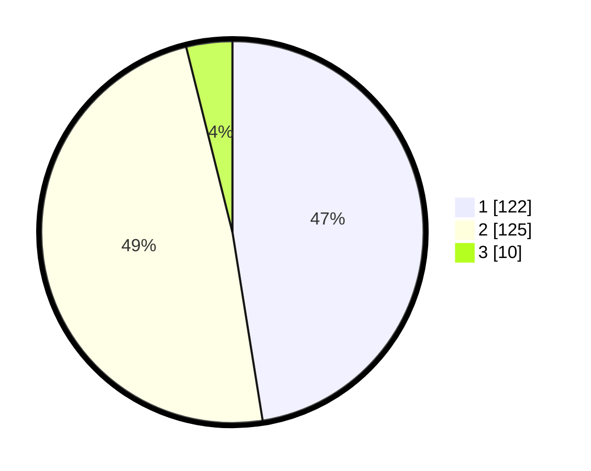

# Hasil

## Grafik

## Tabel

| No. | Nama Paslon    | Suara | Suara (raw) | Persentase |
|:--- |:-------------- | -----:| -----------:| ----------:|
| 1   | ANIES MUHAIMIN | 122   | [122][p-1]  | 47,47      |
| 2   | PRABOWO GIBRAN | 125   | [125][p-2]  | 48,64      |
| 3   | GANJAR MAHFUD  | 10    | [10][p-3]   | 3,89       |

[p-1]: https://github.com/gigit-pemilu/pemilu-2024/blob/main/pilpres/hitung-suara/sub/36-banten/sub/04-serang/sub/30-anyar/sub/2002-sindang-mandi/sub/003-tps/sub/paslon-1.txt
[p-2]: https://github.com/gigit-pemilu/pemilu-2024/blob/main/pilpres/hitung-suara/sub/36-banten/sub/04-serang/sub/30-anyar/sub/2002-sindang-mandi/sub/003-tps/sub/paslon-2.txt
[p-3]: https://github.com/gigit-pemilu/pemilu-2024/blob/main/pilpres/hitung-suara/sub/36-banten/sub/04-serang/sub/30-anyar/sub/2002-sindang-mandi/sub/003-tps/sub/paslon-3.txt

## Foto C Plano

https://sirekap-obj-formc.kpu.go.id/5e60/pemilu/ppwp/36/04/30/20/02/3604302002003-20240215-001829--72889943-1612-4f69-ac72-74388daabc32.jpg

https://sirekap-obj-formc.kpu.go.id/5e60/pemilu/ppwp/36/04/30/20/02/3604302002003-20240215-002248--f6c9864d-cf03-4e4d-9105-fc38516ffdc0.jpg

https://sirekap-obj-formc.kpu.go.id/5e60/pemilu/ppwp/36/04/30/20/02/3604302002003-20240215-002517--be61b063-13f7-4237-89fb-9d376c048613.jpg

## Metadata

| Key        | Value               |
| ---------- | ------------------- |
| Time Stamp | 2024-02-16 00:30:27 |

