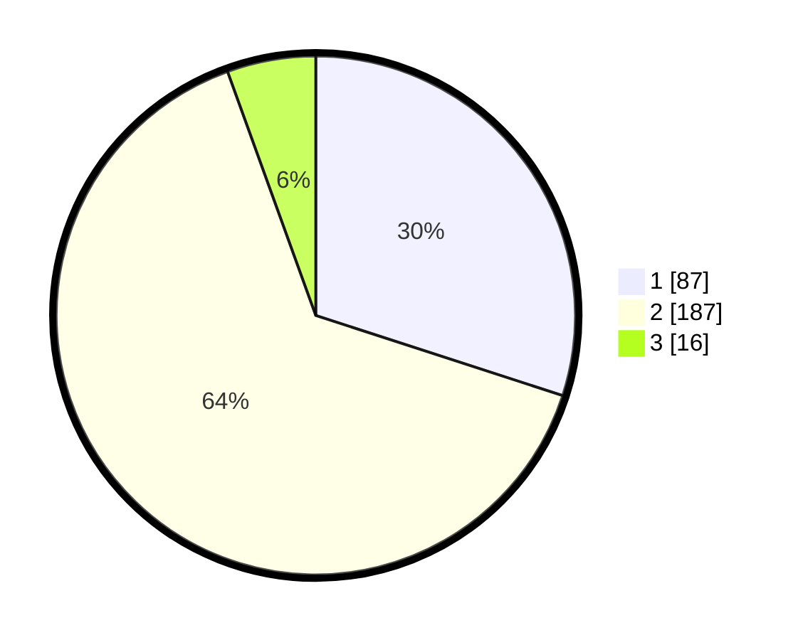

# Hasil

## Grafik

## Tabel

| No. | Nama Paslon    | Suara | Suara (raw) | Persentase |
|:--- |:-------------- | -----:| -----------:| ----------:|
| 1   | ANIES MUHAIMIN | 87    | [87][p-1]   | 30,00      |
| 2   | PRABOWO GIBRAN | 187   | [187][p-2]  | 64,48      |
| 3   | GANJAR MAHFUD  | 16    | [16][p-3]   | 5,52       |

[p-1]: https://github.com/gigit-pemilu/pemilu-2024/blob/main/pilpres/hitung-suara/sub/36-banten/sub/04-serang/sub/30-anyar/sub/2005-bandulu/sub/005-tps/sub/paslon-1.txt
[p-2]: https://github.com/gigit-pemilu/pemilu-2024/blob/main/pilpres/hitung-suara/sub/36-banten/sub/04-serang/sub/30-anyar/sub/2005-bandulu/sub/005-tps/sub/paslon-2.txt
[p-3]: https://github.com/gigit-pemilu/pemilu-2024/blob/main/pilpres/hitung-suara/sub/36-banten/sub/04-serang/sub/30-anyar/sub/2005-bandulu/sub/005-tps/sub/paslon-3.txt

## Foto C Plano

https://sirekap-obj-formc.kpu.go.id/dced/pemilu/ppwp/36/04/30/20/05/3604302005005-20240215-011127--fe85c2fa-3760-496a-9c0e-917f14a37526.jpg

https://sirekap-obj-formc.kpu.go.id/dced/pemilu/ppwp/36/04/30/20/05/3604302005005-20240215-011011--7373bca7-ecaa-44d2-9cd2-6fe6b098eed5.jpg

https://sirekap-obj-formc.kpu.go.id/dced/pemilu/ppwp/36/04/30/20/05/3604302005005-20240215-011340--8a527764-3ead-46e6-b949-67ce2ea43502.jpg

## Metadata

| Key        | Value               |
| ---------- | ------------------- |
| Time Stamp | 2024-02-16 22:01:00 |

