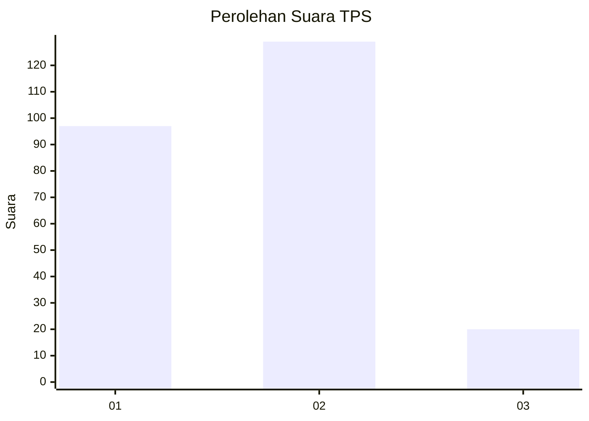
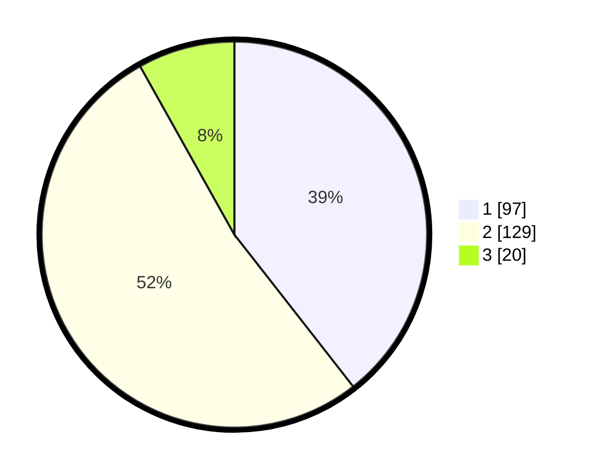

# Hasil

## Grafik

## Tabel

| No. | Nama Paslon    | Suara | Suara (raw) | Persentase |
|:--- |:-------------- | -----:| -----------:| ----------:|
| 1   | ANIES MUHAIMIN | 97    | [97][p-1]   | 39,43      |
| 2   | PRABOWO GIBRAN | 129   | [129][p-2]  | 52,44      |
| 3   | GANJAR MAHFUD  | 20    | [20][p-3]   | 8,13       |

[p-1]: https://github.com/gigit-pemilu/pemilu-2024-36-banten/blob/main/pilpres/hitung-suara/sub/36-banten/sub/04-serang/sub/31-cinangka/sub/2001-cinangka/sub/001-tps/sub/paslon-1.txt
[p-2]: https://github.com/gigit-pemilu/pemilu-2024-36-banten/blob/main/pilpres/hitung-suara/sub/36-banten/sub/04-serang/sub/31-cinangka/sub/2001-cinangka/sub/001-tps/sub/paslon-2.txt
[p-3]: https://github.com/gigit-pemilu/pemilu-2024-36-banten/blob/main/pilpres/hitung-suara/sub/36-banten/sub/04-serang/sub/31-cinangka/sub/2001-cinangka/sub/001-tps/sub/paslon-3.txt

## Foto C Plano

https://sirekap-obj-formc.kpu.go.id/1dfe/pemilu/ppwp/36/04/31/20/01/3604312001001-20240214-225430--f6b72c1f-679f-436a-aaa6-31eb14cf6673.jpg

https://sirekap-obj-formc.kpu.go.id/1dfe/pemilu/ppwp/36/04/31/20/01/3604312001001-20240214-225444--1b995bd3-f0c3-4af9-9753-8df3ebd05783.jpg

https://sirekap-obj-formc.kpu.go.id/1dfe/pemilu/ppwp/36/04/31/20/01/3604312001001-20240214-225500--6c3388a6-bf9c-4384-b8d6-cbe6ed055874.jpg

## Metadata

| Key        | Value               |
| ---------- | ------------------- |
| Time Stamp | 2024-02-15 21:30:27 |

