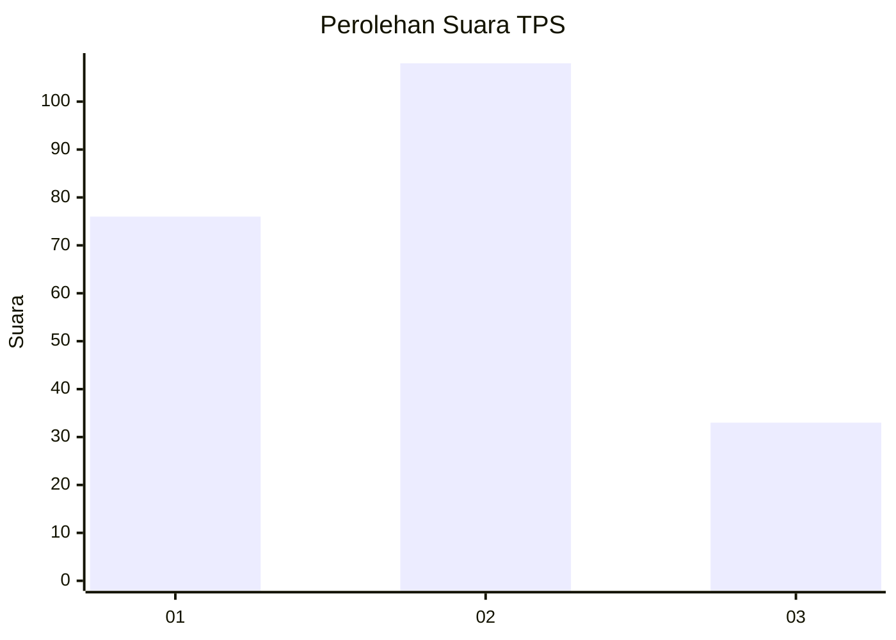
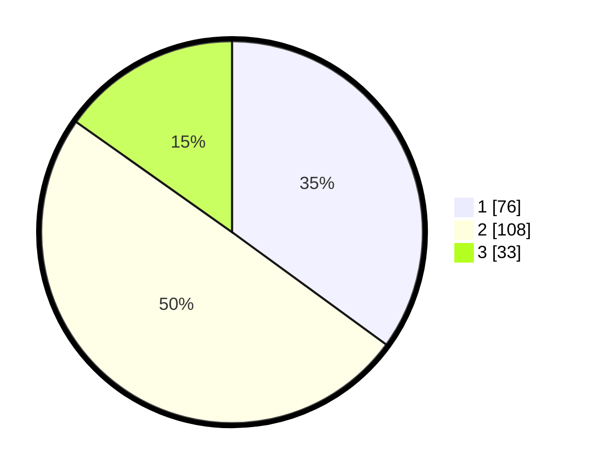

# Hasil

## Grafik

## Tabel

| No. | Nama Paslon    | Suara | Suara (raw) | Persentase |
|:--- |:-------------- | -----:| -----------:| ----------:|
| 1   | ANIES MUHAIMIN | 76    | [76][p-1]   | 35,02      |
| 2   | PRABOWO GIBRAN | 108   | [108][p-2]  | 49,77      |
| 3   | GANJAR MAHFUD  | 33    | [33][p-3]   | 15,21      |

[p-1]: https://github.com/gigit-pemilu/pemilu-2024/blob/main/pilpres/hitung-suara/sub/36-banten/sub/04-serang/sub/31-cinangka/sub/2001-cinangka/sub/004-tps/sub/paslon-1.txt
[p-2]: https://github.com/gigit-pemilu/pemilu-2024/blob/main/pilpres/hitung-suara/sub/36-banten/sub/04-serang/sub/31-cinangka/sub/2001-cinangka/sub/004-tps/sub/paslon-2.txt
[p-3]: https://github.com/gigit-pemilu/pemilu-2024/blob/main/pilpres/hitung-suara/sub/36-banten/sub/04-serang/sub/31-cinangka/sub/2001-cinangka/sub/004-tps/sub/paslon-3.txt

## Foto C Plano

https://sirekap-obj-formc.kpu.go.id/9f85/pemilu/ppwp/36/04/31/20/01/3604312001004-20240224-184414--02470dc4-ed4b-422a-9a1d-db2bb192ff7e.jpg

https://sirekap-obj-formc.kpu.go.id/9f85/pemilu/ppwp/36/04/31/20/01/3604312001004-20240226-103458--edfcaac0-d700-45b8-b4ac-f29aa64e9f6c.jpg

https://sirekap-obj-formc.kpu.go.id/9f85/pemilu/ppwp/36/04/31/20/01/3604312001004-20240226-103836--9afee011-ce5c-473b-bf80-6b66de9a9739.jpg

## Metadata

| Key        | Value               |
| ---------- | ------------------- |
| Time Stamp | 2024-02-28 21:00:00 |

