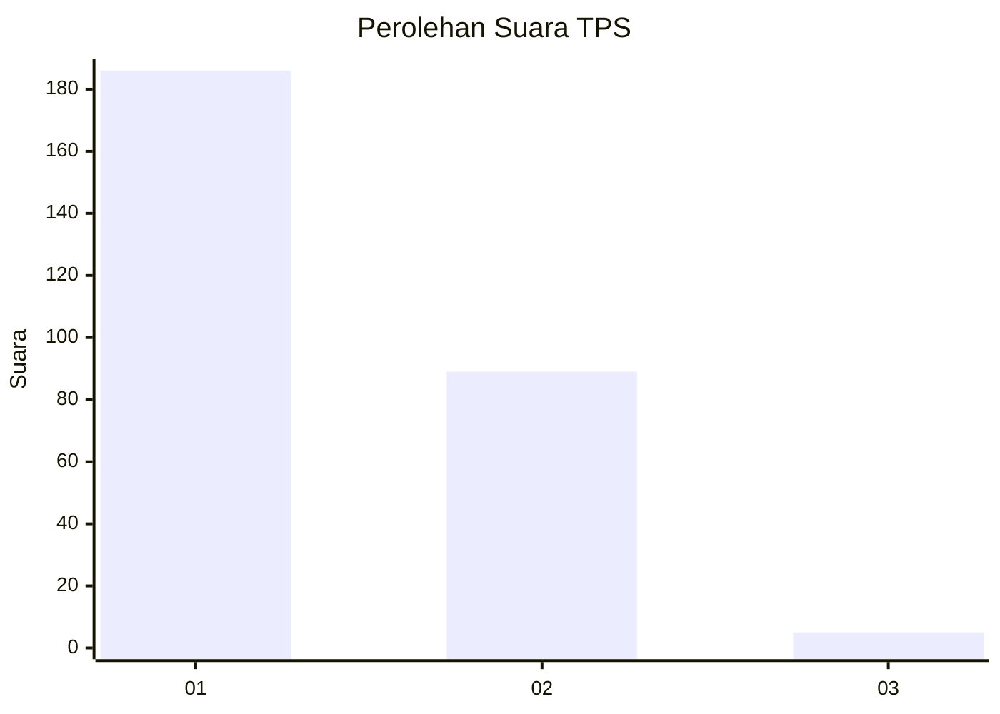
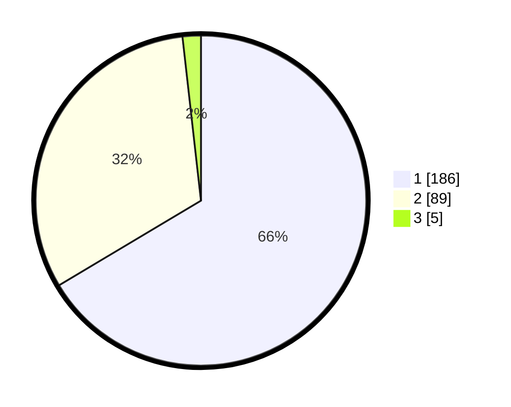

# Hasil

## Grafik

## Tabel

| No. | Nama Paslon    | Suara | Suara (raw) | Persentase |
|:--- |:-------------- | -----:| -----------:| ----------:|
| 1   | ANIES MUHAIMIN | 186   | [186][p-1]  | 66,43      |
| 2   | PRABOWO GIBRAN | 89    | [89][p-2]   | 31,79      |
| 3   | GANJAR MAHFUD  | 5     | [5][p-3]    | 1,79       |

[p-1]: https://github.com/gigit-pemilu/pemilu-2024-36-banten/blob/main/pilpres/hitung-suara/sub/36-banten/sub/04-serang/sub/31-cinangka/sub/2002-bantarwaru/sub/009-tps/sub/paslon-1.txt
[p-2]: https://github.com/gigit-pemilu/pemilu-2024-36-banten/blob/main/pilpres/hitung-suara/sub/36-banten/sub/04-serang/sub/31-cinangka/sub/2002-bantarwaru/sub/009-tps/sub/paslon-2.txt
[p-3]: https://github.com/gigit-pemilu/pemilu-2024-36-banten/blob/main/pilpres/hitung-suara/sub/36-banten/sub/04-serang/sub/31-cinangka/sub/2002-bantarwaru/sub/009-tps/sub/paslon-3.txt

## Foto C Plano

https://sirekap-obj-formc.kpu.go.id/b7d1/pemilu/ppwp/36/04/31/20/02/3604312002009-20240224-155132--3d7c47ca-8355-433a-9570-3b4aab4abf16.jpg

https://sirekap-obj-formc.kpu.go.id/b7d1/pemilu/ppwp/36/04/31/20/02/3604312002009-20240224-155350--0c3ac002-e2f7-4326-8f75-a43ccf3606c7.jpg

https://sirekap-obj-formc.kpu.go.id/b7d1/pemilu/ppwp/36/04/31/20/02/3604312002009-20240224-155544--81cf0db5-1265-4b84-89a7-6608aee4452a.jpg

## Metadata

| Key        | Value               |
| ---------- | ------------------- |
| Time Stamp | 2024-02-26 12:00:00 |

