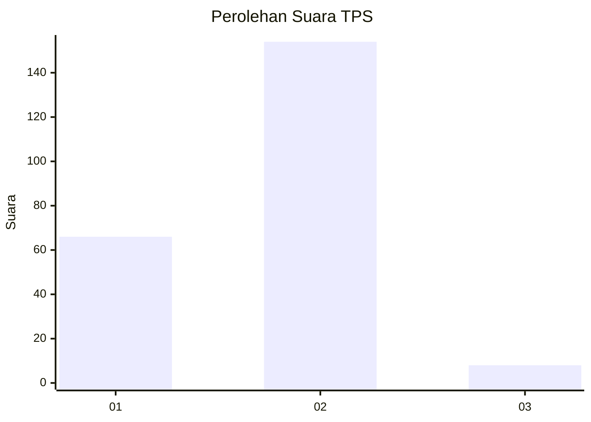
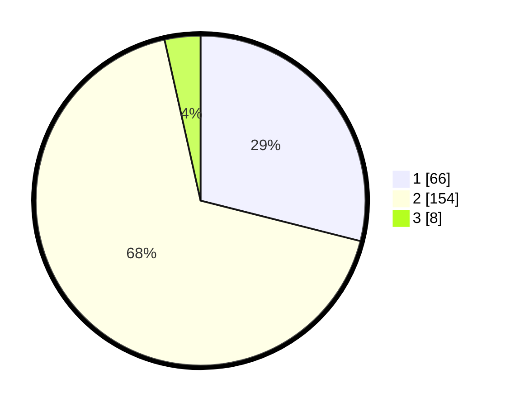

# Hasil

## Grafik

## Tabel

| No. | Nama Paslon    | Suara | Suara (raw) | Persentase |
|:--- |:-------------- | -----:| -----------:| ----------:|
| 1   | ANIES MUHAIMIN | 66    | [66][p-1]   | 28,95      |
| 2   | PRABOWO GIBRAN | 154   | [154][p-2]  | 67,54      |
| 3   | GANJAR MAHFUD  | 8     | [8][p-3]    | 3,51       |

[p-1]: https://github.com/gigit-pemilu/pemilu-2024/blob/main/pilpres/hitung-suara/sub/36-banten/sub/04-serang/sub/33-gunungsari/sub/2001-gunungsari/sub/001-tps/sub/paslon-1.txt
[p-2]: https://github.com/gigit-pemilu/pemilu-2024/blob/main/pilpres/hitung-suara/sub/36-banten/sub/04-serang/sub/33-gunungsari/sub/2001-gunungsari/sub/001-tps/sub/paslon-2.txt
[p-3]: https://github.com/gigit-pemilu/pemilu-2024/blob/main/pilpres/hitung-suara/sub/36-banten/sub/04-serang/sub/33-gunungsari/sub/2001-gunungsari/sub/001-tps/sub/paslon-3.txt

## Foto C Plano

https://sirekap-obj-formc.kpu.go.id/6834/pemilu/ppwp/36/04/33/20/01/3604332001001-20240215-070657--06efe8bf-75ae-46c3-9973-d980e3eb6812.jpg

https://sirekap-obj-formc.kpu.go.id/6834/pemilu/ppwp/36/04/33/20/01/3604332001001-20240215-024749--217aaf48-a6c7-4c17-8824-2188084429b8.jpg

https://sirekap-obj-formc.kpu.go.id/6834/pemilu/ppwp/36/04/33/20/01/3604332001001-20240215-024915--39f090f9-e164-454d-a21b-a2b51a2a8b4c.jpg

## Metadata

| Key        | Value               |
| ---------- | ------------------- |
| Time Stamp | 2024-02-16 11:00:29 |

