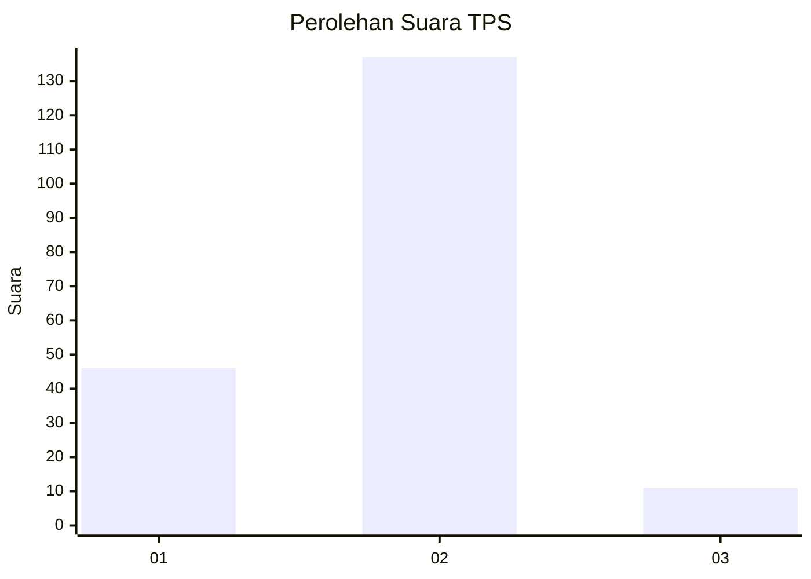

# Hasil

## Grafik

## Tabel

| No. | Nama Paslon    | Suara | Suara (raw) | Persentase |
|:--- |:-------------- | -----:| -----------:| ----------:|
| 1   | ANIES MUHAIMIN | 46    | [46][p-1]   | 23,71      |
| 2   | PRABOWO GIBRAN | 137   | [137][p-2]  | 70,62      |
| 3   | GANJAR MAHFUD  | 11    | [11][p-3]   | 5,67       |

[p-1]: https://github.com/gigit-pemilu/pemilu-2024/blob/main/pilpres/hitung-suara/sub/36-banten/sub/04-serang/sub/33-gunungsari/sub/2001-gunungsari/sub/002-tps/sub/paslon-1.txt
[p-2]: https://github.com/gigit-pemilu/pemilu-2024/blob/main/pilpres/hitung-suara/sub/36-banten/sub/04-serang/sub/33-gunungsari/sub/2001-gunungsari/sub/002-tps/sub/paslon-2.txt
[p-3]: https://github.com/gigit-pemilu/pemilu-2024/blob/main/pilpres/hitung-suara/sub/36-banten/sub/04-serang/sub/33-gunungsari/sub/2001-gunungsari/sub/002-tps/sub/paslon-3.txt

## Foto C Plano

https://sirekap-obj-formc.kpu.go.id/ecf3/pemilu/ppwp/36/04/33/20/01/3604332001002-20240214-223949--19719c29-cd66-45db-9e59-86e123384a38.jpg

https://sirekap-obj-formc.kpu.go.id/ecf3/pemilu/ppwp/36/04/33/20/01/3604332001002-20240214-214659--d97a53f7-7892-4eff-a989-410bf8201afc.jpg

https://sirekap-obj-formc.kpu.go.id/ecf3/pemilu/ppwp/36/04/33/20/01/3604332001002-20240214-233915--8d330055-fd45-450e-94cc-2f337703ceb5.jpg

## Metadata

| Key        | Value               |
| ---------- | ------------------- |
| Time Stamp | 2024-02-16 11:00:29 |

