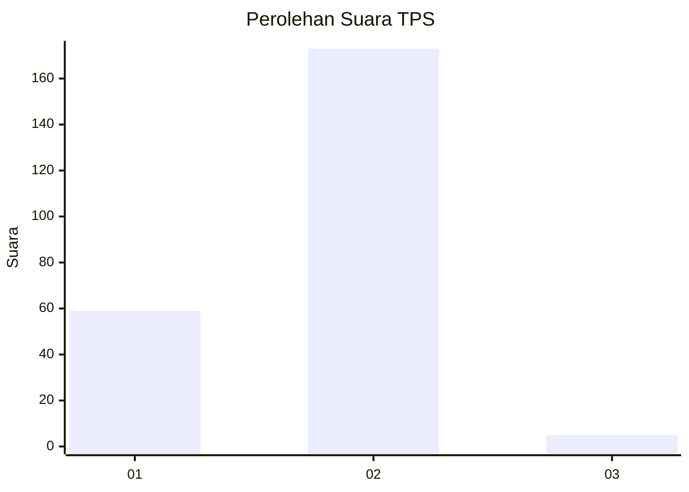
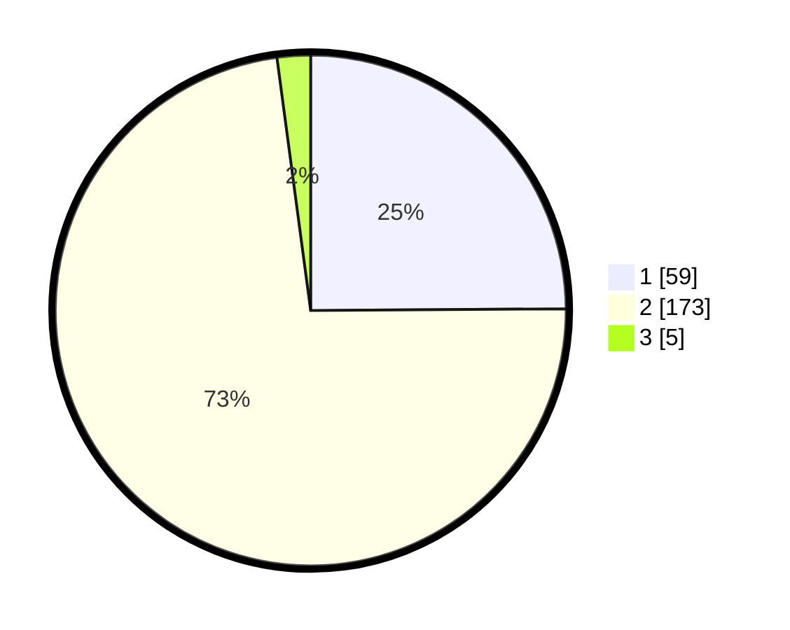

# Hasil

## Grafik

## Tabel

| No. | Nama Paslon    | Suara | Suara (raw) | Persentase |
|:--- |:-------------- | -----:| -----------:| ----------:|
| 1   | ANIES MUHAIMIN | 59    | [59][p-1]   | 24,89      |
| 2   | PRABOWO GIBRAN | 173   | [173][p-2]  | 73,00      |
| 3   | GANJAR MAHFUD  | 5     | [5][p-3]    | 2,11       |

[p-1]: https://github.com/gigit-pemilu/pemilu-2024/blob/main/pilpres/hitung-suara/sub/36-banten/sub/04-serang/sub/33-gunungsari/sub/2001-gunungsari/sub/004-tps/sub/paslon-1.txt
[p-2]: https://github.com/gigit-pemilu/pemilu-2024/blob/main/pilpres/hitung-suara/sub/36-banten/sub/04-serang/sub/33-gunungsari/sub/2001-gunungsari/sub/004-tps/sub/paslon-2.txt
[p-3]: https://github.com/gigit-pemilu/pemilu-2024/blob/main/pilpres/hitung-suara/sub/36-banten/sub/04-serang/sub/33-gunungsari/sub/2001-gunungsari/sub/004-tps/sub/paslon-3.txt

## Foto C Plano

https://sirekap-obj-formc.kpu.go.id/3658/pemilu/ppwp/36/04/33/20/01/3604332001004-20240214-215532--6b7648ab-f591-4ae0-ac91-af94c5338ac9.jpg

https://sirekap-obj-formc.kpu.go.id/3658/pemilu/ppwp/36/04/33/20/01/3604332001004-20240214-220049--ab4bb5fe-60d4-4f8a-9990-fa61f22e96b5.jpg

https://sirekap-obj-formc.kpu.go.id/3658/pemilu/ppwp/36/04/33/20/01/3604332001004-20240214-220228--ef6375cb-289d-44a0-9466-50a096bcf1a3.jpg

## Metadata

| Key        | Value               |
| ---------- | ------------------- |
| Time Stamp | 2024-02-16 11:00:29 |

