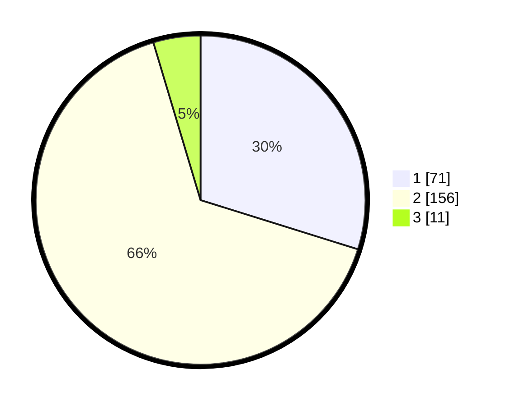

# Hasil

## Grafik

## Tabel

| No. | Nama Paslon    | Suara | Suara (raw) | Persentase |
|:--- |:-------------- | -----:| -----------:| ----------:|
| 1   | ANIES MUHAIMIN | 71    | [71][p-1]   | 29,83      |
| 2   | PRABOWO GIBRAN | 156   | [156][p-2]  | 65,55      |
| 3   | GANJAR MAHFUD  | 11    | [11][p-3]   | 4,62       |

[p-1]: https://github.com/gigit-pemilu/pemilu-2024/blob/main/pilpres/hitung-suara/sub/36-banten/sub/04-serang/sub/33-gunungsari/sub/2007-curug-sulanjana/sub/001-tps/sub/paslon-1.txt
[p-2]: https://github.com/gigit-pemilu/pemilu-2024/blob/main/pilpres/hitung-suara/sub/36-banten/sub/04-serang/sub/33-gunungsari/sub/2007-curug-sulanjana/sub/001-tps/sub/paslon-2.txt
[p-3]: https://github.com/gigit-pemilu/pemilu-2024/blob/main/pilpres/hitung-suara/sub/36-banten/sub/04-serang/sub/33-gunungsari/sub/2007-curug-sulanjana/sub/001-tps/sub/paslon-3.txt

## Foto C Plano

https://sirekap-obj-formc.kpu.go.id/e0c0/pemilu/ppwp/36/04/33/20/07/3604332007001-20240214-215304--b97049a3-8d5a-4065-9d7c-b0fbcd324146.jpg

https://sirekap-obj-formc.kpu.go.id/e0c0/pemilu/ppwp/36/04/33/20/07/3604332007001-20240214-225744--17a23bb0-5a1a-4562-9e26-dcd86d0db1c6.jpg

https://sirekap-obj-formc.kpu.go.id/e0c0/pemilu/ppwp/36/04/33/20/07/3604332007001-20240214-220111--694f61a4-ff61-4517-9323-c442ac8c58ab.jpg

## Metadata

| Key        | Value               |
| ---------- | ------------------- |
| Time Stamp | 2024-02-19 06:16:00 |

