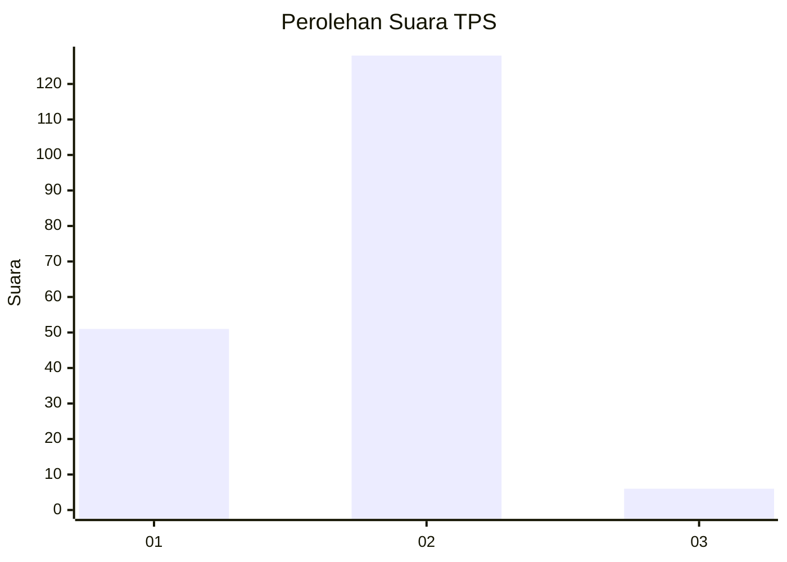
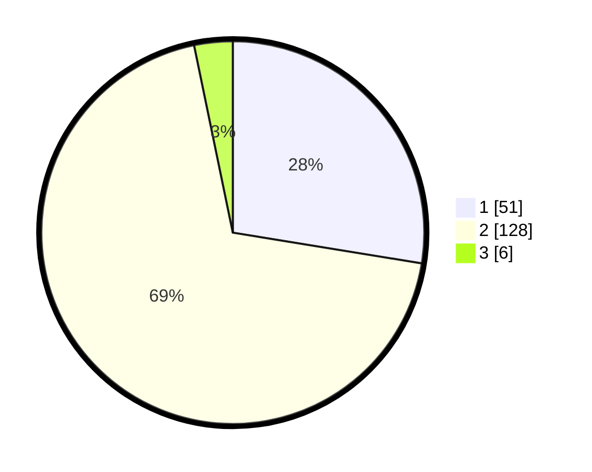

# Hasil

## Grafik

## Tabel

| No. | Nama Paslon    | Suara | Suara (raw) | Persentase |
|:--- |:-------------- | -----:| -----------:| ----------:|
| 1   | ANIES MUHAIMIN | 51    | [51][p-1]   | 27,57      |
| 2   | PRABOWO GIBRAN | 128   | [128][p-2]  | 69,19      |
| 3   | GANJAR MAHFUD  | 6     | [6][p-3]    | 3,24       |

[p-1]: https://github.com/gigit-pemilu/pemilu-2024/blob/main/pilpres/hitung-suara/sub/36-banten/sub/04-serang/sub/33-gunungsari/sub/2007-curug-sulanjana/sub/005-tps/sub/paslon-1.txt
[p-2]: https://github.com/gigit-pemilu/pemilu-2024/blob/main/pilpres/hitung-suara/sub/36-banten/sub/04-serang/sub/33-gunungsari/sub/2007-curug-sulanjana/sub/005-tps/sub/paslon-2.txt
[p-3]: https://github.com/gigit-pemilu/pemilu-2024/blob/main/pilpres/hitung-suara/sub/36-banten/sub/04-serang/sub/33-gunungsari/sub/2007-curug-sulanjana/sub/005-tps/sub/paslon-3.txt

## Foto C Plano

https://sirekap-obj-formc.kpu.go.id/f8c5/pemilu/ppwp/36/04/33/20/07/3604332007005-20240214-233121--3d3f0c5d-518e-48e1-b533-84b5f10ecd61.jpg

https://sirekap-obj-formc.kpu.go.id/f8c5/pemilu/ppwp/36/04/33/20/07/3604332007005-20240214-233602--fd86a60a-d93c-449a-adbe-0de90af5427d.jpg

https://sirekap-obj-formc.kpu.go.id/f8c5/pemilu/ppwp/36/04/33/20/07/3604332007005-20240214-231204--2114e9fa-4833-4a8f-a810-e7bb07cc7b35.jpg

## Metadata

| Key        | Value               |
| ---------- | ------------------- |
| Time Stamp | 2024-02-19 06:16:00 |

