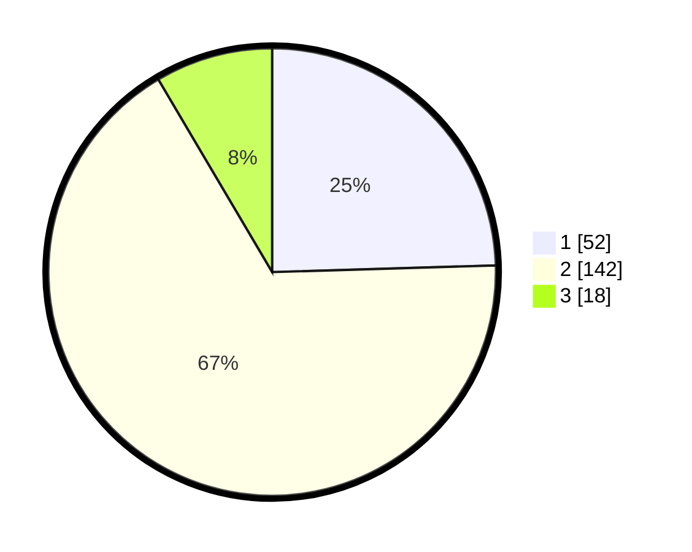

# Hasil

## Grafik

## Tabel

| No. | Nama Paslon    | Suara | Suara (raw) | Persentase |
|:--- |:-------------- | -----:| -----------:| ----------:|
| 1   | ANIES MUHAIMIN | 52    | [52][p-1]   | 24,53      |
| 2   | PRABOWO GIBRAN | 142   | [142][p-2]  | 66,98      |
| 3   | GANJAR MAHFUD  | 18    | [18][p-3]   | 8,49       |

[p-1]: https://github.com/gigit-pemilu/pemilu-2024-36-banten/blob/main/pilpres/hitung-suara/sub/36-banten/sub/04-serang/sub/34-bandung/sub/2001-bandung/sub/006-tps/sub/paslon-1.txt
[p-2]: https://github.com/gigit-pemilu/pemilu-2024-36-banten/blob/main/pilpres/hitung-suara/sub/36-banten/sub/04-serang/sub/34-bandung/sub/2001-bandung/sub/006-tps/sub/paslon-2.txt
[p-3]: https://github.com/gigit-pemilu/pemilu-2024-36-banten/blob/main/pilpres/hitung-suara/sub/36-banten/sub/04-serang/sub/34-bandung/sub/2001-bandung/sub/006-tps/sub/paslon-3.txt

## Foto C Plano

https://sirekap-obj-formc.kpu.go.id/6067/pemilu/ppwp/36/04/34/20/01/3604342001006-20240214-195737--c9afff97-c928-4cd0-9ddc-82d3922ba362.jpg

https://sirekap-obj-formc.kpu.go.id/6067/pemilu/ppwp/36/04/34/20/01/3604342001006-20240214-200338--73e070e9-11ad-4fdb-a196-0132cb0de40e.jpg

https://sirekap-obj-formc.kpu.go.id/6067/pemilu/ppwp/36/04/34/20/01/3604342001006-20240214-200725--5279d704-4b17-4e11-a5f1-837174536096.jpg

## Metadata

| Key        | Value               |
| ---------- | ------------------- |
| Time Stamp | 2024-02-16 08:00:28 |

