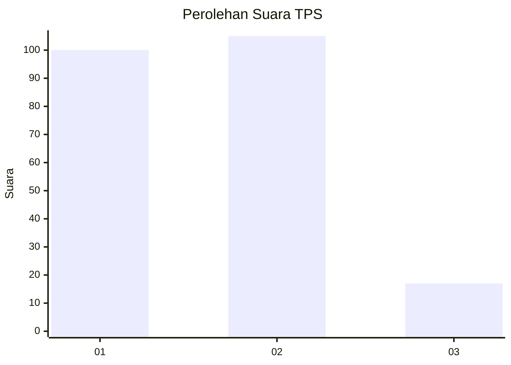
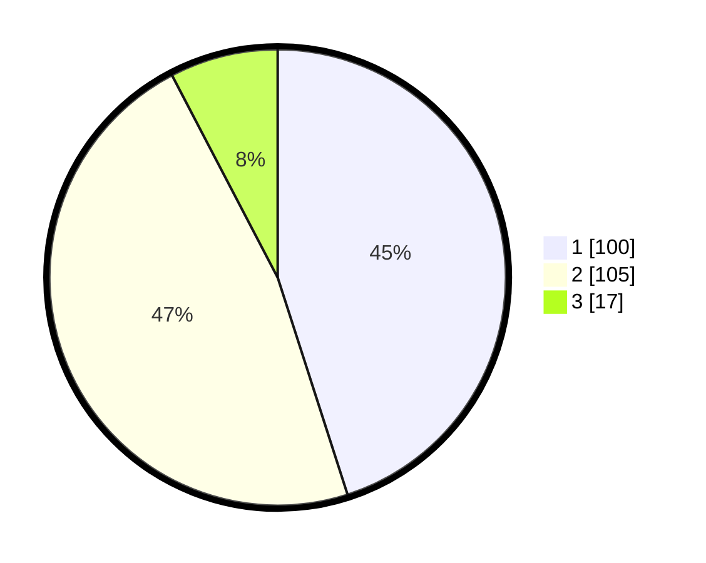

# Hasil

## Grafik

## Tabel

| No. | Nama Paslon    | Suara | Suara (raw) | Persentase |
|:--- |:-------------- | -----:| -----------:| ----------:|
| 1   | ANIES MUHAIMIN | 100   | [100][p-1]  | 45,05      |
| 2   | PRABOWO GIBRAN | 105   | [105][p-2]  | 47,30      |
| 3   | GANJAR MAHFUD  | 17    | [17][p-3]   | 7,66       |

[p-1]: https://github.com/gigit-pemilu/pemilu-2024/blob/main/pilpres/hitung-suara/sub/36-banten/sub/04-serang/sub/34-bandung/sub/2001-bandung/sub/008-tps/sub/paslon-1.txt
[p-2]: https://github.com/gigit-pemilu/pemilu-2024/blob/main/pilpres/hitung-suara/sub/36-banten/sub/04-serang/sub/34-bandung/sub/2001-bandung/sub/008-tps/sub/paslon-2.txt
[p-3]: https://github.com/gigit-pemilu/pemilu-2024/blob/main/pilpres/hitung-suara/sub/36-banten/sub/04-serang/sub/34-bandung/sub/2001-bandung/sub/008-tps/sub/paslon-3.txt

## Foto C Plano

https://sirekap-obj-formc.kpu.go.id/7b9a/pemilu/ppwp/36/04/34/20/01/3604342001008-20240214-233039--70e5504b-ed77-496a-a37c-ff2c2149abda.jpg

https://sirekap-obj-formc.kpu.go.id/7b9a/pemilu/ppwp/36/04/34/20/01/3604342001008-20240214-233336--de9bcf14-8bda-441e-863c-fe1a7bff2bda.jpg

https://sirekap-obj-formc.kpu.go.id/7b9a/pemilu/ppwp/36/04/34/20/01/3604342001008-20240214-233626--a2b6a0c7-181b-4cb9-950f-8ecc8496f584.jpg

## Metadata

| Key        | Value               |
| ---------- | ------------------- |
| Time Stamp | 2024-02-24 22:31:28 |

