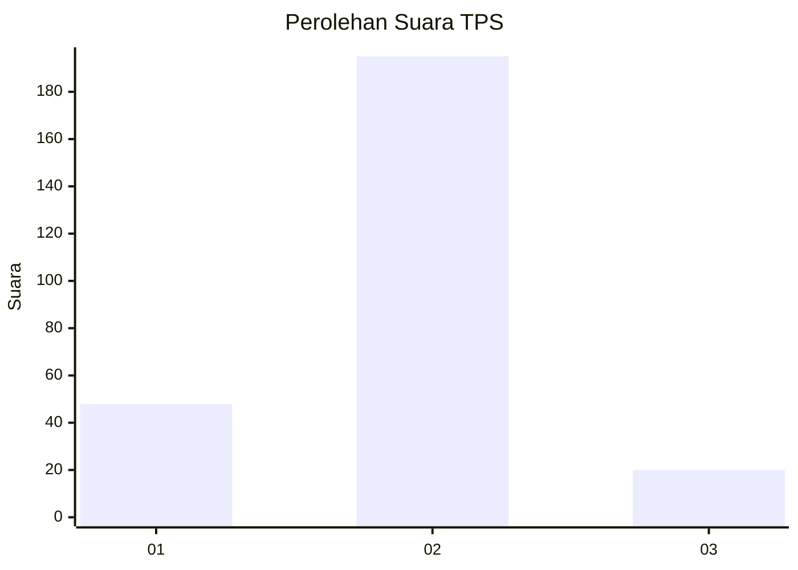
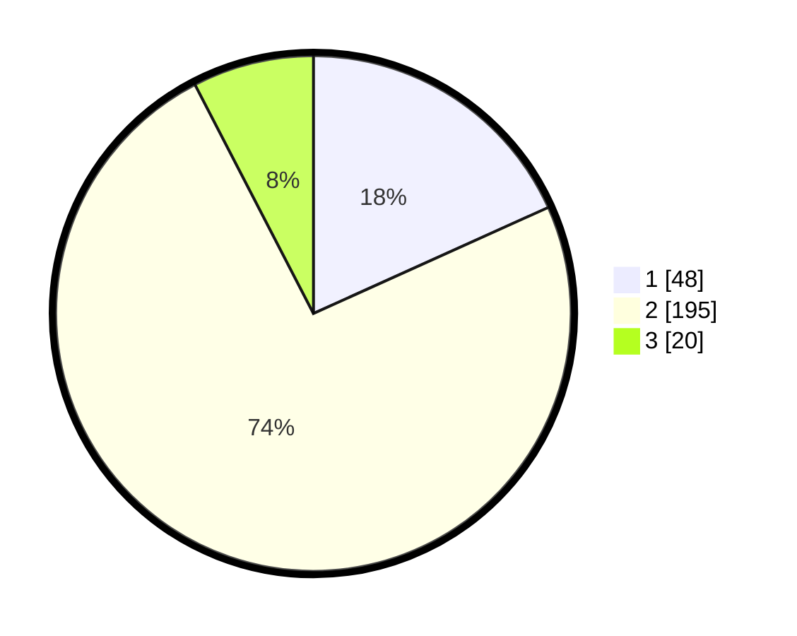

# Hasil

## Grafik

## Tabel

| No. | Nama Paslon    | Suara | Suara (raw) | Persentase |
|:--- |:-------------- | -----:| -----------:| ----------:|
| 1   | ANIES MUHAIMIN | 48    | [48][p-1]   | 18,25      |
| 2   | PRABOWO GIBRAN | 195   | [195][p-2]  | 74,14      |
| 3   | GANJAR MAHFUD  | 20    | [20][p-3]   | 7,60       |

[p-1]: https://github.com/gigit-pemilu/pemilu-2024-36-banten/blob/main/pilpres/hitung-suara/sub/36-banten/sub/04-serang/sub/34-bandung/sub/2004-pangawinan/sub/005-tps/sub/paslon-1.txt
[p-2]: https://github.com/gigit-pemilu/pemilu-2024-36-banten/blob/main/pilpres/hitung-suara/sub/36-banten/sub/04-serang/sub/34-bandung/sub/2004-pangawinan/sub/005-tps/sub/paslon-2.txt
[p-3]: https://github.com/gigit-pemilu/pemilu-2024-36-banten/blob/main/pilpres/hitung-suara/sub/36-banten/sub/04-serang/sub/34-bandung/sub/2004-pangawinan/sub/005-tps/sub/paslon-3.txt

## Foto C Plano

https://sirekap-obj-formc.kpu.go.id/c9b3/pemilu/ppwp/36/04/34/20/04/3604342004005-20240215-124913--0f4d3417-abbb-4d36-8718-6cc9cb2a2c65.jpg

https://sirekap-obj-formc.kpu.go.id/c9b3/pemilu/ppwp/36/04/34/20/04/3604342004005-20240215-125027--6fb5537c-4a5a-44be-a0fb-801af7e5b4ef.jpg

https://sirekap-obj-formc.kpu.go.id/c9b3/pemilu/ppwp/36/04/34/20/04/3604342004005-20240215-125201--af5712ef-9191-4ef1-aa62-169b563d6df0.jpg

## Metadata

| Key        | Value               |
| ---------- | ------------------- |
| Time Stamp | 2024-02-16 09:00:28 |

