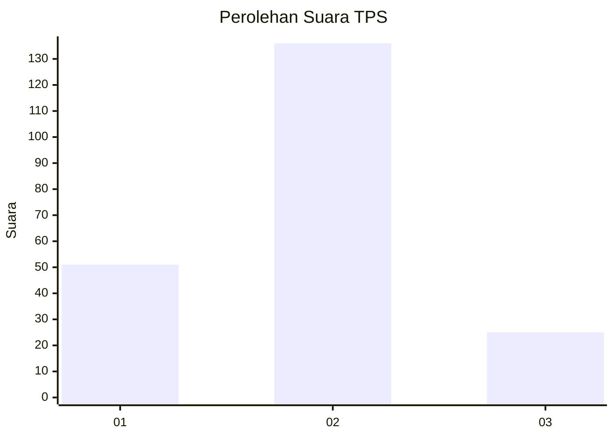
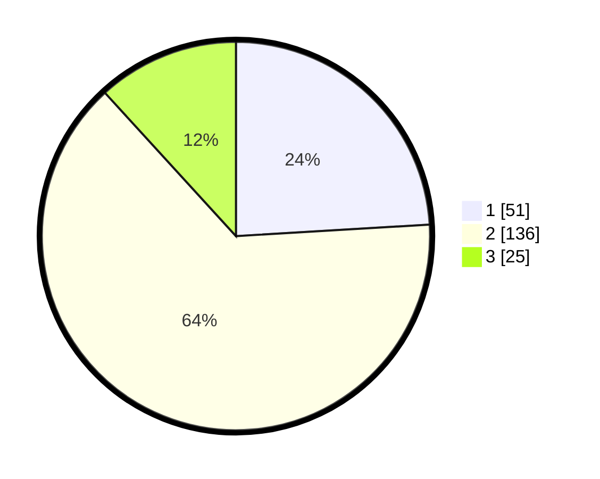

# Hasil

## Grafik

## Tabel

| No. | Nama Paslon    | Suara | Suara (raw) | Persentase |
|:--- |:-------------- | -----:| -----------:| ----------:|
| 1   | ANIES MUHAIMIN | 51    | [51][p-1]   | 24,06      |
| 2   | PRABOWO GIBRAN | 136   | [136][p-2]  | 64,15      |
| 3   | GANJAR MAHFUD  | 25    | [25][p-3]   | 11,79      |

[p-1]: https://github.com/gigit-pemilu/pemilu-2024-36-banten/blob/main/pilpres/hitung-suara/sub/36-banten/sub/04-serang/sub/35-lebak-wangi/sub/2001-kamaruton/sub/003-tps/sub/paslon-1.txt
[p-2]: https://github.com/gigit-pemilu/pemilu-2024-36-banten/blob/main/pilpres/hitung-suara/sub/36-banten/sub/04-serang/sub/35-lebak-wangi/sub/2001-kamaruton/sub/003-tps/sub/paslon-2.txt
[p-3]: https://github.com/gigit-pemilu/pemilu-2024-36-banten/blob/main/pilpres/hitung-suara/sub/36-banten/sub/04-serang/sub/35-lebak-wangi/sub/2001-kamaruton/sub/003-tps/sub/paslon-3.txt

## Foto C Plano

https://sirekap-obj-formc.kpu.go.id/4871/pemilu/ppwp/36/04/35/20/01/3604352001003-20240215-012349--9b385ba6-0ecd-4904-856e-2c82373e3261.jpg

https://sirekap-obj-formc.kpu.go.id/4871/pemilu/ppwp/36/04/35/20/01/3604352001003-20240215-012424--7d6f51ee-4e0b-4574-b651-62e4a0945075.jpg

https://sirekap-obj-formc.kpu.go.id/4871/pemilu/ppwp/36/04/35/20/01/3604352001003-20240215-012450--eefc225f-19ef-4c88-b2d0-0a0f82d94e9c.jpg

## Metadata

| Key        | Value               |
| ---------- | ------------------- |
| Time Stamp | 2024-02-15 21:01:18 |

