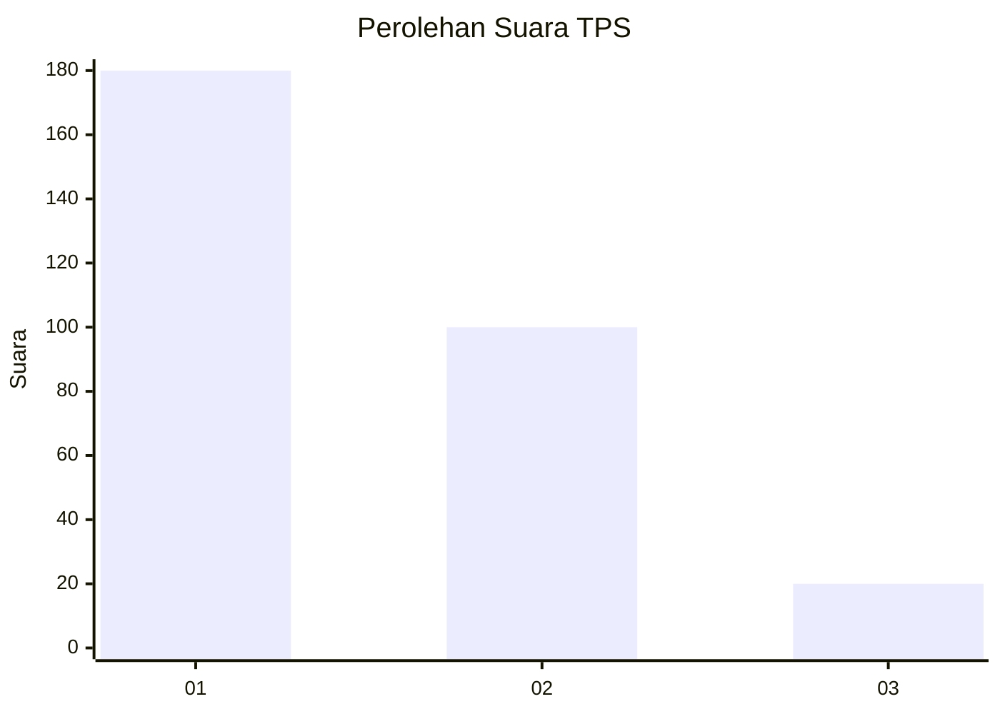
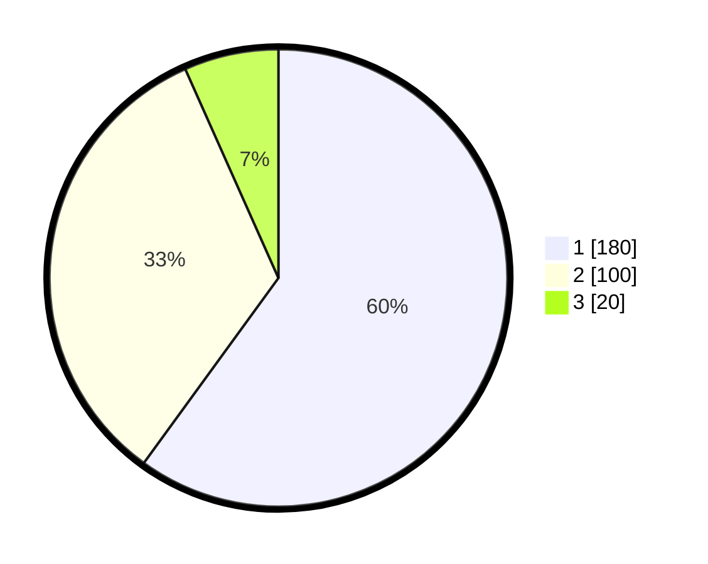

# Hasil

## Grafik

## Tabel

| No. | Nama Paslon    | Suara | Suara (raw) | Persentase |
|:--- |:-------------- | -----:| -----------:| ----------:|
| 1   | ANIES MUHAIMIN | 180   | [180][p-1]  | 60,00      |
| 2   | PRABOWO GIBRAN | 100   | [100][p-2]  | 33,33      |
| 3   | GANJAR MAHFUD  | 20    | [20][p-3]   | 6,67       |

[p-1]: https://github.com/gigit-pemilu/pemilu-2024-36-banten/blob/main/pilpres/hitung-suara/sub/36-banten/sub/04-serang/sub/35-lebak-wangi/sub/2008-bolang/sub/009-tps/sub/paslon-1.txt
[p-2]: https://github.com/gigit-pemilu/pemilu-2024-36-banten/blob/main/pilpres/hitung-suara/sub/36-banten/sub/04-serang/sub/35-lebak-wangi/sub/2008-bolang/sub/009-tps/sub/paslon-2.txt
[p-3]: https://github.com/gigit-pemilu/pemilu-2024-36-banten/blob/main/pilpres/hitung-suara/sub/36-banten/sub/04-serang/sub/35-lebak-wangi/sub/2008-bolang/sub/009-tps/sub/paslon-3.txt

## Foto C Plano

https://sirekap-obj-formc.kpu.go.id/7a82/pemilu/ppwp/36/04/35/20/08/3604352008009-20240215-000917--166aacef-a2f2-487a-bdbb-275f7abd653b.jpg

https://sirekap-obj-formc.kpu.go.id/7a82/pemilu/ppwp/36/04/35/20/08/3604352008009-20240215-001224--adca784d-8cd8-485c-8000-e7b2d0d3ba75.jpg

https://sirekap-obj-formc.kpu.go.id/7a82/pemilu/ppwp/36/04/35/20/08/3604352008009-20240215-001507--cc3c6cae-bf00-43f1-88e7-1c4bf99a4f46.jpg

## Metadata

| Key        | Value               |
| ---------- | ------------------- |
| Time Stamp | 2024-02-15 21:01:18 |

