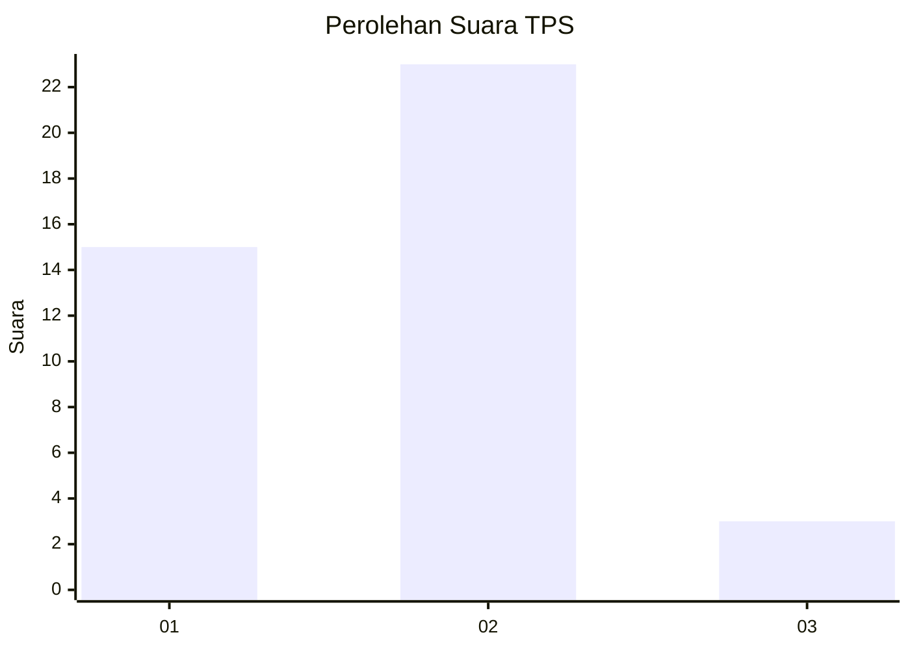
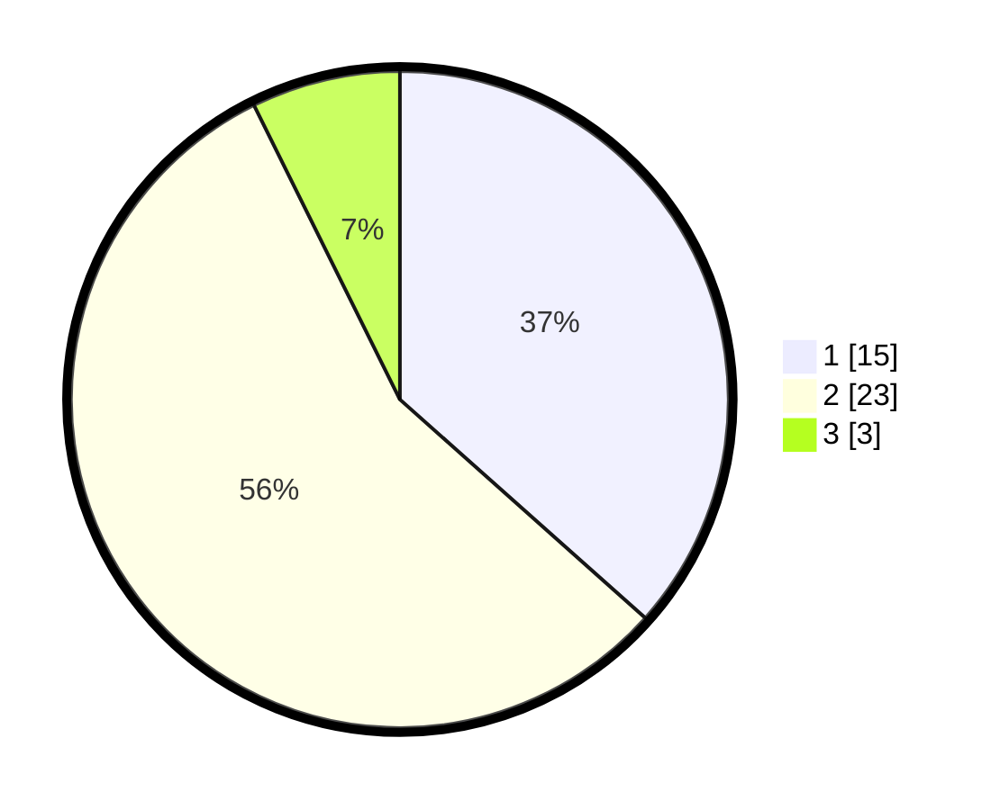

# Hasil

## Grafik

## Tabel

| No. | Nama Paslon    | Suara | Suara (raw) | Persentase |
|:--- |:-------------- | -----:| -----------:| ----------:|
| 1   | ANIES MUHAIMIN | 15    | [15][p-1]   | 36,59      |
| 2   | PRABOWO GIBRAN | 23    | [23][p-2]   | 56,10      |
| 3   | GANJAR MAHFUD  | 3     | [3][p-3]    | 7,32       |

[p-1]: https://github.com/gigit-pemilu/pemilu-2024/blob/main/pilpres/hitung-suara/sub/36-banten/sub/71-kota-tangerang/sub/01-tangerang/sub/1002-sukaasih/sub/901-tps/sub/paslon-1.txt
[p-2]: https://github.com/gigit-pemilu/pemilu-2024/blob/main/pilpres/hitung-suara/sub/36-banten/sub/71-kota-tangerang/sub/01-tangerang/sub/1002-sukaasih/sub/901-tps/sub/paslon-2.txt
[p-3]: https://github.com/gigit-pemilu/pemilu-2024/blob/main/pilpres/hitung-suara/sub/36-banten/sub/71-kota-tangerang/sub/01-tangerang/sub/1002-sukaasih/sub/901-tps/sub/paslon-3.txt

## Foto C Plano

https://sirekap-obj-formc.kpu.go.id/cded/pemilu/ppwp/36/71/01/10/02/3671011002901-20240214-224734--3c183ae8-3e70-4abd-9faf-d1fb3fb6f855.jpg

https://sirekap-obj-formc.kpu.go.id/cded/pemilu/ppwp/36/71/01/10/02/3671011002901-20240216-143525--ea06c737-17bd-4320-88a8-614869dc896e.jpg

https://sirekap-obj-formc.kpu.go.id/cded/pemilu/ppwp/36/71/01/10/02/3671011002901-20240216-143524--bd152dce-5db1-4f68-bb13-e80c8b82ac27.jpg

## Metadata

| Key        | Value               |
| ---------- | ------------------- |
| Time Stamp | 2024-02-21 18:00:00 |

