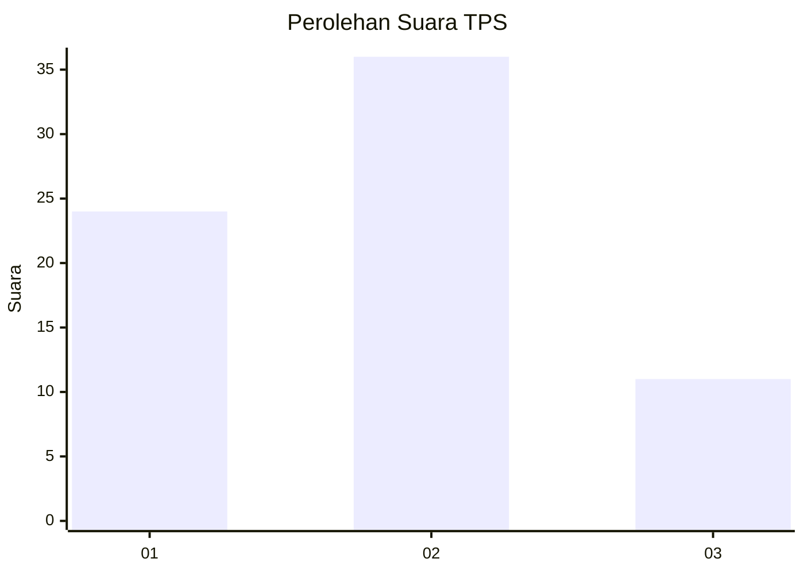
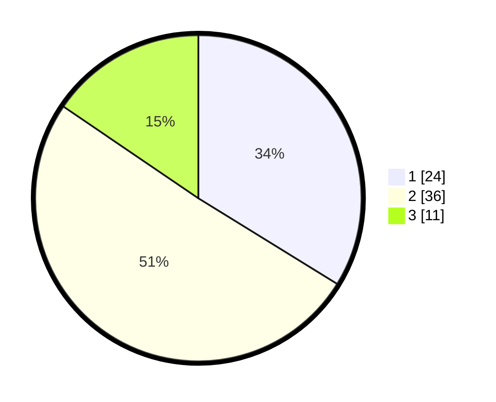

# Hasil

## Grafik

## Tabel

| No. | Nama Paslon    | Suara | Suara (raw) | Persentase |
|:--- |:-------------- | -----:| -----------:| ----------:|
| 1   | ANIES MUHAIMIN | 24    | [24][p-1]   | 33,80      |
| 2   | PRABOWO GIBRAN | 36    | [36][p-2]   | 50,70      |
| 3   | GANJAR MAHFUD  | 11    | [11][p-3]   | 15,49      |

[p-1]: https://github.com/gigit-pemilu/pemilu-2024-36-banten/blob/main/pilpres/hitung-suara/sub/36-banten/sub/71-kota-tangerang/sub/01-tangerang/sub/1008-babakan/sub/051-tps/sub/paslon-1.txt
[p-2]: https://github.com/gigit-pemilu/pemilu-2024-36-banten/blob/main/pilpres/hitung-suara/sub/36-banten/sub/71-kota-tangerang/sub/01-tangerang/sub/1008-babakan/sub/051-tps/sub/paslon-2.txt
[p-3]: https://github.com/gigit-pemilu/pemilu-2024-36-banten/blob/main/pilpres/hitung-suara/sub/36-banten/sub/71-kota-tangerang/sub/01-tangerang/sub/1008-babakan/sub/051-tps/sub/paslon-3.txt

## Foto C Plano

https://sirekap-obj-formc.kpu.go.id/aaa7/pemilu/ppwp/36/71/01/10/08/3671011008051-20240214-231948--5805461f-4248-4994-8528-5b1e48ecd802.jpg

https://sirekap-obj-formc.kpu.go.id/aaa7/pemilu/ppwp/36/71/01/10/08/3671011008051-20240214-232110--b5d089c6-fc1e-4ad5-a606-715ea103c876.jpg

https://sirekap-obj-formc.kpu.go.id/aaa7/pemilu/ppwp/36/71/01/10/08/3671011008051-20240214-232220--6bf712de-0060-4922-bce1-3a35233d293f.jpg

## Metadata

| Key        | Value               |
| ---------- | ------------------- |
| Time Stamp | 2024-02-24 22:31:28 |

