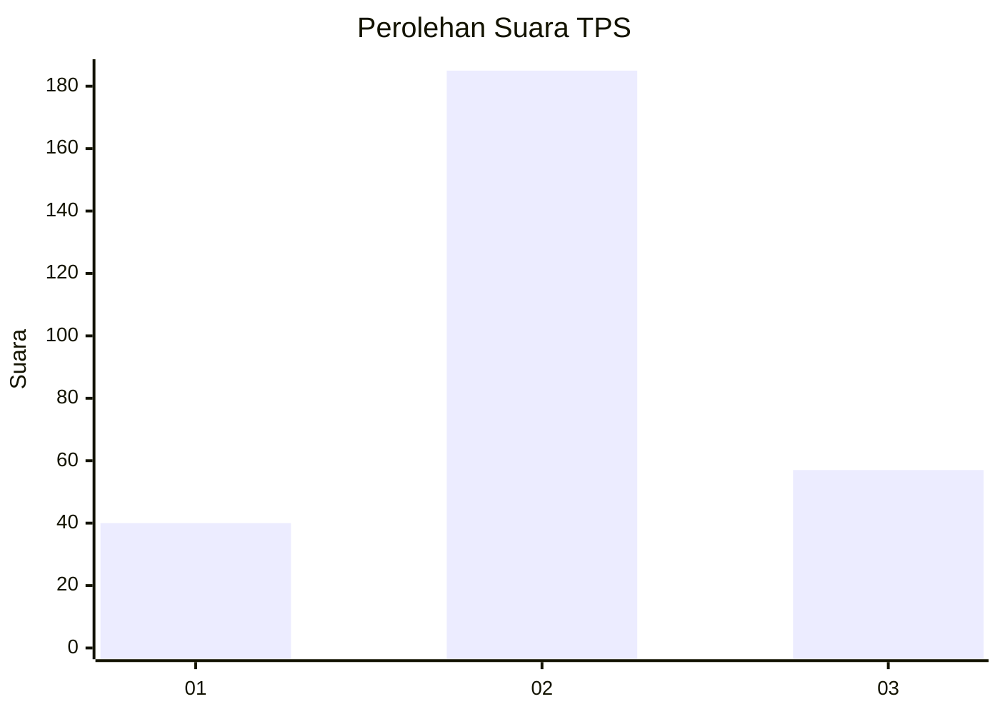
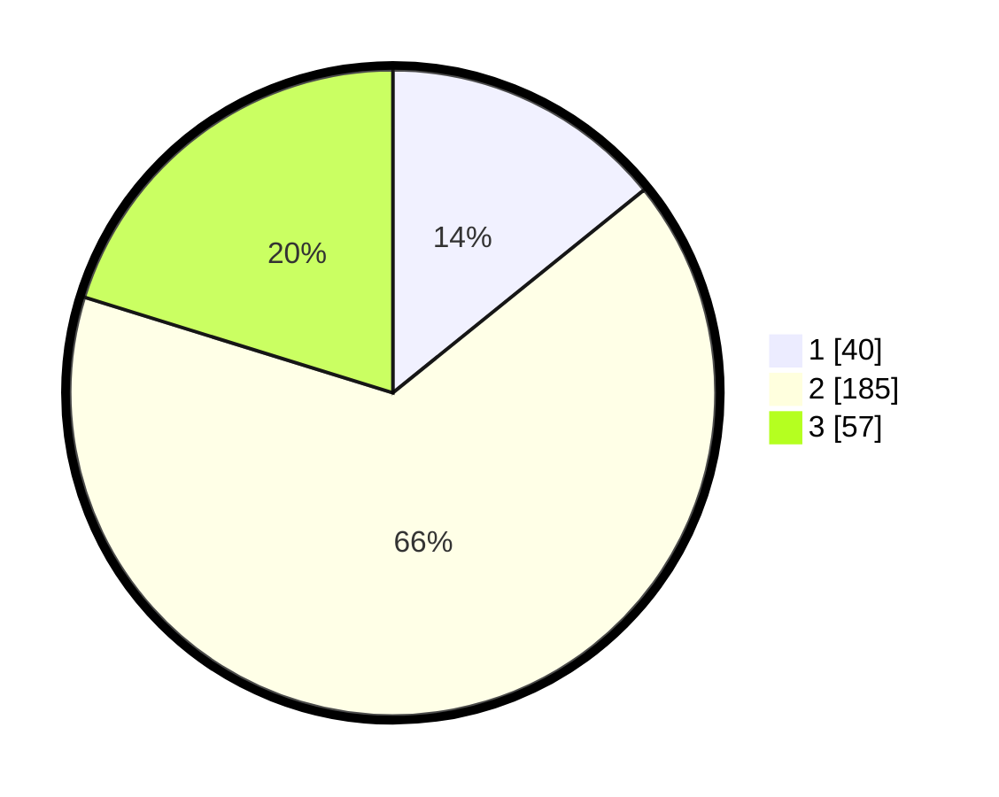

# Hasil

## Grafik

## Tabel

| No. | Nama Paslon    | Suara | Suara (raw) | Persentase |
|:--- |:-------------- | -----:| -----------:| ----------:|
| 1   | ANIES MUHAIMIN | 40    | [40][p-1]   | 14,18      |
| 2   | PRABOWO GIBRAN | 185   | [185][p-2]  | 65,60      |
| 3   | GANJAR MAHFUD  | 57    | [57][p-3]   | 20,21      |

[p-1]: https://github.com/gigit-pemilu/pemilu-2024-36-banten/blob/main/pilpres/hitung-suara/sub/36-banten/sub/71-kota-tangerang/sub/01-tangerang/sub/1008-babakan/sub/901-tps/sub/paslon-1.txt
[p-2]: https://github.com/gigit-pemilu/pemilu-2024-36-banten/blob/main/pilpres/hitung-suara/sub/36-banten/sub/71-kota-tangerang/sub/01-tangerang/sub/1008-babakan/sub/901-tps/sub/paslon-2.txt
[p-3]: https://github.com/gigit-pemilu/pemilu-2024-36-banten/blob/main/pilpres/hitung-suara/sub/36-banten/sub/71-kota-tangerang/sub/01-tangerang/sub/1008-babakan/sub/901-tps/sub/paslon-3.txt

## Foto C Plano

https://sirekap-obj-formc.kpu.go.id/f134/pemilu/ppwp/36/71/01/10/08/3671011008901-20240214-233132--42a5b489-02e3-4b9a-b837-5d4402134980.jpg

https://sirekap-obj-formc.kpu.go.id/f134/pemilu/ppwp/36/71/01/10/08/3671011008901-20240214-233316--cc6c5ba3-2d73-4359-a867-4cbdbb898e45.jpg

https://sirekap-obj-formc.kpu.go.id/f134/pemilu/ppwp/36/71/01/10/08/3671011008901-20240214-233644--a221460c-ae8d-4355-8c9d-d0fc6194effa.jpg

## Metadata

| Key        | Value               |
| ---------- | ------------------- |
| Time Stamp | 2024-02-25 12:00:00 |

