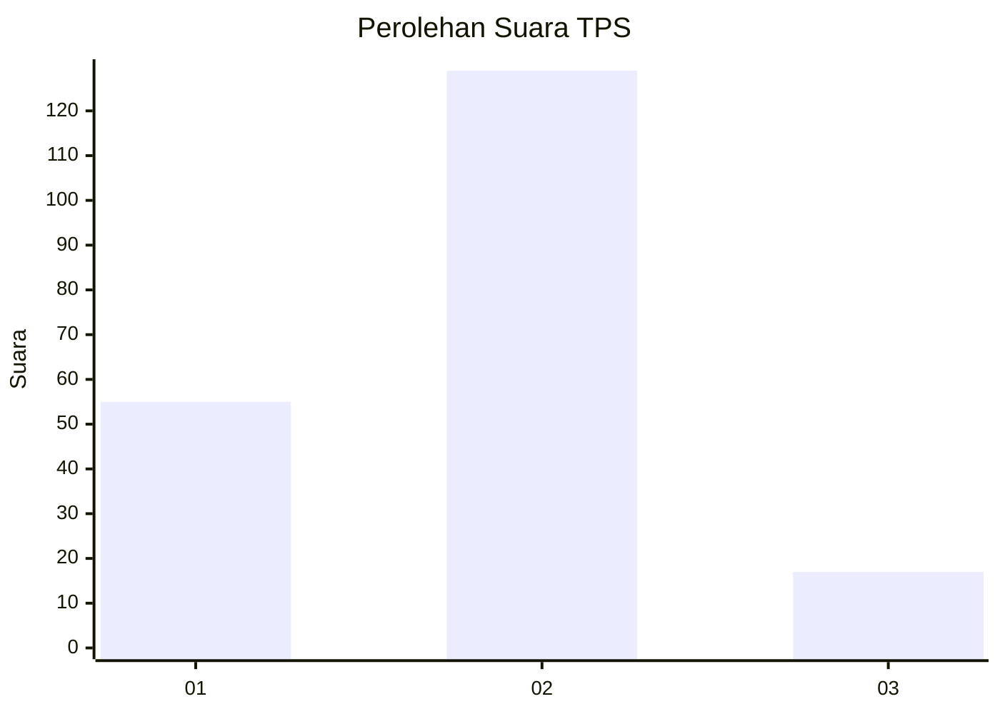
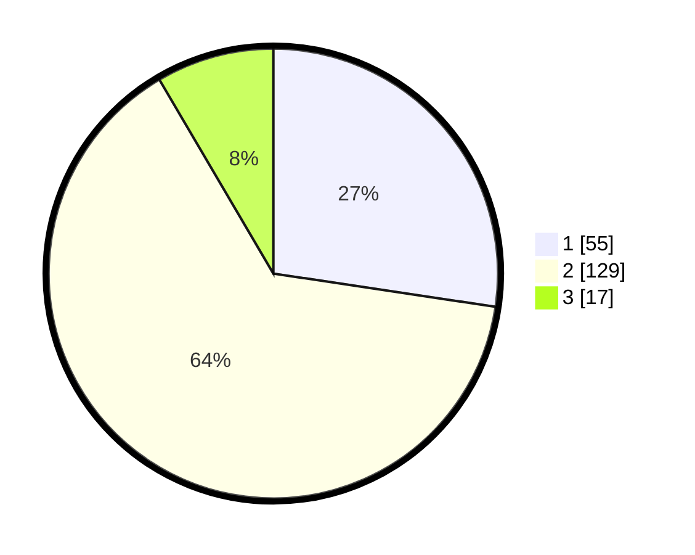

# Hasil

## Grafik

## Tabel

| No. | Nama Paslon    | Suara | Suara (raw) | Persentase |
|:--- |:-------------- | -----:| -----------:| ----------:|
| 1   | ANIES MUHAIMIN | 55    | [55][p-1]   | 27,36      |
| 2   | PRABOWO GIBRAN | 129   | [129][p-2]  | 64,18      |
| 3   | GANJAR MAHFUD  | 17    | [17][p-3]   | 8,46       |

[p-1]: https://github.com/gigit-pemilu/pemilu-2024/blob/main/pilpres/hitung-suara/sub/36-banten/sub/71-kota-tangerang/sub/03-batuceper/sub/1001-batuceper/sub/001-tps/sub/paslon-1.txt
[p-2]: https://github.com/gigit-pemilu/pemilu-2024/blob/main/pilpres/hitung-suara/sub/36-banten/sub/71-kota-tangerang/sub/03-batuceper/sub/1001-batuceper/sub/001-tps/sub/paslon-2.txt
[p-3]: https://github.com/gigit-pemilu/pemilu-2024/blob/main/pilpres/hitung-suara/sub/36-banten/sub/71-kota-tangerang/sub/03-batuceper/sub/1001-batuceper/sub/001-tps/sub/paslon-3.txt

## Foto C Plano

https://sirekap-obj-formc.kpu.go.id/fe28/pemilu/ppwp/36/71/03/10/01/3671031001001-20240214-232157--f8b886b2-1a10-44bd-93c6-2d69e0c0415e.jpg

https://sirekap-obj-formc.kpu.go.id/fe28/pemilu/ppwp/36/71/03/10/01/3671031001001-20240214-231719--100fcf43-efd4-4ad1-b70b-331d1f7ce90c.jpg

https://sirekap-obj-formc.kpu.go.id/fe28/pemilu/ppwp/36/71/03/10/01/3671031001001-20240214-231726--94364843-ae02-4b1b-b925-b865bf9739bf.jpg

## Metadata

| Key        | Value               |
| ---------- | ------------------- |
| Time Stamp | 2024-02-16 16:25:10 |

