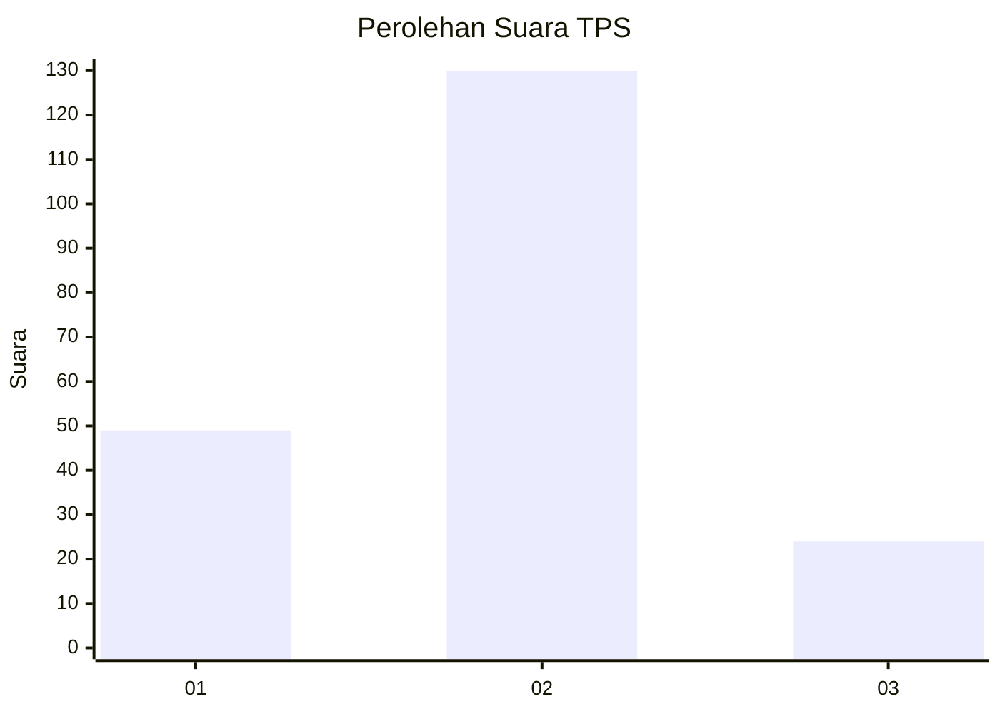
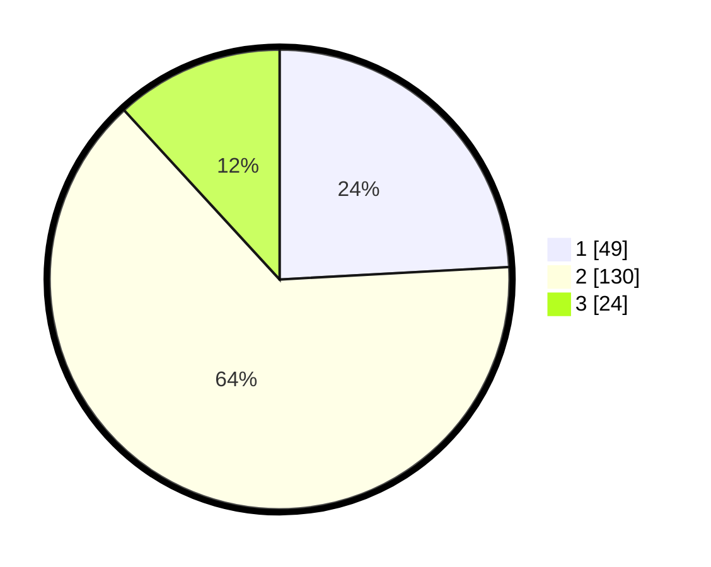

# Hasil

## Grafik

## Tabel

| No. | Nama Paslon    | Suara | Suara (raw) | Persentase |
|:--- |:-------------- | -----:| -----------:| ----------:|
| 1   | ANIES MUHAIMIN | 49    | [49][p-1]   | 24,14      |
| 2   | PRABOWO GIBRAN | 130   | [130][p-2]  | 64,04      |
| 3   | GANJAR MAHFUD  | 24    | [24][p-3]   | 11,82      |

[p-1]: https://github.com/gigit-pemilu/pemilu-2024-36-banten/blob/main/pilpres/hitung-suara/sub/36-banten/sub/71-kota-tangerang/sub/03-batuceper/sub/1001-batuceper/sub/002-tps/sub/paslon-1.txt
[p-2]: https://github.com/gigit-pemilu/pemilu-2024-36-banten/blob/main/pilpres/hitung-suara/sub/36-banten/sub/71-kota-tangerang/sub/03-batuceper/sub/1001-batuceper/sub/002-tps/sub/paslon-2.txt
[p-3]: https://github.com/gigit-pemilu/pemilu-2024-36-banten/blob/main/pilpres/hitung-suara/sub/36-banten/sub/71-kota-tangerang/sub/03-batuceper/sub/1001-batuceper/sub/002-tps/sub/paslon-3.txt

## Foto C Plano

https://sirekap-obj-formc.kpu.go.id/bf87/pemilu/ppwp/36/71/03/10/01/3671031001002-20240215-011445--8300641a-7504-4169-b0e0-a3224d60cdee.jpg

https://sirekap-obj-formc.kpu.go.id/bf87/pemilu/ppwp/36/71/03/10/01/3671031001002-20240215-015349--f5fbd36c-88e9-49df-a315-80e117f6b2ed.jpg

https://sirekap-obj-formc.kpu.go.id/bf87/pemilu/ppwp/36/71/03/10/01/3671031001002-20240214-221305--098902b3-8a24-483d-aeb8-8605ae99ac88.jpg

## Metadata

| Key        | Value               |
| ---------- | ------------------- |
| Time Stamp | 2024-02-24 22:31:28 |

