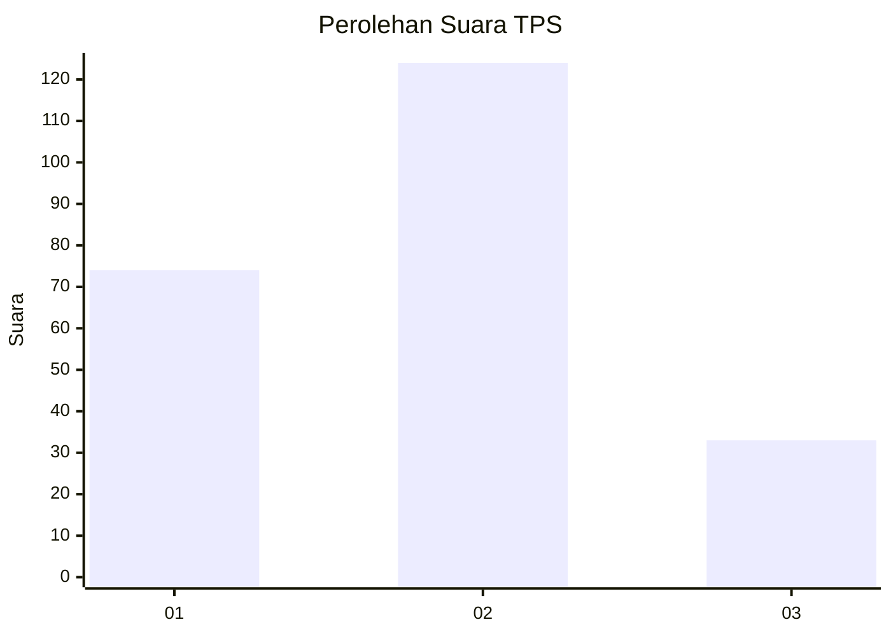
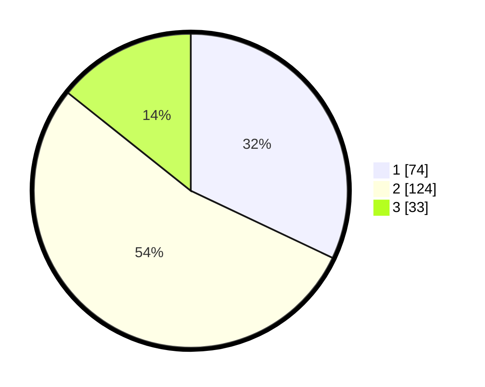

# Hasil

## Grafik

## Tabel

| No. | Nama Paslon    | Suara | Suara (raw) | Persentase |
|:--- |:-------------- | -----:| -----------:| ----------:|
| 1   | ANIES MUHAIMIN | 74    | [74][p-1]   | 32,03      |
| 2   | PRABOWO GIBRAN | 124   | [124][p-2]  | 53,68      |
| 3   | GANJAR MAHFUD  | 33    | [33][p-3]   | 14,29      |

[p-1]: https://github.com/gigit-pemilu/pemilu-2024-36-banten/blob/main/pilpres/hitung-suara/sub/36-banten/sub/71-kota-tangerang/sub/03-batuceper/sub/1001-batuceper/sub/004-tps/sub/paslon-1.txt
[p-2]: https://github.com/gigit-pemilu/pemilu-2024-36-banten/blob/main/pilpres/hitung-suara/sub/36-banten/sub/71-kota-tangerang/sub/03-batuceper/sub/1001-batuceper/sub/004-tps/sub/paslon-2.txt
[p-3]: https://github.com/gigit-pemilu/pemilu-2024-36-banten/blob/main/pilpres/hitung-suara/sub/36-banten/sub/71-kota-tangerang/sub/03-batuceper/sub/1001-batuceper/sub/004-tps/sub/paslon-3.txt

## Foto C Plano

https://sirekap-obj-formc.kpu.go.id/16ab/pemilu/ppwp/36/71/03/10/01/3671031001004-20240215-022653--592f2100-90b8-4019-83e0-fd835007c606.jpg

https://sirekap-obj-formc.kpu.go.id/16ab/pemilu/ppwp/36/71/03/10/01/3671031001004-20240215-022801--5a37b1a3-bdd2-48e2-b636-8bdc637d8318.jpg

https://sirekap-obj-formc.kpu.go.id/16ab/pemilu/ppwp/36/71/03/10/01/3671031001004-20240215-022906--d848e08d-19b4-4246-b9ed-e4a1d232e116.jpg

## Metadata

| Key        | Value               |
| ---------- | ------------------- |
| Time Stamp | 2024-02-24 22:31:28 |

