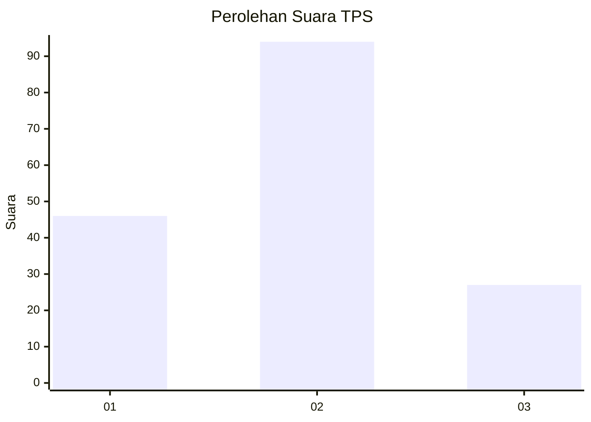
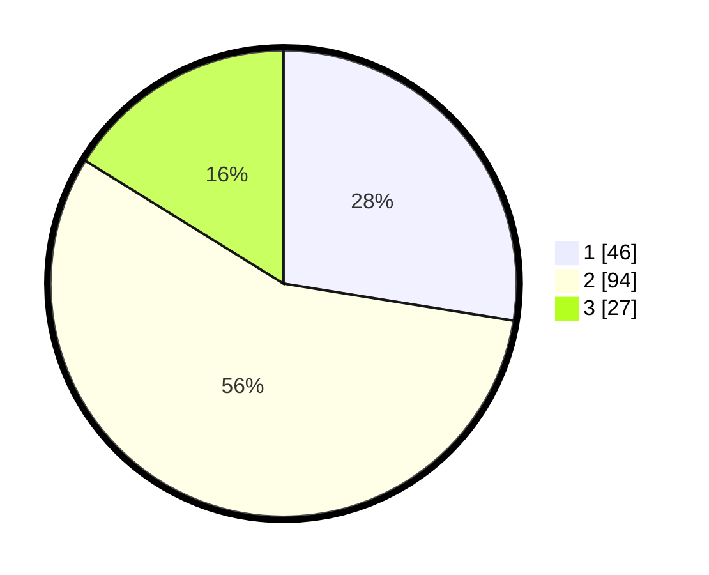

# Hasil

## Grafik

## Tabel

| No. | Nama Paslon    | Suara | Suara (raw) | Persentase |
|:--- |:-------------- | -----:| -----------:| ----------:|
| 1   | ANIES MUHAIMIN | 46    | [46][p-1]   | 27,54      |
| 2   | PRABOWO GIBRAN | 94    | [94][p-2]   | 56,29      |
| 3   | GANJAR MAHFUD  | 27    | [27][p-3]   | 16,17      |

[p-1]: https://github.com/gigit-pemilu/pemilu-2024-36-banten/blob/main/pilpres/hitung-suara/sub/36-banten/sub/71-kota-tangerang/sub/03-batuceper/sub/1001-batuceper/sub/005-tps/sub/paslon-1.txt
[p-2]: https://github.com/gigit-pemilu/pemilu-2024-36-banten/blob/main/pilpres/hitung-suara/sub/36-banten/sub/71-kota-tangerang/sub/03-batuceper/sub/1001-batuceper/sub/005-tps/sub/paslon-2.txt
[p-3]: https://github.com/gigit-pemilu/pemilu-2024-36-banten/blob/main/pilpres/hitung-suara/sub/36-banten/sub/71-kota-tangerang/sub/03-batuceper/sub/1001-batuceper/sub/005-tps/sub/paslon-3.txt

## Foto C Plano

https://sirekap-obj-formc.kpu.go.id/49e5/pemilu/ppwp/36/71/03/10/01/3671031001005-20240214-205119--e1542947-fe1c-4645-b5a3-38e2cf4c44c5.jpg

https://sirekap-obj-formc.kpu.go.id/49e5/pemilu/ppwp/36/71/03/10/01/3671031001005-20240214-192659--ca12cb41-0983-4ed9-a066-6654226f6b75.jpg

https://sirekap-obj-formc.kpu.go.id/49e5/pemilu/ppwp/36/71/03/10/01/3671031001005-20240214-192706--39e6bed5-ef14-48ee-99f5-0aeadb62e9dd.jpg

## Metadata

| Key        | Value               |
| ---------- | ------------------- |
| Time Stamp | 2024-02-24 22:31:28 |

