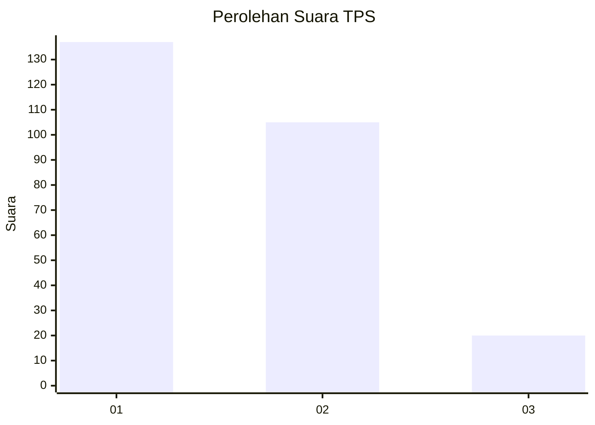
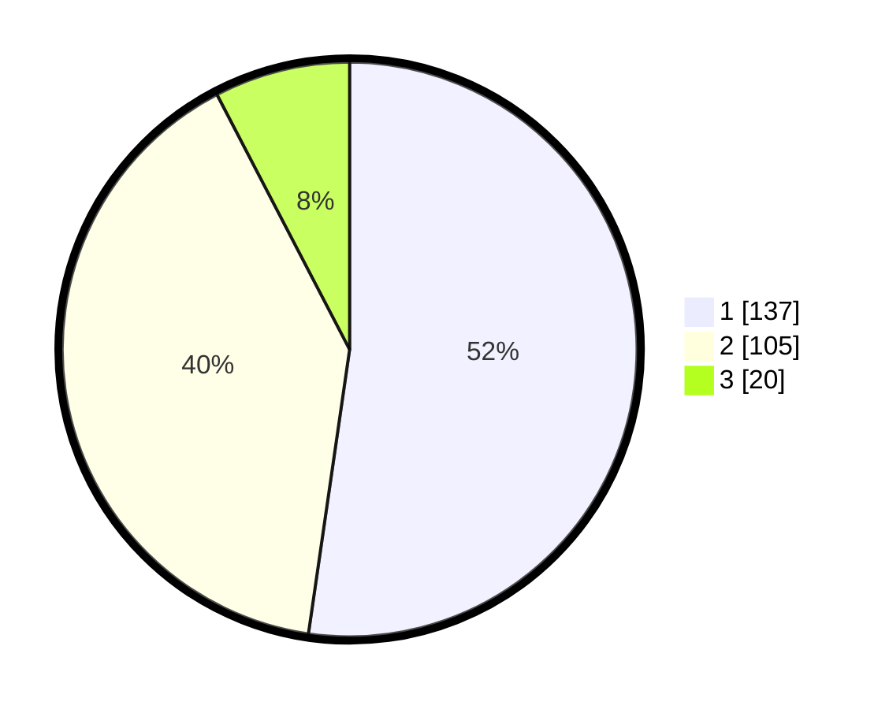

# Hasil

## Grafik

## Tabel

| No. | Nama Paslon    | Suara | Suara (raw) | Persentase |
|:--- |:-------------- | -----:| -----------:| ----------:|
| 1   | ANIES MUHAIMIN | 137   | [137][p-1]  | 52,29      |
| 2   | PRABOWO GIBRAN | 105   | [105][p-2]  | 40,08      |
| 3   | GANJAR MAHFUD  | 20    | [20][p-3]   | 7,63       |

[p-1]: https://github.com/gigit-pemilu/pemilu-2024-36-banten/blob/main/pilpres/hitung-suara/sub/36-banten/sub/71-kota-tangerang/sub/04-benda/sub/1001-belendung/sub/001-tps/sub/paslon-1.txt
[p-2]: https://github.com/gigit-pemilu/pemilu-2024-36-banten/blob/main/pilpres/hitung-suara/sub/36-banten/sub/71-kota-tangerang/sub/04-benda/sub/1001-belendung/sub/001-tps/sub/paslon-2.txt
[p-3]: https://github.com/gigit-pemilu/pemilu-2024-36-banten/blob/main/pilpres/hitung-suara/sub/36-banten/sub/71-kota-tangerang/sub/04-benda/sub/1001-belendung/sub/001-tps/sub/paslon-3.txt

## Foto C Plano

https://sirekap-obj-formc.kpu.go.id/729e/pemilu/ppwp/36/71/04/10/01/3671041001001-20240214-224837--b7de1c32-9fa7-4a35-a579-91c60771f50d.jpg

https://sirekap-obj-formc.kpu.go.id/729e/pemilu/ppwp/36/71/04/10/01/3671041001001-20240214-204657--1f5b78a4-3b1b-4f51-9694-7da805f89b8f.jpg

https://sirekap-obj-formc.kpu.go.id/729e/pemilu/ppwp/36/71/04/10/01/3671041001001-20240214-224649--35fec8de-9fe4-4dfd-b94f-cdce5c048a3e.jpg

## Metadata

| Key        | Value               |
| ---------- | ------------------- |
| Time Stamp | 2024-02-24 22:31:28 |

