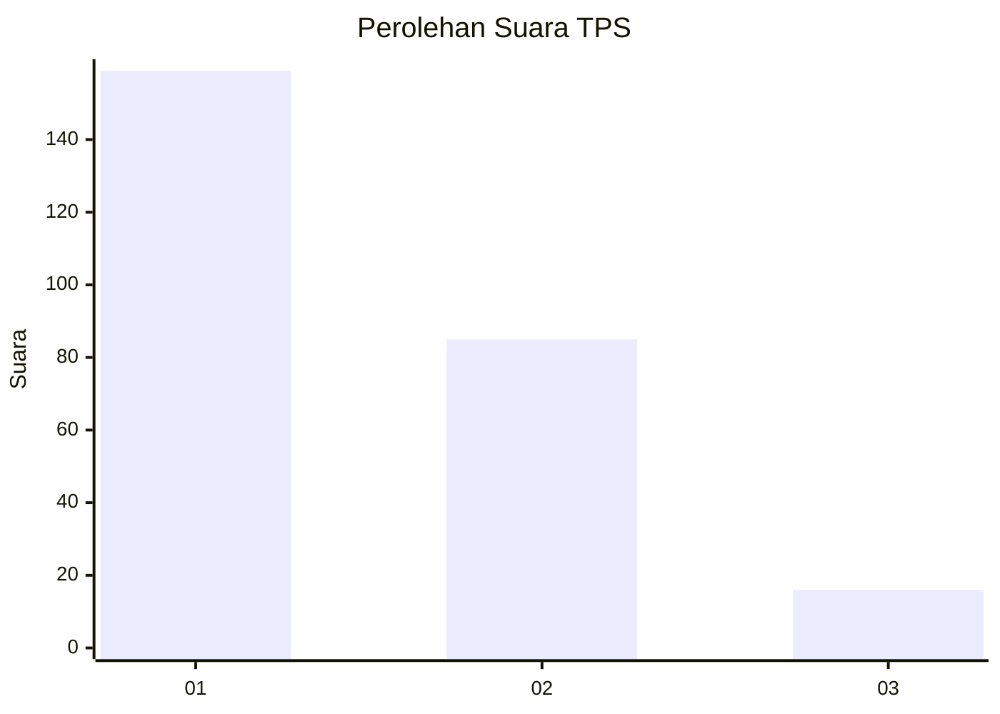
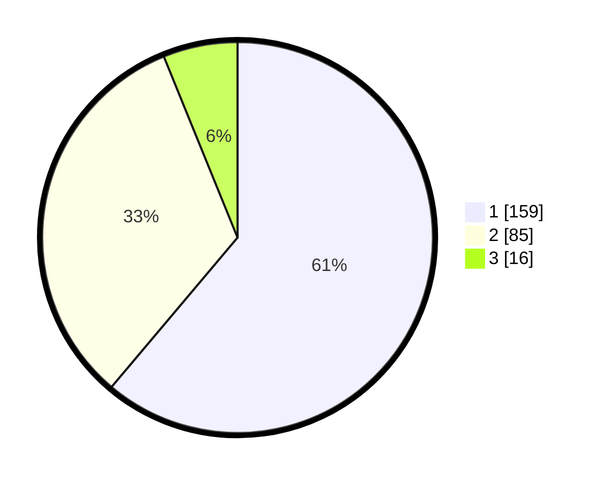

# Hasil

## Grafik

## Tabel

| No. | Nama Paslon    | Suara | Suara (raw) | Persentase |
|:--- |:-------------- | -----:| -----------:| ----------:|
| 1   | ANIES MUHAIMIN | 159   | [159][p-1]  | 61,15      |
| 2   | PRABOWO GIBRAN | 85    | [85][p-2]   | 32,69      |
| 3   | GANJAR MAHFUD  | 16    | [16][p-3]   | 6,15       |

[p-1]: https://github.com/gigit-pemilu/pemilu-2024-36-banten/blob/main/pilpres/hitung-suara/sub/36-banten/sub/71-kota-tangerang/sub/04-benda/sub/1001-belendung/sub/003-tps/sub/paslon-1.txt
[p-2]: https://github.com/gigit-pemilu/pemilu-2024-36-banten/blob/main/pilpres/hitung-suara/sub/36-banten/sub/71-kota-tangerang/sub/04-benda/sub/1001-belendung/sub/003-tps/sub/paslon-2.txt
[p-3]: https://github.com/gigit-pemilu/pemilu-2024-36-banten/blob/main/pilpres/hitung-suara/sub/36-banten/sub/71-kota-tangerang/sub/04-benda/sub/1001-belendung/sub/003-tps/sub/paslon-3.txt

## Foto C Plano

https://sirekap-obj-formc.kpu.go.id/baec/pemilu/ppwp/36/71/04/10/01/3671041001003-20240214-223246--f006a1d9-2b14-4301-8f41-177ded642252.jpg

https://sirekap-obj-formc.kpu.go.id/baec/pemilu/ppwp/36/71/04/10/01/3671041001003-20240214-223414--deea1780-7383-4548-8f3f-15f18eb441f5.jpg

https://sirekap-obj-formc.kpu.go.id/baec/pemilu/ppwp/36/71/04/10/01/3671041001003-20240214-224019--d24fbcdf-e851-4579-a37f-779260022d3f.jpg

## Metadata

| Key        | Value               |
| ---------- | ------------------- |
| Time Stamp | 2024-02-24 22:31:28 |

