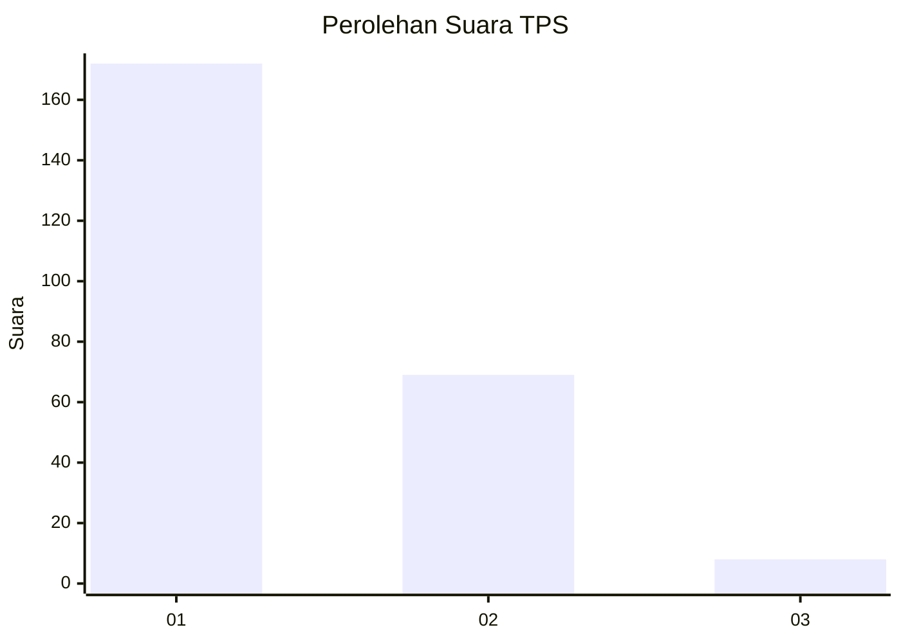
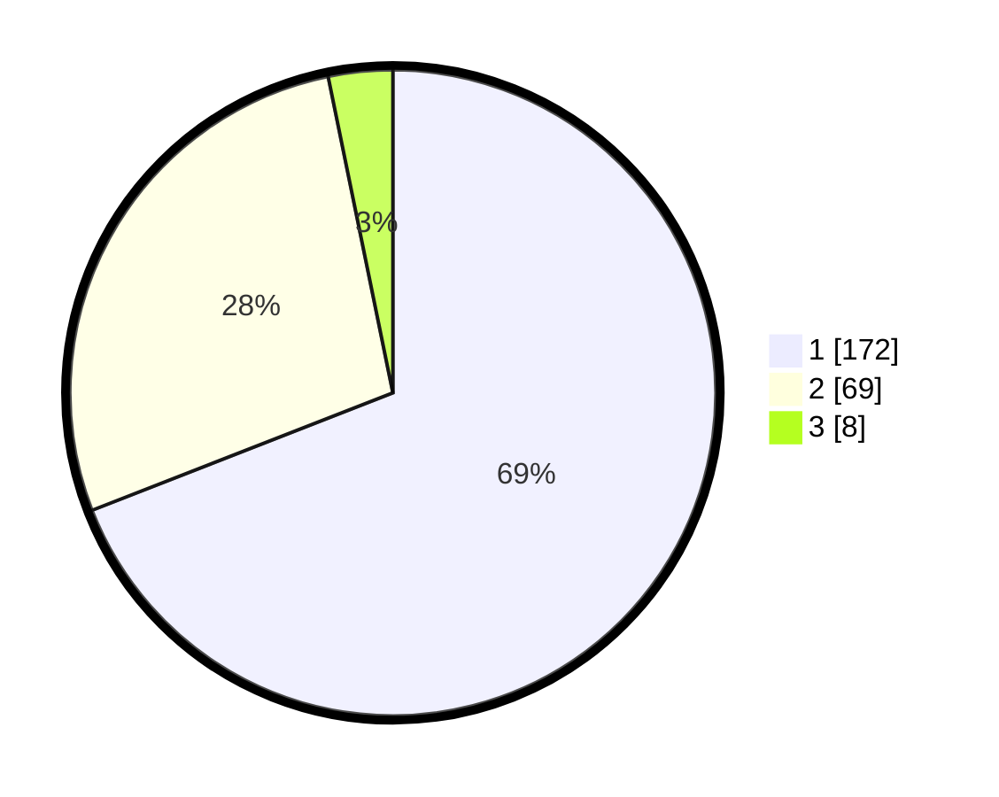

# Hasil

## Grafik

## Tabel

| No. | Nama Paslon    | Suara | Suara (raw) | Persentase |
|:--- |:-------------- | -----:| -----------:| ----------:|
| 1   | ANIES MUHAIMIN | 172   | [172][p-1]  | 69,08      |
| 2   | PRABOWO GIBRAN | 69    | [69][p-2]   | 27,71      |
| 3   | GANJAR MAHFUD  | 8     | [8][p-3]    | 3,21       |

[p-1]: https://github.com/gigit-pemilu/pemilu-2024-36-banten/blob/main/pilpres/hitung-suara/sub/36-banten/sub/71-kota-tangerang/sub/04-benda/sub/1001-belendung/sub/051-tps/sub/paslon-1.txt
[p-2]: https://github.com/gigit-pemilu/pemilu-2024-36-banten/blob/main/pilpres/hitung-suara/sub/36-banten/sub/71-kota-tangerang/sub/04-benda/sub/1001-belendung/sub/051-tps/sub/paslon-2.txt
[p-3]: https://github.com/gigit-pemilu/pemilu-2024-36-banten/blob/main/pilpres/hitung-suara/sub/36-banten/sub/71-kota-tangerang/sub/04-benda/sub/1001-belendung/sub/051-tps/sub/paslon-3.txt

## Foto C Plano

https://sirekap-obj-formc.kpu.go.id/978c/pemilu/ppwp/36/71/04/10/01/3671041001051-20240215-011855--2a1c373c-0bc1-4c26-9947-69b0984216fc.jpg

https://sirekap-obj-formc.kpu.go.id/978c/pemilu/ppwp/36/71/04/10/01/3671041001051-20240215-011959--87db7880-4b17-4cc5-ac82-572222e665ca.jpg

https://sirekap-obj-formc.kpu.go.id/978c/pemilu/ppwp/36/71/04/10/01/3671041001051-20240215-012136--4239c57a-6de7-42e2-b275-9d4e81b6967d.jpg

## Metadata

| Key        | Value               |
| ---------- | ------------------- |
| Time Stamp | 2024-02-25 12:00:00 |

