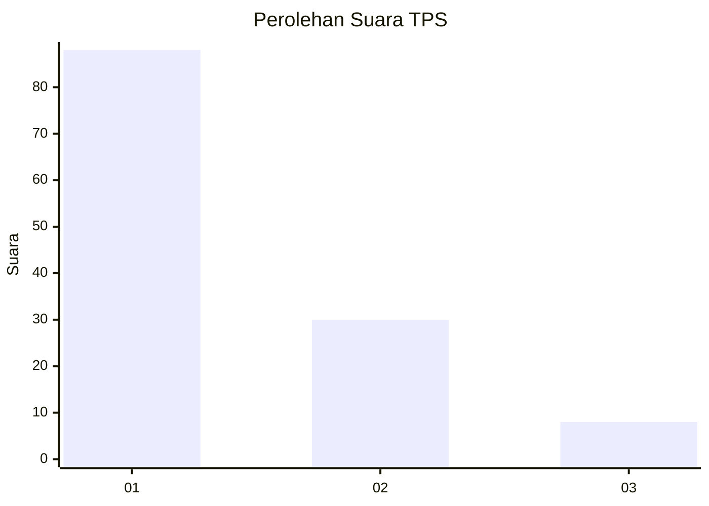
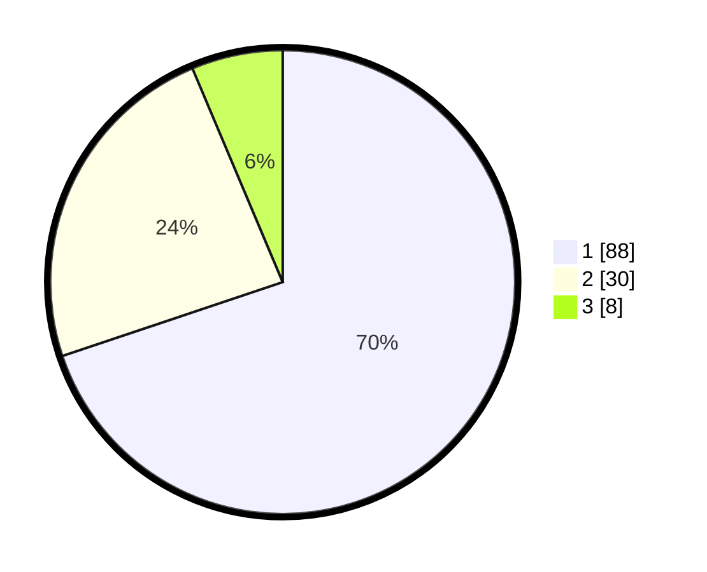

# Hasil

## Grafik

## Tabel

| No. | Nama Paslon    | Suara | Suara (raw) | Persentase |
|:--- |:-------------- | -----:| -----------:| ----------:|
| 1   | ANIES MUHAIMIN | 88    | [88][p-1]   | 69,84      |
| 2   | PRABOWO GIBRAN | 30    | [30][p-2]   | 23,81      |
| 3   | GANJAR MAHFUD  | 8     | [8][p-3]    | 6,35       |

[p-1]: https://github.com/gigit-pemilu/pemilu-2024/blob/main/pilpres/hitung-suara/sub/36-banten/sub/71-kota-tangerang/sub/04-benda/sub/1005-jurumudi-baru/sub/006-tps/sub/paslon-1.txt
[p-2]: https://github.com/gigit-pemilu/pemilu-2024/blob/main/pilpres/hitung-suara/sub/36-banten/sub/71-kota-tangerang/sub/04-benda/sub/1005-jurumudi-baru/sub/006-tps/sub/paslon-2.txt
[p-3]: https://github.com/gigit-pemilu/pemilu-2024/blob/main/pilpres/hitung-suara/sub/36-banten/sub/71-kota-tangerang/sub/04-benda/sub/1005-jurumudi-baru/sub/006-tps/sub/paslon-3.txt

## Foto C Plano

https://sirekap-obj-formc.kpu.go.id/26d6/pemilu/ppwp/36/71/04/10/05/3671041005006-20240214-221849--b0e0f86d-7009-4d2b-9c17-0e6cb4b98883.jpg

https://sirekap-obj-formc.kpu.go.id/26d6/pemilu/ppwp/36/71/04/10/05/3671041005006-20240214-222751--413ba959-896c-4ba3-a9f7-67eab6f3ef56.jpg

https://sirekap-obj-formc.kpu.go.id/26d6/pemilu/ppwp/36/71/04/10/05/3671041005006-20240214-223004--04042be5-4041-4787-9116-2103d63ccba9.jpg

## Metadata

| Key        | Value               |
| ---------- | ------------------- |
| Time Stamp | 2024-02-24 22:31:28 |

