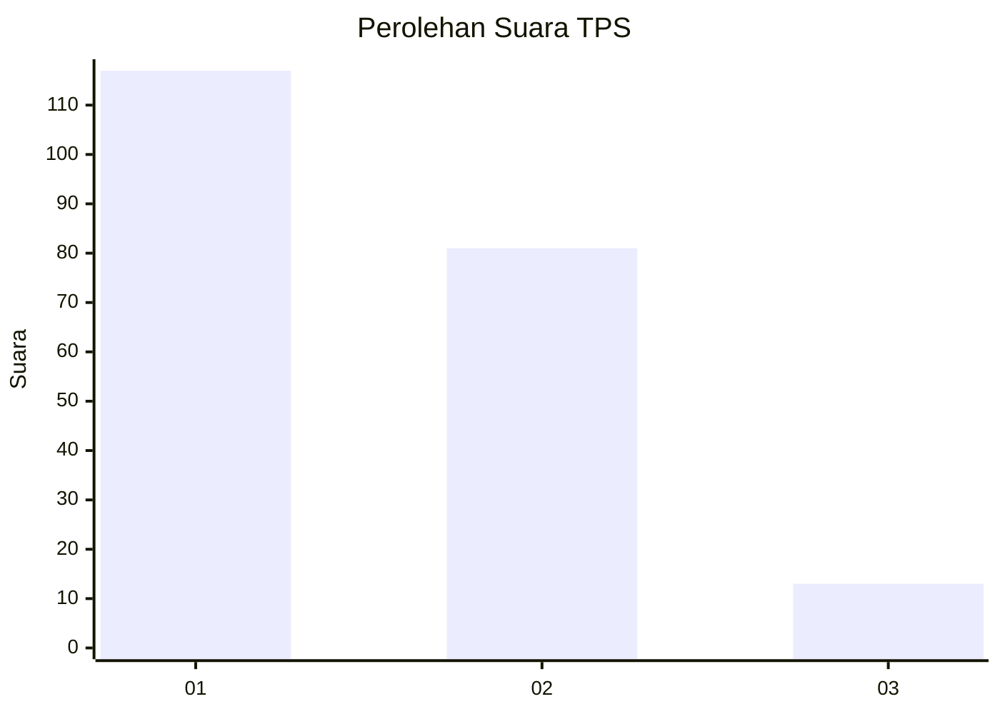
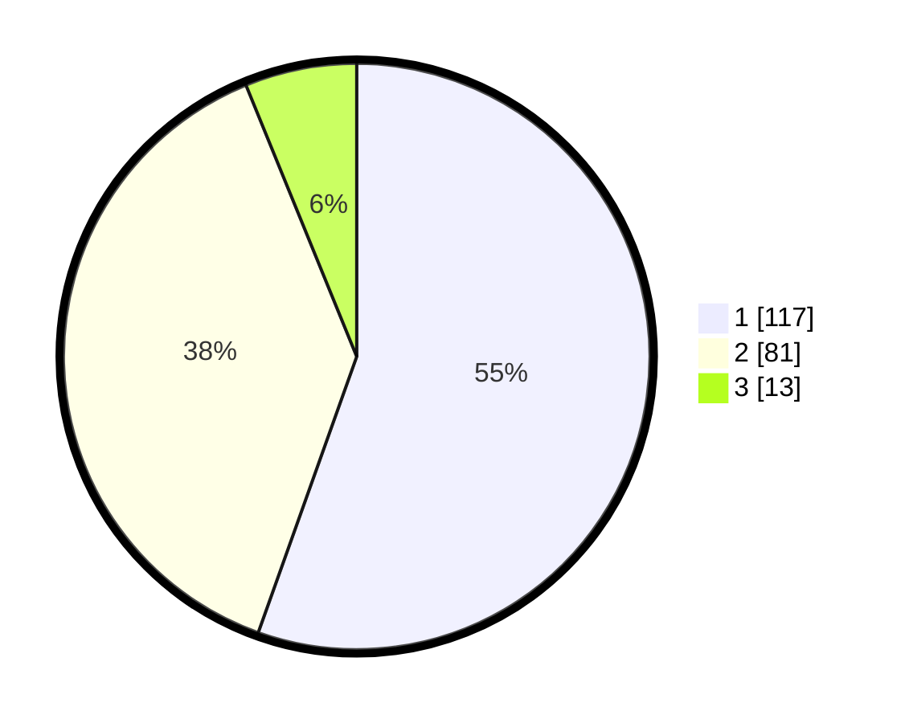

# Hasil

## Grafik

## Tabel

| No. | Nama Paslon    | Suara | Suara (raw) | Persentase |
|:--- |:-------------- | -----:| -----------:| ----------:|
| 1   | ANIES MUHAIMIN | 117   | [117][p-1]  | 55,45      |
| 2   | PRABOWO GIBRAN | 81    | [81][p-2]   | 38,39      |
| 3   | GANJAR MAHFUD  | 13    | [13][p-3]   | 6,16       |

[p-1]: https://github.com/gigit-pemilu/pemilu-2024/blob/main/pilpres/hitung-suara/sub/36-banten/sub/71-kota-tangerang/sub/05-cipondoh/sub/1001-cipondoh/sub/001-tps/sub/paslon-1.txt
[p-2]: https://github.com/gigit-pemilu/pemilu-2024/blob/main/pilpres/hitung-suara/sub/36-banten/sub/71-kota-tangerang/sub/05-cipondoh/sub/1001-cipondoh/sub/001-tps/sub/paslon-2.txt
[p-3]: https://github.com/gigit-pemilu/pemilu-2024/blob/main/pilpres/hitung-suara/sub/36-banten/sub/71-kota-tangerang/sub/05-cipondoh/sub/1001-cipondoh/sub/001-tps/sub/paslon-3.txt

## Foto C Plano

https://sirekap-obj-formc.kpu.go.id/c487/pemilu/ppwp/36/71/05/10/01/3671051001001-20240214-190356--b4fdb55a-94ef-425c-980e-49ae756e052c.jpg

https://sirekap-obj-formc.kpu.go.id/c487/pemilu/ppwp/36/71/05/10/01/3671051001001-20240214-190641--5afefe66-d4fa-459c-bfa4-1ffea62e55ab.jpg

https://sirekap-obj-formc.kpu.go.id/c487/pemilu/ppwp/36/71/05/10/01/3671051001001-20240214-190409--b88f78c2-914b-4b7f-a692-6aaa437d746f.jpg

## Metadata

| Key        | Value               |
| ---------- | ------------------- |
| Time Stamp | 2024-02-24 22:31:28 |

