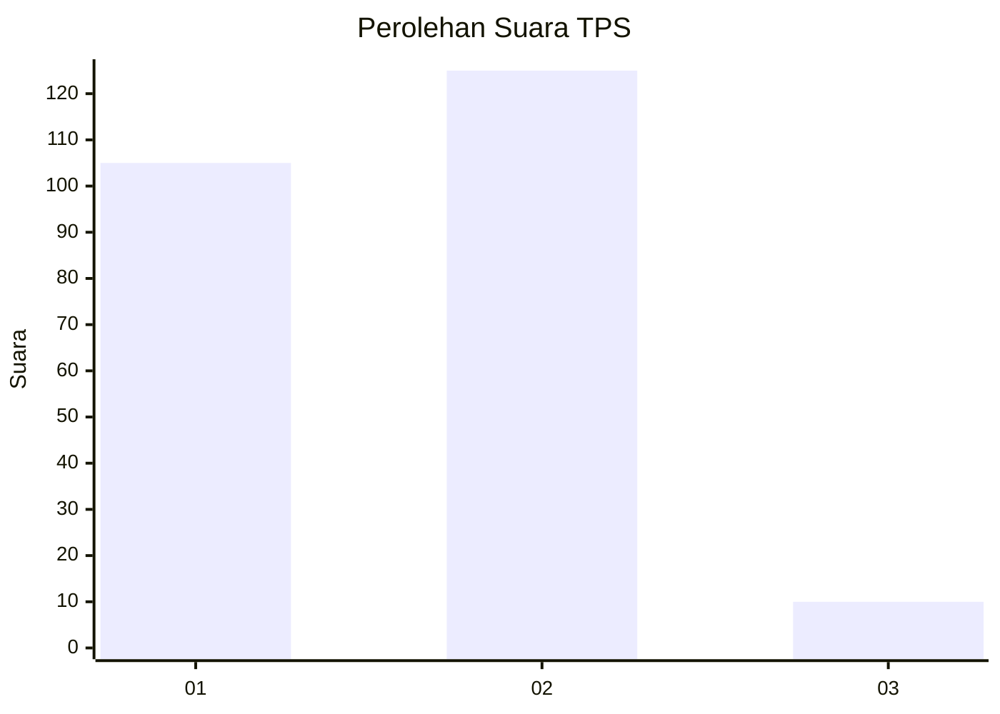
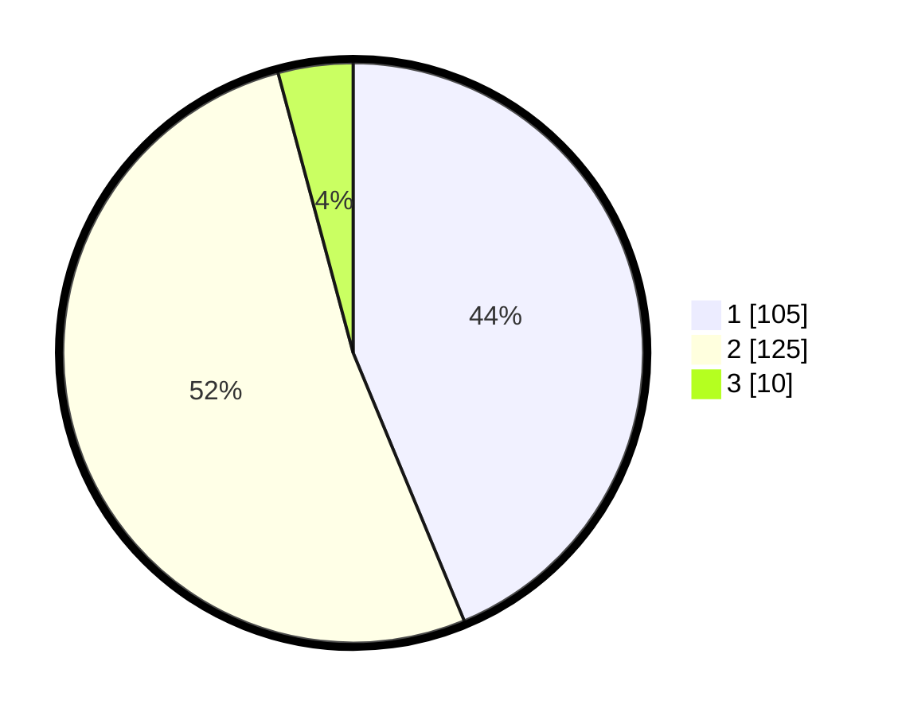

# Hasil

## Grafik

## Tabel

| No. | Nama Paslon    | Suara | Suara (raw) | Persentase |
|:--- |:-------------- | -----:| -----------:| ----------:|
| 1   | ANIES MUHAIMIN | 105   | [105][p-1]  | 43,75      |
| 2   | PRABOWO GIBRAN | 125   | [125][p-2]  | 52,08      |
| 3   | GANJAR MAHFUD  | 10    | [10][p-3]   | 4,17       |

[p-1]: https://github.com/gigit-pemilu/pemilu-2024-36-banten/blob/main/pilpres/hitung-suara/sub/36-banten/sub/71-kota-tangerang/sub/05-cipondoh/sub/1001-cipondoh/sub/006-tps/sub/paslon-1.txt
[p-2]: https://github.com/gigit-pemilu/pemilu-2024-36-banten/blob/main/pilpres/hitung-suara/sub/36-banten/sub/71-kota-tangerang/sub/05-cipondoh/sub/1001-cipondoh/sub/006-tps/sub/paslon-2.txt
[p-3]: https://github.com/gigit-pemilu/pemilu-2024-36-banten/blob/main/pilpres/hitung-suara/sub/36-banten/sub/71-kota-tangerang/sub/05-cipondoh/sub/1001-cipondoh/sub/006-tps/sub/paslon-3.txt

## Foto C Plano

https://sirekap-obj-formc.kpu.go.id/a107/pemilu/ppwp/36/71/05/10/01/3671051001006-20240214-234127--6fcea6bc-3c6b-429c-afb2-f56e31e52886.jpg

https://sirekap-obj-formc.kpu.go.id/a107/pemilu/ppwp/36/71/05/10/01/3671051001006-20240214-234201--55c7bb71-433a-4a12-b786-9039eba6219c.jpg

https://sirekap-obj-formc.kpu.go.id/a107/pemilu/ppwp/36/71/05/10/01/3671051001006-20240214-234230--5e2dac37-5b6f-4dc6-90b7-4e599961bfc6.jpg

## Metadata

| Key        | Value               |
| ---------- | ------------------- |
| Time Stamp | 2024-02-24 22:31:28 |

