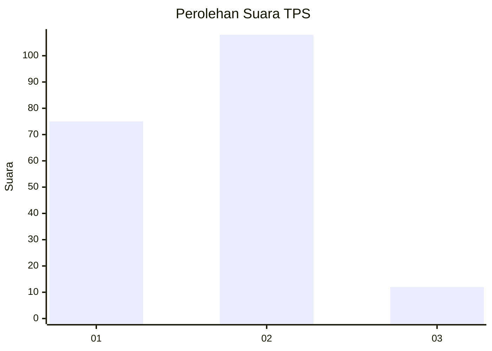

# Hasil

## Grafik

## Tabel

| No. | Nama Paslon    | Suara | Suara (raw) | Persentase |
|:--- |:-------------- | -----:| -----------:| ----------:|
| 1   | ANIES MUHAIMIN | 75    | [75][p-1]   | 38,46      |
| 2   | PRABOWO GIBRAN | 108   | [108][p-2]  | 55,38      |
| 3   | GANJAR MAHFUD  | 12    | [12][p-3]   | 6,15       |

[p-1]: https://github.com/gigit-pemilu/pemilu-2024-36-banten/blob/main/pilpres/hitung-suara/sub/36-banten/sub/71-kota-tangerang/sub/05-cipondoh/sub/1001-cipondoh/sub/017-tps/sub/paslon-1.txt
[p-2]: https://github.com/gigit-pemilu/pemilu-2024-36-banten/blob/main/pilpres/hitung-suara/sub/36-banten/sub/71-kota-tangerang/sub/05-cipondoh/sub/1001-cipondoh/sub/017-tps/sub/paslon-2.txt
[p-3]: https://github.com/gigit-pemilu/pemilu-2024-36-banten/blob/main/pilpres/hitung-suara/sub/36-banten/sub/71-kota-tangerang/sub/05-cipondoh/sub/1001-cipondoh/sub/017-tps/sub/paslon-3.txt

## Foto C Plano

https://sirekap-obj-formc.kpu.go.id/0708/pemilu/ppwp/36/71/05/10/01/3671051001017-20240214-213604--24e4e49e-1745-4e59-82d6-521b81717df2.jpg

https://sirekap-obj-formc.kpu.go.id/0708/pemilu/ppwp/36/71/05/10/01/3671051001017-20240214-213514--564185d8-6044-42d3-b0dd-3cca279891b3.jpg

https://sirekap-obj-formc.kpu.go.id/0708/pemilu/ppwp/36/71/05/10/01/3671051001017-20240214-213645--c28b63c6-e4df-4ff1-9de3-40c47f407616.jpg

## Metadata

| Key        | Value               |
| ---------- | ------------------- |
| Time Stamp | 2024-02-24 22:31:28 |

