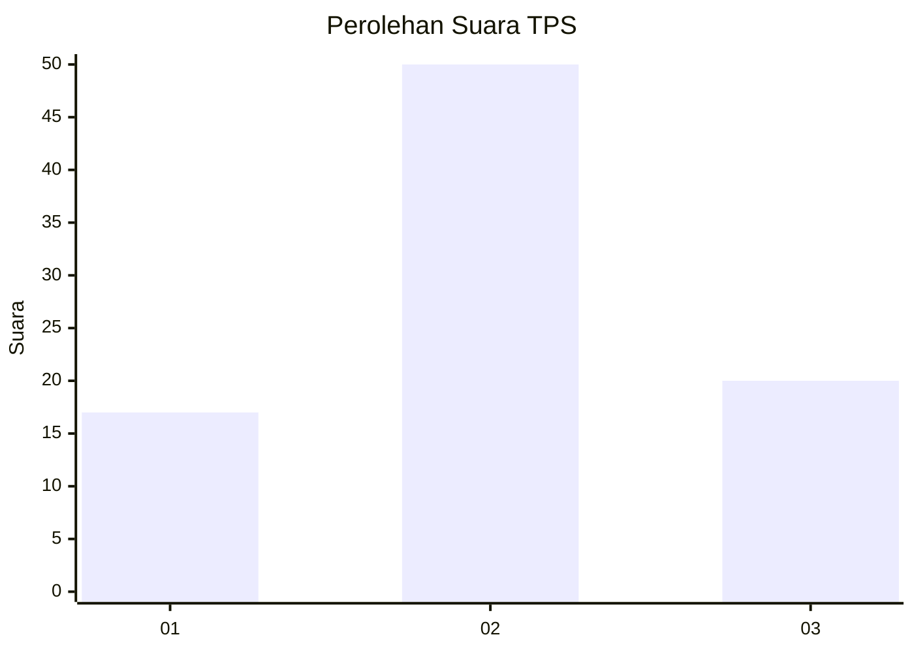
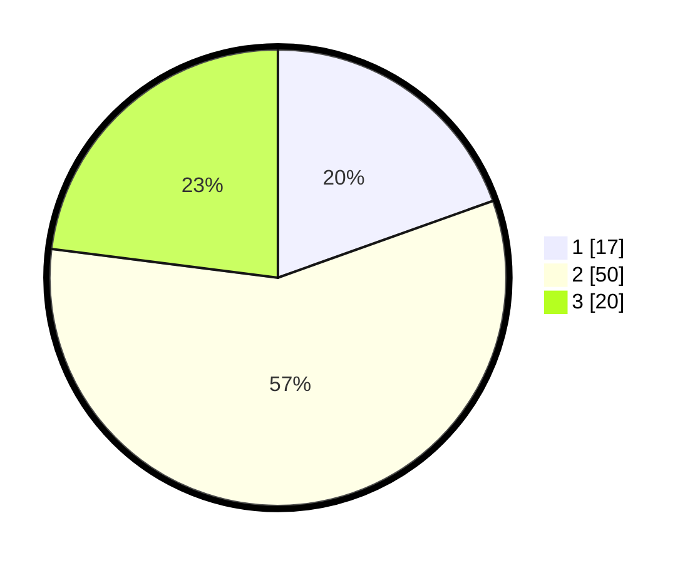

# Hasil

## Grafik

## Tabel

| No. | Nama Paslon    | Suara | Suara (raw) | Persentase |
|:--- |:-------------- | -----:| -----------:| ----------:|
| 1   | ANIES MUHAIMIN | 17    | [17][p-1]   | 19,54      |
| 2   | PRABOWO GIBRAN | 50    | [50][p-2]   | 57,47      |
| 3   | GANJAR MAHFUD  | 20    | [20][p-3]   | 22,99      |

[p-1]: https://github.com/gigit-pemilu/pemilu-2024-36-banten/blob/main/pilpres/hitung-suara/sub/36-banten/sub/71-kota-tangerang/sub/05-cipondoh/sub/1001-cipondoh/sub/079-tps/sub/paslon-1.txt
[p-2]: https://github.com/gigit-pemilu/pemilu-2024-36-banten/blob/main/pilpres/hitung-suara/sub/36-banten/sub/71-kota-tangerang/sub/05-cipondoh/sub/1001-cipondoh/sub/079-tps/sub/paslon-2.txt
[p-3]: https://github.com/gigit-pemilu/pemilu-2024-36-banten/blob/main/pilpres/hitung-suara/sub/36-banten/sub/71-kota-tangerang/sub/05-cipondoh/sub/1001-cipondoh/sub/079-tps/sub/paslon-3.txt

## Foto C Plano

https://sirekap-obj-formc.kpu.go.id/a462/pemilu/ppwp/36/71/05/10/01/3671051001079-20240214-194838--5bbeb736-2fe0-408f-a7c6-929e581a5749.jpg

https://sirekap-obj-formc.kpu.go.id/a462/pemilu/ppwp/36/71/05/10/01/3671051001079-20240214-193938--a4ad63fb-cfd7-4035-a998-f10b157d87de.jpg

https://sirekap-obj-formc.kpu.go.id/a462/pemilu/ppwp/36/71/05/10/01/3671051001079-20240214-193959--f054fbb8-4abf-4665-9bca-f13a7ee9dacc.jpg

## Metadata

| Key        | Value               |
| ---------- | ------------------- |
| Time Stamp | 2024-02-15 22:30:27 |

