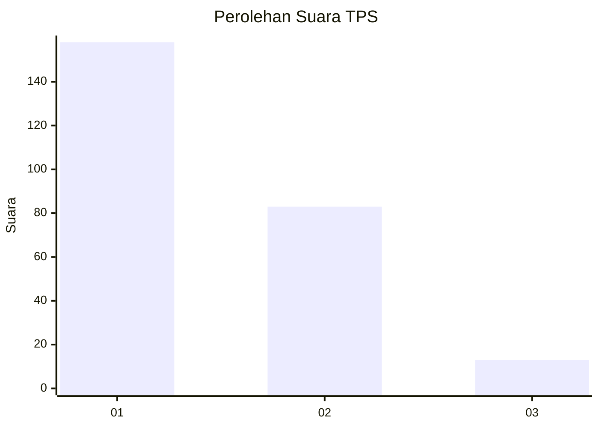
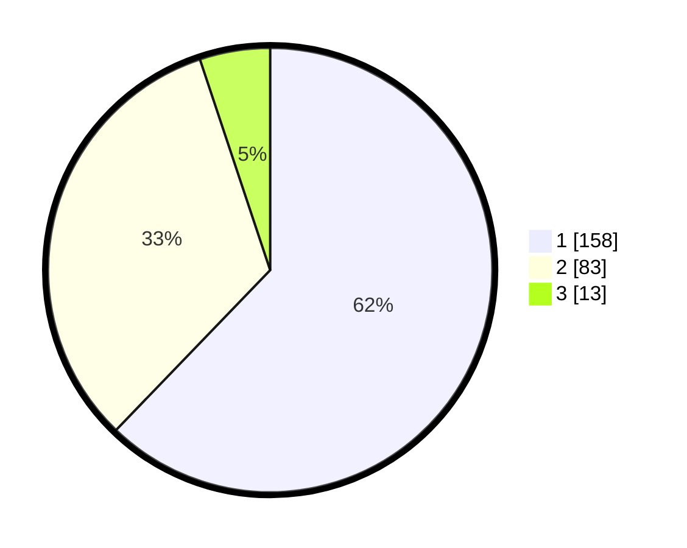

# Hasil

## Grafik

## Tabel

| No. | Nama Paslon    | Suara | Suara (raw) | Persentase |
|:--- |:-------------- | -----:| -----------:| ----------:|
| 1   | ANIES MUHAIMIN | 158   | [158][p-1]  | 62,20      |
| 2   | PRABOWO GIBRAN | 83    | [83][p-2]   | 32,68      |
| 3   | GANJAR MAHFUD  | 13    | [13][p-3]   | 5,12       |

[p-1]: https://github.com/gigit-pemilu/pemilu-2024-36-banten/blob/main/pilpres/hitung-suara/sub/36-banten/sub/71-kota-tangerang/sub/05-cipondoh/sub/1002-cipondoh-makmur/sub/001-tps/sub/paslon-1.txt
[p-2]: https://github.com/gigit-pemilu/pemilu-2024-36-banten/blob/main/pilpres/hitung-suara/sub/36-banten/sub/71-kota-tangerang/sub/05-cipondoh/sub/1002-cipondoh-makmur/sub/001-tps/sub/paslon-2.txt
[p-3]: https://github.com/gigit-pemilu/pemilu-2024-36-banten/blob/main/pilpres/hitung-suara/sub/36-banten/sub/71-kota-tangerang/sub/05-cipondoh/sub/1002-cipondoh-makmur/sub/001-tps/sub/paslon-3.txt

## Foto C Plano

https://sirekap-obj-formc.kpu.go.id/24f1/pemilu/ppwp/36/71/05/10/02/3671051002001-20240214-225303--44997e89-e411-41a4-9610-93e76655f82c.jpg

https://sirekap-obj-formc.kpu.go.id/24f1/pemilu/ppwp/36/71/05/10/02/3671051002001-20240214-224654--0cf3f32b-0bf6-45c7-851c-1bd0dfb1066a.jpg

https://sirekap-obj-formc.kpu.go.id/24f1/pemilu/ppwp/36/71/05/10/02/3671051002001-20240214-224746--9cb4063e-9c97-4562-9c7d-1346013c2aa8.jpg

## Metadata

| Key        | Value               |
| ---------- | ------------------- |
| Time Stamp | 2024-02-24 22:31:28 |

