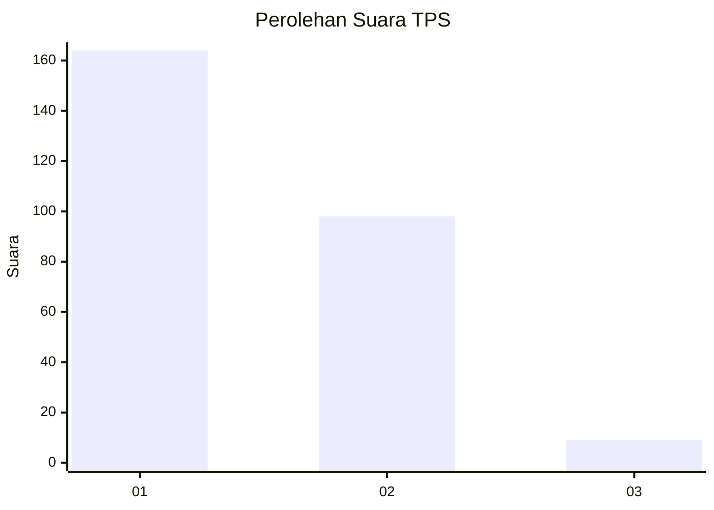
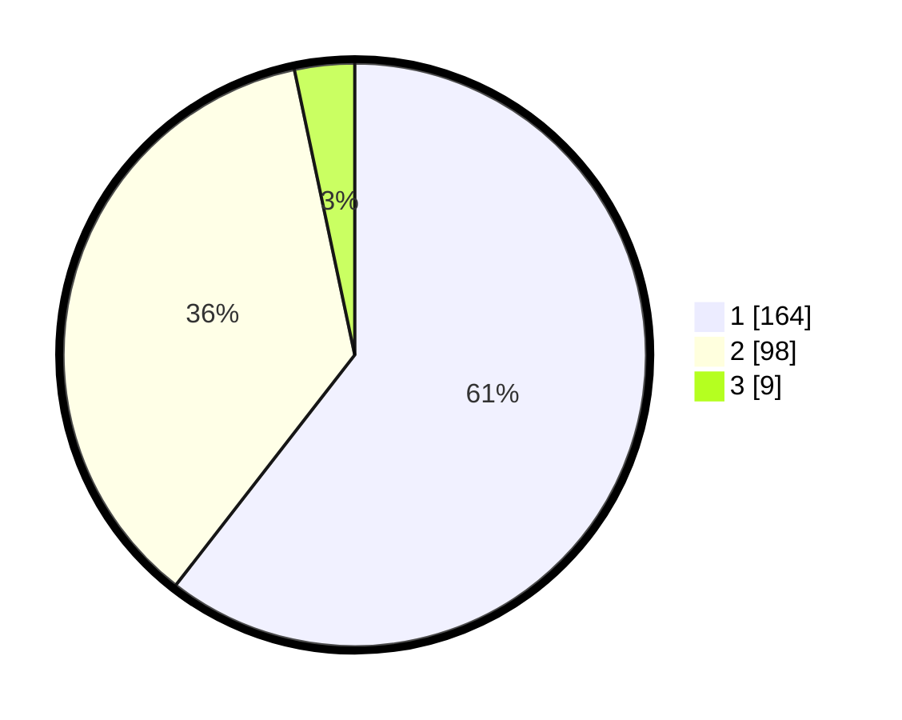

# Hasil

## Grafik

## Tabel

| No. | Nama Paslon    | Suara | Suara (raw) | Persentase |
|:--- |:-------------- | -----:| -----------:| ----------:|
| 1   | ANIES MUHAIMIN | 164   | [164][p-1]  | 60,52      |
| 2   | PRABOWO GIBRAN | 98    | [98][p-2]   | 36,16      |
| 3   | GANJAR MAHFUD  | 9     | [9][p-3]    | 3,32       |

[p-1]: https://github.com/gigit-pemilu/pemilu-2024/blob/main/pilpres/hitung-suara/sub/36-banten/sub/71-kota-tangerang/sub/05-cipondoh/sub/1002-cipondoh-makmur/sub/011-tps/sub/paslon-1.txt
[p-2]: https://github.com/gigit-pemilu/pemilu-2024/blob/main/pilpres/hitung-suara/sub/36-banten/sub/71-kota-tangerang/sub/05-cipondoh/sub/1002-cipondoh-makmur/sub/011-tps/sub/paslon-2.txt
[p-3]: https://github.com/gigit-pemilu/pemilu-2024/blob/main/pilpres/hitung-suara/sub/36-banten/sub/71-kota-tangerang/sub/05-cipondoh/sub/1002-cipondoh-makmur/sub/011-tps/sub/paslon-3.txt

## Foto C Plano

https://sirekap-obj-formc.kpu.go.id/3d37/pemilu/ppwp/36/71/05/10/02/3671051002011-20240214-222045--d6151aad-8d44-4605-bd26-87f8404eb8b7.jpg

https://sirekap-obj-formc.kpu.go.id/3d37/pemilu/ppwp/36/71/05/10/02/3671051002011-20240214-222135--2f5ea9a4-086c-4087-8db3-33b4681c91e1.jpg

https://sirekap-obj-formc.kpu.go.id/3d37/pemilu/ppwp/36/71/05/10/02/3671051002011-20240214-222324--9f2a9488-fd9c-476c-aebb-df876969c8ad.jpg

## Metadata

| Key        | Value               |
| ---------- | ------------------- |
| Time Stamp | 2024-02-24 22:31:28 |

