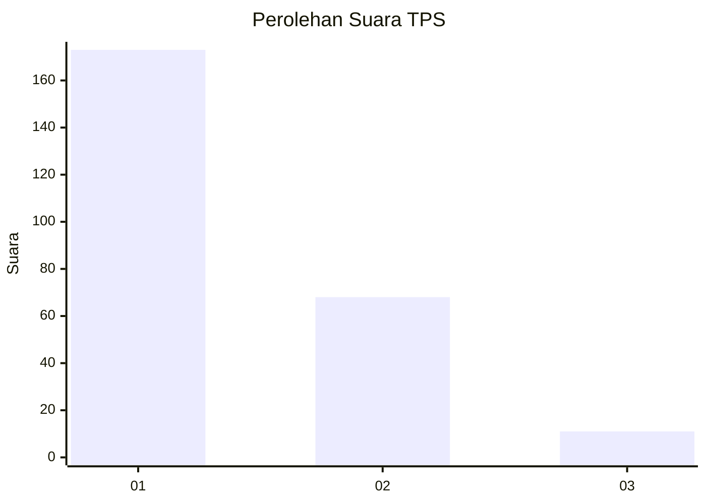
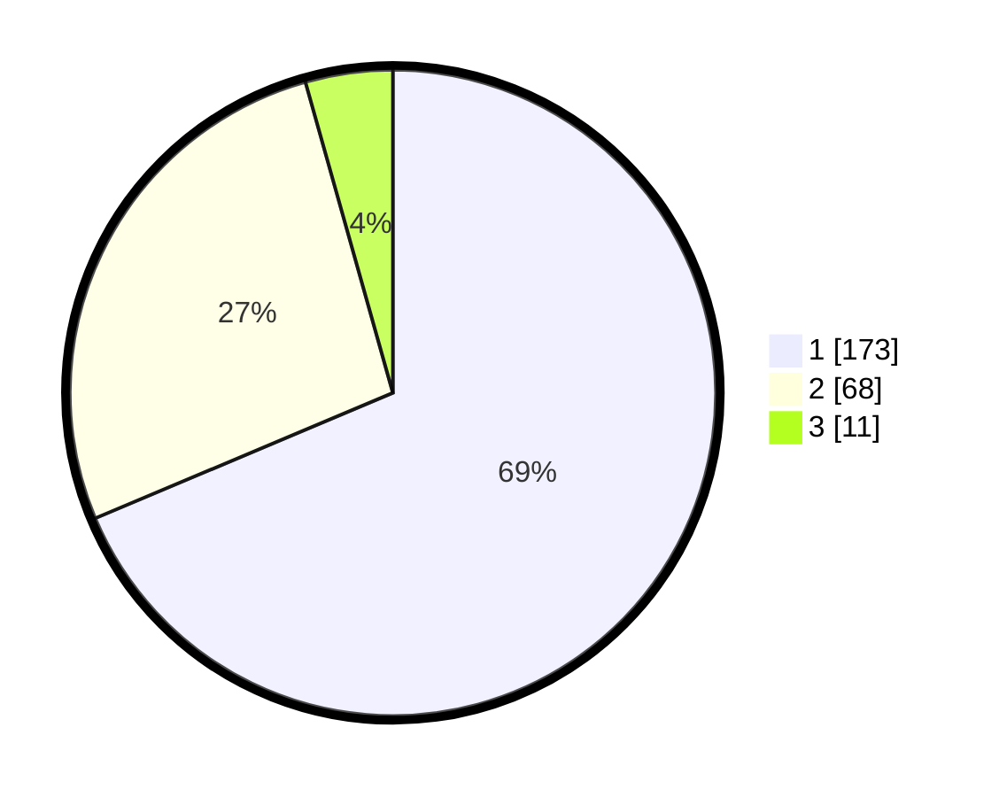

# Hasil

## Grafik

## Tabel

| No. | Nama Paslon    | Suara | Suara (raw) | Persentase |
|:--- |:-------------- | -----:| -----------:| ----------:|
| 1   | ANIES MUHAIMIN | 173   | [173][p-1]  | 68,65      |
| 2   | PRABOWO GIBRAN | 68    | [68][p-2]   | 26,98      |
| 3   | GANJAR MAHFUD  | 11    | [11][p-3]   | 4,37       |

[p-1]: https://github.com/gigit-pemilu/pemilu-2024-36-banten/blob/main/pilpres/hitung-suara/sub/36-banten/sub/71-kota-tangerang/sub/05-cipondoh/sub/1006-petir/sub/020-tps/sub/paslon-1.txt
[p-2]: https://github.com/gigit-pemilu/pemilu-2024-36-banten/blob/main/pilpres/hitung-suara/sub/36-banten/sub/71-kota-tangerang/sub/05-cipondoh/sub/1006-petir/sub/020-tps/sub/paslon-2.txt
[p-3]: https://github.com/gigit-pemilu/pemilu-2024-36-banten/blob/main/pilpres/hitung-suara/sub/36-banten/sub/71-kota-tangerang/sub/05-cipondoh/sub/1006-petir/sub/020-tps/sub/paslon-3.txt

## Foto C Plano

https://sirekap-obj-formc.kpu.go.id/5d33/pemilu/ppwp/36/71/05/10/06/3671051006020-20240215-201229--8af8bf25-0e5b-4a80-97cc-c5e3efae5fbd.jpg

https://sirekap-obj-formc.kpu.go.id/5d33/pemilu/ppwp/36/71/05/10/06/3671051006020-20240214-221619--a410759e-1973-4a3a-b49b-5cc84eefab61.jpg

https://sirekap-obj-formc.kpu.go.id/5d33/pemilu/ppwp/36/71/05/10/06/3671051006020-20240214-221735--b5148b31-f86b-4486-bb9d-30f0e5b9d180.jpg

## Metadata

| Key        | Value               |
| ---------- | ------------------- |
| Time Stamp | 2024-02-24 22:31:28 |

