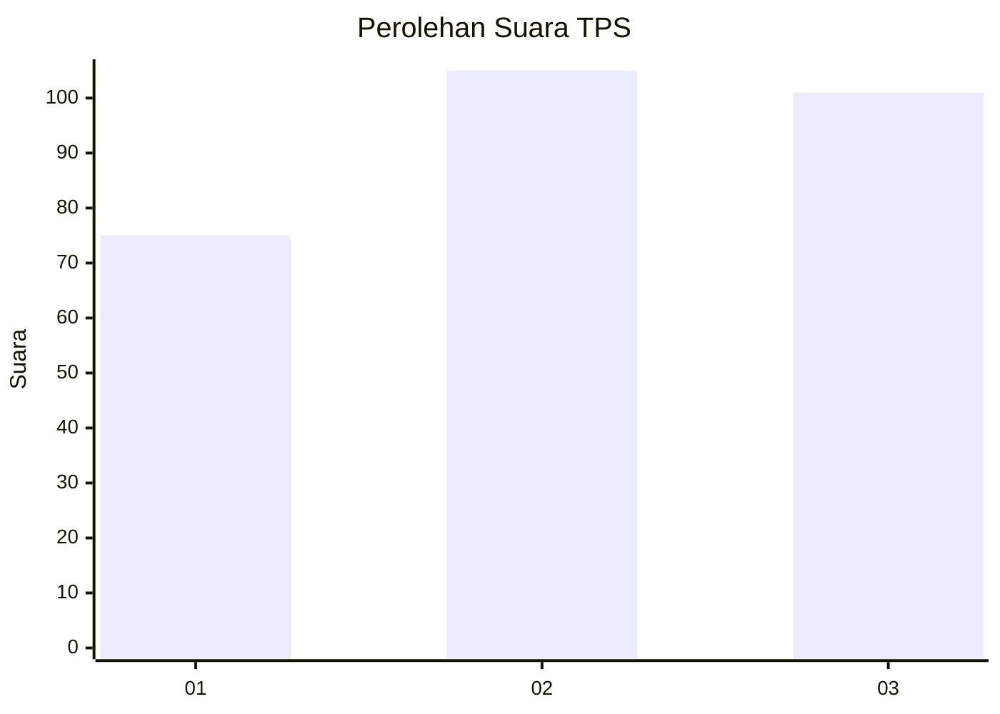
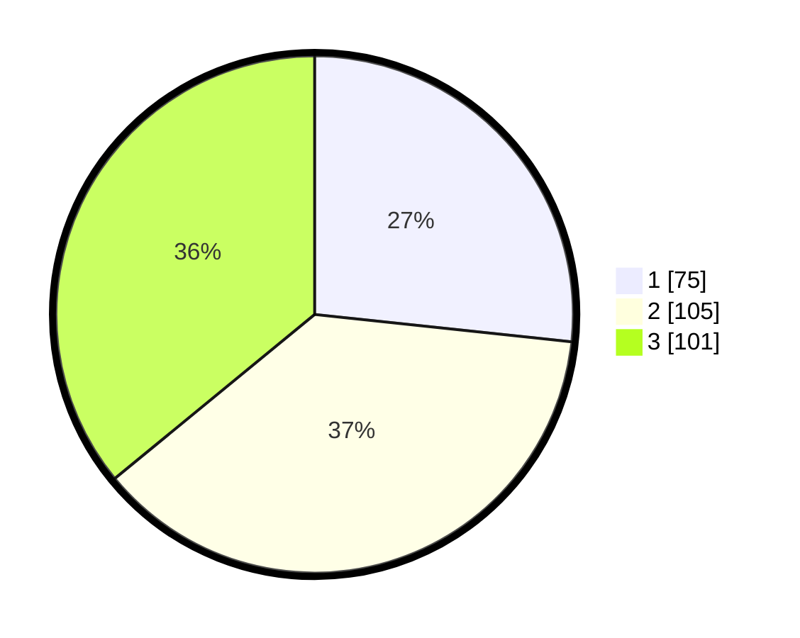

# Hasil

## Grafik

## Tabel

| No. | Nama Paslon    | Suara | Suara (raw) | Persentase |
|:--- |:-------------- | -----:| -----------:| ----------:|
| 1   | ANIES MUHAIMIN | 75    | [75][p-1]   | 26,69      |
| 2   | PRABOWO GIBRAN | 105   | [105][p-2]  | 37,37      |
| 3   | GANJAR MAHFUD  | 101   | [101][p-3]  | 35,94      |

[p-1]: https://github.com/gigit-pemilu/pemilu-2024-36-banten/blob/main/pilpres/hitung-suara/sub/36-banten/sub/71-kota-tangerang/sub/05-cipondoh/sub/1010-poris-plawad-indah/sub/050-tps/sub/paslon-1.txt
[p-2]: https://github.com/gigit-pemilu/pemilu-2024-36-banten/blob/main/pilpres/hitung-suara/sub/36-banten/sub/71-kota-tangerang/sub/05-cipondoh/sub/1010-poris-plawad-indah/sub/050-tps/sub/paslon-2.txt
[p-3]: https://github.com/gigit-pemilu/pemilu-2024-36-banten/blob/main/pilpres/hitung-suara/sub/36-banten/sub/71-kota-tangerang/sub/05-cipondoh/sub/1010-poris-plawad-indah/sub/050-tps/sub/paslon-3.txt

## Foto C Plano

https://sirekap-obj-formc.kpu.go.id/9b9a/pemilu/ppwp/36/71/05/10/10/3671051010050-20240215-010536--ba8f65da-6487-4578-932a-0a0f3ccad52c.jpg

https://sirekap-obj-formc.kpu.go.id/9b9a/pemilu/ppwp/36/71/05/10/10/3671051010050-20240215-010612--ed3d216b-a722-4f72-be78-399192eea8ca.jpg

https://sirekap-obj-formc.kpu.go.id/9b9a/pemilu/ppwp/36/71/05/10/10/3671051010050-20240215-010654--0edb81d1-e655-4755-9e28-cbb481976c7a.jpg

## Metadata

| Key        | Value               |
| ---------- | ------------------- |
| Time Stamp | 2024-02-24 22:31:28 |

