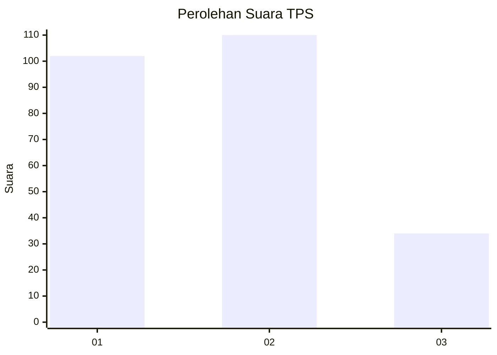
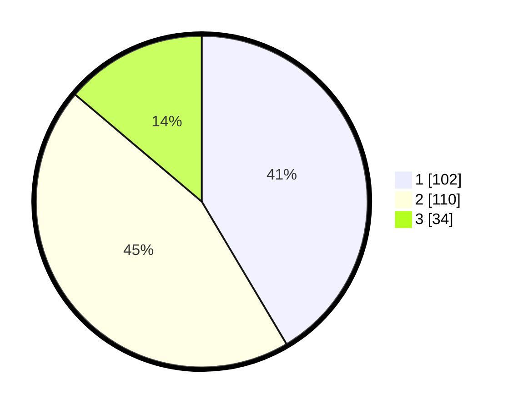

# Hasil

## Grafik

## Tabel

| No. | Nama Paslon    | Suara | Suara (raw) | Persentase |
|:--- |:-------------- | -----:| -----------:| ----------:|
| 1   | ANIES MUHAIMIN | 102   | [102][p-1]  | 41,46      |
| 2   | PRABOWO GIBRAN | 110   | [110][p-2]  | 44,72      |
| 3   | GANJAR MAHFUD  | 34    | [34][p-3]   | 13,82      |

[p-1]: https://github.com/gigit-pemilu/pemilu-2024-36-banten/blob/main/pilpres/hitung-suara/sub/36-banten/sub/71-kota-tangerang/sub/06-ciledug/sub/1001-paninggilan/sub/005-tps/sub/paslon-1.txt
[p-2]: https://github.com/gigit-pemilu/pemilu-2024-36-banten/blob/main/pilpres/hitung-suara/sub/36-banten/sub/71-kota-tangerang/sub/06-ciledug/sub/1001-paninggilan/sub/005-tps/sub/paslon-2.txt
[p-3]: https://github.com/gigit-pemilu/pemilu-2024-36-banten/blob/main/pilpres/hitung-suara/sub/36-banten/sub/71-kota-tangerang/sub/06-ciledug/sub/1001-paninggilan/sub/005-tps/sub/paslon-3.txt

## Foto C Plano

https://sirekap-obj-formc.kpu.go.id/77c6/pemilu/ppwp/36/71/06/10/01/3671061001005-20240214-222936--0409a520-e139-4cb5-b983-b945bb79bda4.jpg

https://sirekap-obj-formc.kpu.go.id/77c6/pemilu/ppwp/36/71/06/10/01/3671061001005-20240214-235532--5b9d2c93-ddfb-4c7e-883d-593d800a2283.jpg

https://sirekap-obj-formc.kpu.go.id/77c6/pemilu/ppwp/36/71/06/10/01/3671061001005-20240214-235737--e45269ae-416d-4322-a47f-3cb1c81c0baf.jpg

## Metadata

| Key        | Value               |
| ---------- | ------------------- |
| Time Stamp | 2024-02-15 21:01:18 |

